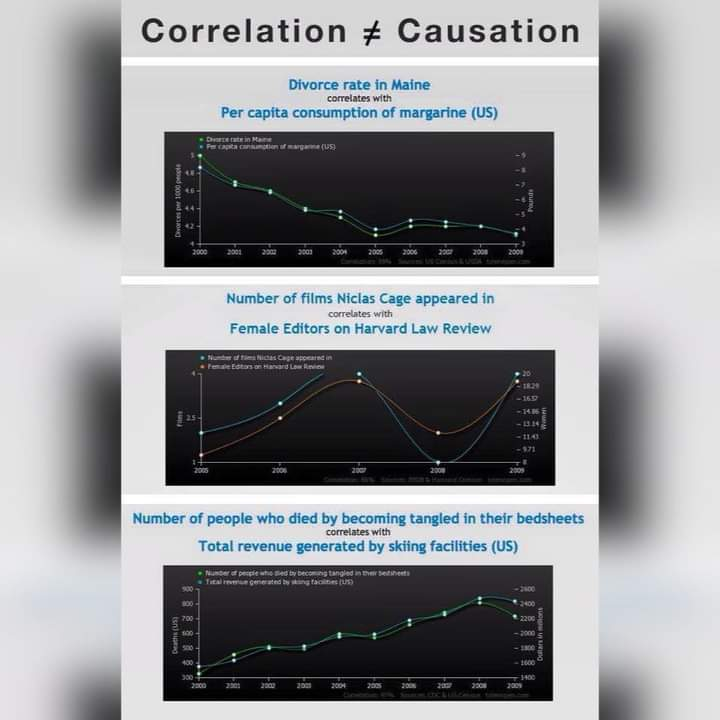
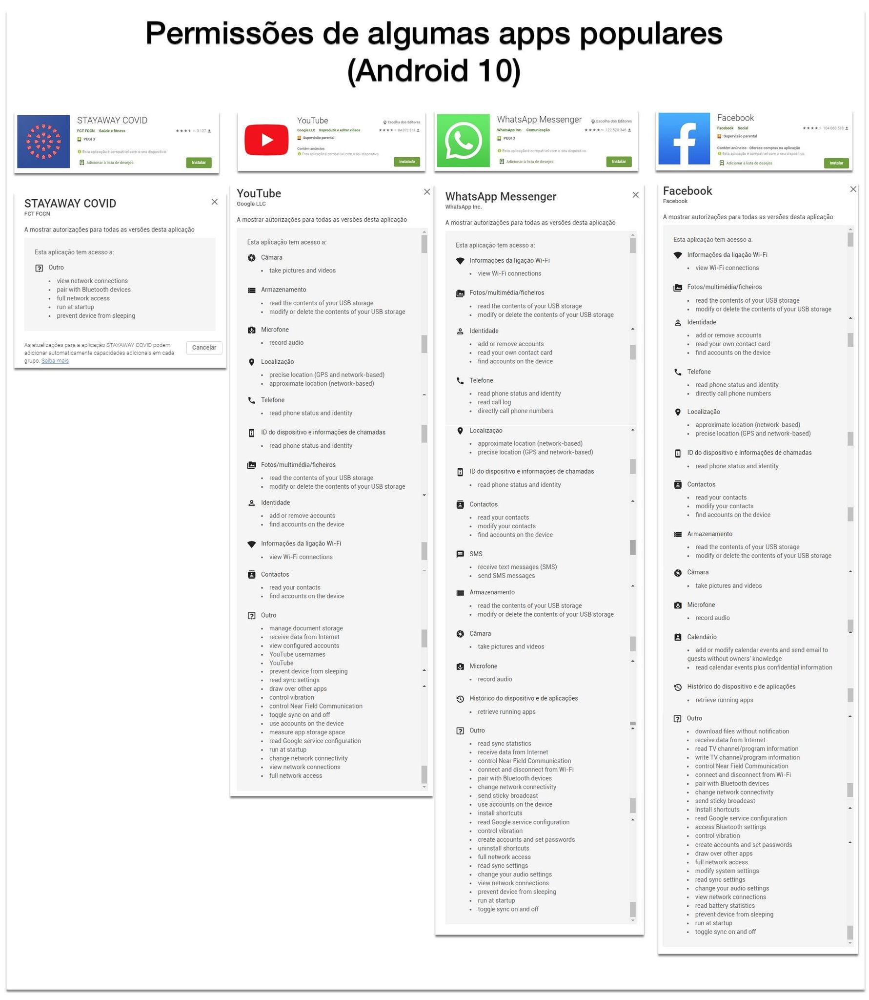
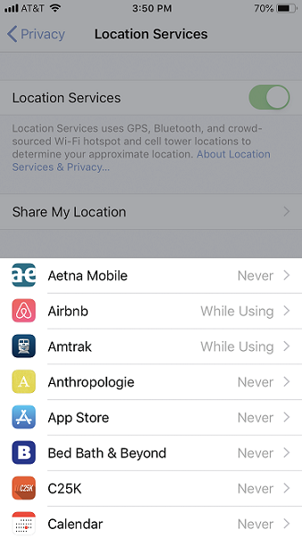

# TOC

* [Medidas Confinamento](#medidas-confinamento)
  * [Confinamento PT](#confinamento-pt)
  * [Confinamento Europa](#confinamento-europa)
  * [Criterios de confinamento](#criterios-de-confinamento)
  * [Positividade vs Testes por caso Positivo](#positividade-vs-testes-por-caso-positivo)
* [Vacinacao](#vacinacao)
  * [Plano de vacinacao PT](#plano-de-vacinacao-pt)
  * [Reportagem CBS 60 minutos](#reportagem-cbs-60-minutos)
* [Reunioes do infarmed](#reunioes-do-infarmed)
  * [11 reuniao do infarmed - sumario](#11-reuniao-do-infarmed---sumario)
  * [11 reuniao do infarmed - detalhes](#11-reuniao-do-infarmed---detalhes)
  * [12 reuniao do infarmed](#12-reuniao-do-infarmed)
  * [13 reuniao do infarmed](#13-reuniao-do-infarmed)
  * [14 reuniao do infarmed](#14-reuniao-do-infarmed)
  * [15 reuniao do infarmed](#15-reuniao-do-infarmed)
* [Reunioes do infarmed - Formato](#reunioes-do-infarmed---formato)
  * [Comentario JMJ sobre as reunioes](#comentario-jmj-sobre-as-reunioes)
  * [Comentario Manuel Carvalho sobre reunioes infarmed](#comentario-manuel-carvalho-sobre-reunioes-infarmed)
  * [Transparencia das reunioes publicas](#transparencia-das-reunioes-publicas)
* [Negacionistas](#negacionistas)
  * [Entrevista Fernando Nobre e Gustavo Carona](#entrevista-fernando-nobre-e-gustavo-carona)
  * [Cherry picking](#cherry-picking)
  * [Meta analises de ivermectina e hidroxicloroquina](#meta-analises-de-ivermectina-e-hidroxicloroquina)
  * [Reportagem e Debate TVI sobre negacionistas](#reportagem-e-debate-tvi-sobre-negacionistas)
  * [Reportagem com Rastreadores](#reportagem-com-rastreadores)
  * [Entrevistas ao chefe dos UCI do Porto](#entrevistas-ao-chefe-dos-uci-do-porto)
  * [Acordao da Relacao fala em 97\x falsos positivos](#acordao-da-relacao-fala-em-97-falsos-positivos)
  * [Acordao da Relacao - detalhes](#acordao-da-relacao---detalhes)
  * [Artigo sobre negacionistas no noticias magazine](#artigo-sobre-negacionistas-no-noticias-magazine)
  * [Analise de um video de negacionistas](#analise-de-um-video-de-negacionistas)
* [Fiabilidade de Testes](#fiabilidade-de-testes)
  * [O que 'e o Evidentia Medica](#o-que-e-o-evidentia-medica)
  * [Jargão estatístico: sensibilidade e especificidade](#jargão-estatístico-sensibilidade-e-especificidade)
  * [Exemplos de FPs e FNs](#exemplos-de-fps-e-fns)
  * [Como posso calcular FPs, FNs e probabilidade pre-teste?](#como-posso-calcular-fps-fns-e-probabilidade-pre-teste)
  * [Os testes sao fiaveis?](#os-testes-sao-fiaveis)
  * [Qual 'e a utilidade de testes sistematicos em massa?](#qual-e-a-utilidade-de-testes-sistematicos-em-massa)
  * [Entrevista a um Rastreador na Amadora](#entrevista-a-um-rastreador-na-amadora)
  * [Velocidade de Rastreamento](#velocidade-de-rastreamento)
  * [Infeccao em ferrovias](#infeccao-em-ferrovias)
  * [Comentario paulo portas, 21 junho](#comentario-paulo-portas-21-junho)
  * [Comentario paulo portas, 12 julho](#comentario-paulo-portas-12-julho)
  * [Manchete do expresso, 1 Agosto](#manchete-do-expresso-1-agosto)
  * [Sobre os testes rapidos](#sobre-os-testes-rapidos)
  * [Artigo Tomas Peuyo no NYT](#artigo-tomas-peuyo-no-nyt)
  * [Podemos apenas proteger os idosos?](#podemos-apenas-proteger-os-idosos)
  * [Covid vs Gripe](#covid-vs-gripe)
  * [Animacao do grafico do ECDC](#animacao-do-grafico-do-ecdc)
  * [Reunioes Familiares sem mascara](#reunioes-familiares-sem-mascara)
  * [2020-11-09 - 3 videos curtos de Tomas Pueyo](#2020-11-09---3-videos-curtos-de-tomas-pueyo)
  * [2020-11-09 - novo artigo de Tomas Pueyo](#2020-11-09---novo-artigo-de-tomas-pueyo)
  * [artigo cientifico sobre dados da DGS](#artigo-cientifico-sobre-dados-da-dgs)
  * [Aprovacao da vacina pela FDA](#aprovacao-da-vacina-pela-fda)
* [APP covid](#app-covid)
  * [Covid vs Facebook etc](#covid-vs-facebook-etc)
  * [Privacidade actual, e perda de privacidade em democracias asiaticas](#privacidade-actual-e-perda-de-privacidade-em-democracias-asiaticas)
  * [App e privacidade](#app-e-privacidade)
  * [Segunda resolucao do CNPD](#segunda-resolucao-do-cnpd)
  * [APP Sumario - 17 Julho](#app-sumario---17-julho)
  * [Como funciona a APP covid](#como-funciona-a-app-covid)
  * [Quais sao as duas tecnologias para as Apps covid? qual 'e a que portugal vai ter?](#quais-sao-as-duas-tecnologias-para-as-apps-covid-qual-e-a-que-portugal-vai-ter)
  * [Porque 'e que o GAEN no Android necessita de localização?](#porque-e-que-o-gaen-no-android-necessita-de-localização)
  * [o GAEN liga a localização no iPhone?](#o-gaen-liga-a-localização-no-iphone)
  * [Os codigos da app nao sao gerados automaticos](#os-codigos-da-app-nao-sao-gerados-automaticos)
  * [Como configurar os servicos de localizacao em Android e Iphone?](#como-configurar-os-servicos-de-localizacao-em-android-e-iphone)
  * [Quantas pessoas já' foram alertadas pela APP?](#quantas-pessoas-já-foram-alertadas-pela-app)
  * [APP covid em espanha](#app-covid-em-espanha)
  * [Carta aberta de 200 cientistas a favor do medelo de APP descentralizado baseado em BT](#carta-aberta-de-200-cientistas-a-favor-do-medelo-de-app-descentralizado-baseado-em-bt)
  * [Sobre Tomas Pueyo](#sobre-tomas-pueyo)
  * [Entrevista a um programador da App](#entrevista-a-um-programador-da-app)
  * [Sobre a APP, no pplware](#sobre-a-app-no-pplware)
  * [APP vs APPs maradas](#app-vs-apps-maradas)
  * [APP tem que estar a funcionar ANTES do teste](#app-tem-que-estar-a-funcionar-antes-do-teste)
  * [Suporte da analise tecnica da App](#suporte-da-analise-tecnica-da-app)
  * [Quanto custou a app](#quanto-custou-a-app)
  * [Como funciona a app por dentro](#como-funciona-a-app-por-dentro)
  * [O que fazer quando a app enviar um alerta / enviar alertas demais](#o-que-fazer-quando-a-app-enviar-um-alerta--enviar-alertas-demais)
  * [A APP 'e demasiado manual](#a-app-e-demasiado-manual)
* [Impacto na Economia](#impacto-na-economia)
  * [Inqueritos da AHRESP](#inqueritos-da-ahresp)
* [Mascaras e EPIs](#mascaras-e-epis)
  * [Quando 'e que a distancia dos 2m não 'e apropriada?](#quando-e-que-a-distancia-dos-2m-não-e-apropriada)
  * [Mascaras da MO / Adalberto](#mascaras-da-mo--adalberto)
  * [Mascaras da MO / Adalberto - detalhes](#mascaras-da-mo--adalberto---detalhes)
  * [Entrevista ao CITEVE](#entrevista-ao-citeve)
  * [Porque 'e que as Mascaras N95/FFP2 filtram particulas mais pequenas que os seus fios](#porque-e-que-as-mascaras-n95ffp2-filtram-particulas-mais-pequenas-que-os-seus-fios)
* [Espacos ao ar livre](#espacos-ao-ar-livre)
  * [Aglomerações ao ar livre - datas](#aglomerações-ao-ar-livre---datas)
* [Relogios](#relogios)
  * [Documentario](#documentario)
* [English](#english)
  * [Summary](#summary)
* [Vários](#vários)
  * [Humor](#humor)
  * [Humor sobre negacionistas](#humor-sobre-negacionistas)
  * [Anormais](#anormais)
  * [Pictures](#pictures)
* [Varios](#varios)
  * [Impacto da sorte no sucesso das pessoas](#impacto-da-sorte-no-sucesso-das-pessoas)
  * [Voluntarios Covid](#voluntarios-covid)
  * [Links recomendados](#links-recomendados)
  
  
  
# Medidas Confinamento

## Mensagem clara em horario nobre
 
Finalmente informacao clara em horario nobre.


## Confinamento PT

Cada concelho teem medidas diferentes um nivel diferente de risco e de medidas

Este site mostra que medidas esao em vigor para o seu concelho:
<https://covid19estamoson.gov.pt/>

Nivel de Risco:
* [Moderado](https://covid19estamoson.gov.pt/medidas-covid19-ambito-nacional-v2/)
* [Elevado](https://covid19estamoson.gov.pt/medidas-covid19-concelhos-risco-elevado/)
* [Muito Elevado](https://covid19estamoson.gov.pt/medidas-covid19-concelhos-risco-muito-elevado/)
* [Extremamente Elevado](https://covid19estamoson.gov.pt/medidas-covid19-concelhos-risco-muito-elevado/)


Este 'e o mapa diario dos concelhos. A cor pode mudar porque as medidas sao decididas a cada 15 dias:
* Mapa dos concelhos: <https://covid19.min-saude.pt/ponto-de-situacao-atual-em-portugal/>


## Confinamento na Europa

o ECDC compara as infeccoes dos varios paises:
https://www.ecdc.europa.eu/sites/default/files/styles/is_full/public/images/w52_53_COVID_subnational_Last_2week.png

Este site compara as limitacoes dos governos. 
Por exemplo a restauracao em ES e NL:

https://reopen.europa.eu/en/map/ESP/6002
https://reopen.europa.eu/en/map/NLD/6001


## Criterios de confinamento

Manuel Carmo Gomes:
**"Proposta de 3 linhas vermelhas. BASTA UMA para actuacao muito forte"**

* Positividade tem que ser menor que 10% (idealmente 5%):
  * [grafico](https://ourworldindata.org/coronavirus-data-explorer?zoomToSelection=true&time=2020-05-08..latest&country=PRT~ESP~FRA&region=World&positiveTestRate=true&interval=smoothed&perCapita=true&smoothing=7&pickerMetric=total_cases&pickerSort=desc)
* Rt menor que 1.1:
  * [grafico aos 1h02m](https://www.youtube.com/watch?v=C_j2wzGboz8)
* Casos < 200/dia:
  * [grafico](https://ourworldindata.org/coronavirus-data-explorer?zoomToSelection=true&time=2020-05-08..latest&country=PRT~ESP~FRA&region=World&casesMetric=true&interval=smoothed&perCapita=true&smoothing=7&pickerMetric=total_cases&pickerSort=desc)
* Hospitais < 1500, UCI < 200:
  * [grafico, clicar 5 vezes na seta da esquerda](https://esriportugal.maps.arcgis.com/apps/opsdashboard/index.html#/e9dd1dea8d1444b985d38e58076d197a)


Sumario Expresso:
<https://expresso.pt/coronavirus/2021-02-09-Carmo-Gomes-deu-uma-aula-a-Costa-medidas-graduais-nao-servem-precisamos-de-testagem-forte-e-criterios-claros-para-fechar-e-desconfinar>

Sumario Observador:
<https://observador.pt/programas/emissao-especial/a-testagem-e-nao-o-confinamento-e-a-arma-principal-que-devemos-usar>

Saida de MCG das reunioes:
<https://sicnoticias.pt/especiais/coronavirus/2021-02-09-Manuel-Carmo-Gomes-explica-por-que-razao-decidiu-deixar-de-integrar-as-reunioes-do-Infarmed>

## Positividade vs Testes por caso Positivo

Testamos muito? Testamos pouco?

Os dois graficos abaixo mostram EXACTAMENTE a mesma informacao.

Mas no da esquerda parece que estamos a meio caminho, mas na direita estamos muito longe da Dinamarca.

Mais uma vez: sao o mesmo grafico. Sao os mesmos dados. A unica diferenca 'e quem 'e que divide o que.

O da direita mostra que fazemos o dobro dos testes de Franca, mas oito vezes menos testes que a Dinamarca.

[Fonte 1](https://ourworldindata.org/explorers/coronavirus-data-explorer?zoomToSelection=true&time=390..408&pickerSort=asc&pickerMetric=location&Metric=Share+of+positive+tests&Interval=7-day+rolling+average&Relative+to+Population=true&Align+outbreaks=false&country=PRT~DNK~FRA)  
[Fonte 2](https://ourworldindata.org/explorers/coronavirus-data-explorer?zoomToSelection=true&time=390..408&pickerSort=asc&pickerMetric=location&Metric=Tests+per+confirmed+case&Interval=7-day+rolling+average&Relative+to+Population=true&Align+outbreaks=false&country=PRT~DNK~FRA)  


## Portugal no topo do mundo

Janeiro 2021:

Primeiro grafico: Portugal no topo do mundo em casos/1 Milhao.  
Segundo grafico: Cada vez fazemos MENOS testes. Os casos positivos por Teste devia ser 4%.  


## Janeiro 2021 - Hospitais em ruptura

Hospital da Guarda em rutura.
<https://sicnoticias.pt/especiais/coronavirus/2021-01-06-Hospital-da-Guarda-em-rutura.-Imagens-mostram-camas-amontoadas-nos-corredores>

Sera' fake news? sera' em portugal? sera' de ontem? etc etc

A forma mais simples de confirmar isso 'e ver a noticia seguinte:

"O Hospital da Guarda confirma que o momento é muito difícil e anunciou já que vai redimensionar o espaço na urgência geral para diluir os doentes no espaço.
As imagens divulgadas esta quarta-feira pela SIC mostram uma urgência não covid quase sem espaço, com doentes acamados nos corredores."

<https://sicnoticias.pt/especiais/coronavirus/2021-01-06-Hospital-da-Guarda-anuncia-novo-plano-de-acomodacao-de-doentes-nas-urgencias-1>


# Vacinacao

## Plano de vacinacao PT

* plano vacinaco (19 paginas): <https://www.sns.gov.pt/wp-content/uploads/2019/06/PlanoVacinacaoCovid_19.pdf>
* apresentacao task force (32 slides): <https://www.sns.gov.pt/wp-content/uploads/2019/06/ApresPlanoVacCovid19_FrancoscoRamos.pdf>
* apresentacao infarmed (12 slides): <https://www.sns.gov.pt/wp-content/uploads/2019/06/ApresPlanoVacCovid19_RuiSantosIvo.pdf>
  * VACINAS PARA A COVID-19: Desenvolvimento, aprovação e acesso
 
 
sumario: <https://www.sns.gov.pt/noticias/2020/12/03/covid-19-plano-de-vacinacao/>
 

## Reportagem CBS 60 minutos

Excelente reportagem da CBS sobre a logistica de distribuicao da vacina, liderada pelo especialista militar do aprovisionamento nos EUA:\  
<https://www.cbsnews.com/search/?q=warp+speed>

Comparacao com portugal, ver aos 25m:\  
<https://www.rtp.pt/play/p6690/o-ultimo-apaga-a-luz>
"uma task force de 12 entidades 'e um dia bem passado" -> "task force da task force" -> "comissao de inquerito" -> "alto comissario"
 

## Passaporte Covid

Sobre o "passaporte" covid, vejo comentadores na TV que não dizem o mais importante: o certificado FACILITA a viagem ao DISPENSAR o teste. E' tudo. 

Informação da fonte:  
"Os cidadãos ainda não vacinados poderão viajar para outro país da UE?  
Sim. O Certificado Verde Digital deverá facilitar a livre circulação na UE, mas não será uma condição prévia para a mesma"

<https://ec.europa.eu/info/live-work-travel-eu/coronavirus-response/safe-covid-19-vaccines-europeans/covid-19-digital-green-certificates_pt#os-cidados-ainda-no-vacinados-podero-viajar-para-outro-pas-da-ue>

## Seguranca das vacinas

O assunto do dia e' a segurança das vacinas.

Da astrazeneca houve 37 casos de trombose/embolia em 17 milhões. 

Isto e' a prevalência normal de tromboses na população. Não e' causado pela vacina.

E' mais provável serem atingidos por um raio no próximo ano:
<https://www.cdc.gov/disasters/lightning/victimdata.html>

Se todos os 10M portugueses tomassem esta vacina (2 doses) iamos ter 43 casos no TOTAL. 
Em Janeiro morreram 300 __POR DIA__.


A explicação é que as pessoas teem imensa dificuldade em comparar percentagens derivadas de numeros muito grandes.
Pelo que ficam agarradas aos números absolutos pequenos, que compreendem melhor.
Se não querem tomar a vossa vacina, em particular da astra zeneca, sff dêem o meu nome!

## Comparacao das 5 vacinas

"your local epidemiologist" 'e uma pagina no FB que recomendo. Informacao directa de Ciencia explicada de forma simples.

<https://yourlocalepidemiologist.substack.com/about>

Em particular manteem actualizado esta tabela comparando as vacinas das diferentes marcas:


  
# Negacionistas

## Entrevista Fernando Nobre e Gustavo Carona 

Ver em baixo duas entrevistas fundamentais para perceber que sobre o covid so' contam as opinioes:
- dos especialistas (virulogistas) 
- e dos intensivistas (UCIs) que ficam com a batata quente no fim.

----
A primeira entrevista 'e a Fernando Nobre, medico cirurgiao e fundador da AMI, que diz uma quantidade incrivel de asneiras seguidas.
como qualquer pessoa normal, tinha uma percepcao muito boa sobre esta pessoa; esta entrevista mostrou-me a realidade.
https://www.youtube.com/watch?v=F8PfJMIuLnk

A seguinda entrevista foi na semana imediatmente a seguir a Gustavo Carona, médico intensivista que trabalha na UCI de matosinhos. 
Este sim esta' na linha da frente onde a batata quente vai parar, e ao longo dos 90m desmonta completamente todas as asneiras da grossa da entervista anterior.
https://www.youtube.com/watch?v=G1Lq7Z6xT2A
https://rr.sapo.pt/2020/11/11/pais/m/especial/214351/

update: conversa com bruno nogueira:
https://www.facebook.com/watch/?ref=saved&v=841195703394686


## Cherry picking

<https://pt.wikipedia.org/wiki/Evid%C3%AAncia_suprimida>

Evidência suprimida, supressão de evidências ou evidência incompleta (em inglês: cherry picking) 
é uma falácia que consiste em citar casos ou dados individuais que parecem confirmar uma determinada 
posição, ao mesmo tempo em que se ignora uma porção significativa de casos ou dados relacionados 
que possam contradizer aquela posição. É um tipo de falácia de atenção seletiva, sendo seu 
exemplo mais comum o viés de confirmação. Ela pode ser feita de forma intencional e 
também de forma não intencional. É um grande problema em debates públicos.

Numa frase: se escolhermos os numeros que nos convem, e ignoramos a maioria esmagadora dos outros (que mostram o contrario), 
entao podemos "provar" tudo o que quisermos e o seu contrario.


Quando vemos "cherry picking" propositado, isso 'e ma'-fe';
Noutras pessoas pode ser apenas ignorancia cientifica e desleixo, quando partilham mensagem erradas sem as verificarem em fontes crediveis ("poligrafo", "fact checking", etc).


## Correlacao vs Causalidade - Variaveis ocultas

Esta estatisticamente provado que quando se vendem mais gelados, ha mais afogamentos.  
Sera' que as criancas caem na piscina a correr com o gelado na mao?

Nao. Uma nao causa a outra.  
Em vez disso, ambas sao causadas por uma terceira variavel oculta: a tempertura.

Temperaturas altas levam a mais gelados e a mais afogamentos.
<https://www.thoughtco.com/correlation-and-causation-in-statistics-3126340>

Em baixo muiot mais exemplos:


## Meta analises de ivermectina e hidroxicloroquina

Analise do poligrafo brazil: <https://piaui.folha.uol.com.br/lupa/2021/02/23/anuncio-medicos-pela-vida-covid-19/> sobre as meta analises do site <https://c19study.com/>, <https://c19ivermectin.com/> e similares:

"o suposto estudo é uma meta-análise, ou seja, uma análise feita com base em outros trabalhos existentes. 
(...) O problema é que, nesse caso, a análise é feita sem metodologia e rigor científico."

"A eficácia de um tratamento só pode ser realmente comprovada com estudos científicos que 
usam uma metodologia rigorosa:
* randomização 
* duplo-cego 
* publicados em uma revista científica + peer-review"


Problemas:
* Os p-valor sao simplemente multiplicados entre si = LIXO ESTATISCO
* Misturam pre-prints com erros graves e que nunca vao ser publicados, com estudos "a serio" publicados. 
  * So' o estudo publicados em revistas cientificas e' que contam, por terem sido verificados pelos pares (=especialistas).
* Todos os estudos teem todos pesos iguais. Estudos com qualidade zero, ou negativa teem o mesmo peso 1. 

manifesto falso: <https://piaui.folha.uol.com.br/lupa/wp-content/uploads/2021/02/manifesto-medicos-pela-vida.pdf>

## Milhoes vs Bilioes de segundos


Todos os dias ouvimos falar de "Milhoes de euros", mas tambem de "Mil milhoes de euros".  
Essa 'e a diferenca basica entre um Milionario e um Bilionario nos EUA.

Para ter uma idea, um milhao de segundos sao 11 Dias.  
Mil milhoes de segundos sao 31 Anos.


## Reportagem e Debate TVI sobre negacionistas

Excelente reportagem e debate da TVI sobre os "medicos pela verdade". 

No grupo ha' psicologos, dentistas e enfoermeiros.
Mas nao tem nenhum medico de saude publica, epidemiologita ou virulogista.

Problemas semelhantes nos "jornalistas pela verdade". Quem da' a cara nao e' jornalista.

Reportagem:
<https://tviplayer.iol.pt/video/5fad9d950cf203abc5b0c31e>

O debate comeca aos 1h18m deste video:
<https://tviplayer.iol.pt/video/5fadcf1b0cf2c785555011b9>

Update 2021-02-11:\ 
mais quatro médicos pela verdade condenados:
<https://tviplayer.iol.pt/video/60258c5d0cf245b9a97a76b6>


## Fim dos medicos pela verdade

Uma excelente noticia!

Observador:
<https://observador.pt/2021/02/09/movimento-medicos-pela-verdade-suspende-redes-sociais-e-anuncia-interregno/>

Visao:
<https://visao.sapo.pt/atualidade/sociedade/2021-02-09-fim-dos-medicos-pela-verdade-o-chega-e-as-afinidades-que-a-visao-destapou/>

## Reportagem com Rastreadores

"Ninguem está a tossir. Se daqui a um mês eu tiver covid, por amor de deus nao me liguem para a linha saude24, porque vos põem em isolamento DESNECESSARIAMENTE e adicionam lixo ao sistema"

Excelente reportagem com os rastreadores da covid sobre o lixo da SNS24.
Fica a ideia que o governo está a poupar tostões aqui, para perder milhões na perda da economia.

Sumario:
00:50 Festas privadas com centenas de pessoas só podem ser interrompidas pela GNR com mandato judicial
01:35 Naquela unidade sao 40 rastreadores, deviam ser 100.
02:20 Ha' casos que os infectados tiveram >80 contactos nos últimos 14 dias (!). Todos têm que ser contactados um a um. Cada telefonema demora 20 minutos.
03:15 As pessoas mentem os rastreadores
04:06 O traceCovid tem imenso "lixo" lá colocado pela linha saude24. Lixo = contactos de baixo risco e que atrasam os realmente importantes.
04:30 Os contactos devem simplesmente ficar à espera. Mas como ficam assustados, ligam SEM RAZÃO para a saude24 e recebem instrução de isolamento (sem necessidade!)
04:53 Muitas pessoas ficam em isolamento sem necessidade, porque nao foram contactos de risco. Exemplo: alguém que contactou um doente
05:10 Ninguém está a tossir. Se daqui a um mês eu tiver covid, por amor de deus nao me liguem para a linha saude24, porque vos poeem em isolamento DESNECESARIAMENTE e adicionam lixo ao sistema"
05:50 Sistema de informática "em baixo"
06:26 delegados de saúde têm todo o tipo de pedidos sem qualquer interesse (pombas a sujar, cães a ladrar)
07:33 Restaurantes escolas, lares, lojas, restaurantes, ginásios, feiras, vigilância 'a população, juntas médicas e assuntos nao-covid
07:57 Pessoas à beira do limite - contadas na primeira pessoa

<https://sicnoticias.pt/especiais/coronavirus/2020-11-21-Covid-19.-Delegados-de-saude-alertam-que-ha-pessoas-em-isolamento-sem-necessidade>


## Entrevistas ao chefe dos UCI do Porto

Duas entrevistas ao chefe dos Cuidados Intensivos do Sao Joao (Porto).
'E este o medico que fica com a batata quente com o aumento exponencial dos casos intensivos que lhe batem 'a porta, sem parar.
Quaisquer que sejam os recursos, nunca chegariam para um aumento exponencial de casos; um aumento de 30% 'e irrisorio se for necessario um aumento de 1000% (por exemplo). 
Tanto Covid como nao-covid. Porque ninguem serio vai negar UCI aos covid - e esses enchem tudo, e os nao-covid vao chegando tarde. 
Tudo isto 'e evitavel. Todos sabem o que fazer. O timeline 'e ate' o pais estar 70% vacinado. 

RTP3 grande entrevista:
<https://www.rtp.pt/play/p6646/e500951/grande-entrevista>

Expresso entrevista:
<https://www.facebook.com/groups/205024390569013/permalink/361827324888718/>


## Acordao da Relacao fala em 97% falsos positivos

"Ora, da leitura do artigo, concluem as juízas que “a probabilidade de a pessoa receber um falso positivo é de 97% ou superior”."

O assunto do momento 'e o acordao da Relacao sobre a DRS dos Acores. 

Eu fui ler o dito acordao e os 2x artigos cientificos citados. 
Posso afirmar SEM QUALQUER DUVIDA esta conclusao esta' completamente errada, e' completamente irresponsavel, e demonstra ignorancia atroz de assuntos cientificos.

Artigos Cientificos sao destinados a Cientistas dessa area especifica. Nao sao destinados ao publico em geral.

---
O resultado esta' 'a vista. Conceitos de sensibilidade estatistica e especificidade estatistica sao extremamente complicados de perceber, medir e dominar.
https://pestrela.github.io/covid/#jarg%C3%A3o-estat%C3%ADstico-sensibilidade-e-especificidade

Isto sim 'e informacao correcta sobre este assunto:
“Os testes de PCR têm uma especificidade e sensibilidade superiores a 95%. Isto é, na esmagadora maioria dos casos detectam o vírus que provoca a covid-19”.

<https://www.publico.pt/2020/11/17/sociedade/noticia/juizas-fazem-leitura-errada-artigos-cientificos-poe-causa-fiabilidade-testes-covid19-1939616>
<https://www.publico.pt/2020/11/17/ciencia/opiniao/testes-diagnostico-covid19-capricho-irresponsabilidade-tribunal-relacao-1939606>


extra:
* post: <https://www.facebook.com/scimed.evidencia/posts/1010122222802944>
* numeros oficiais: <https://www.worldometers.info/coronavirus/country/portugal/>
* Acordao: <http://www.dgsi.pt/jtrl.nsf/33182fc732316039802565fa00497eec/79d6ba338dcbe5e28025861f003e7b30>

## Acordao da Relacao - detalhes

Existem muitos conceitos legais que ja' sao dificeis de entender para Engenheiros, e ainda pior para Cientistas.
- "sem margem de dúvida razoável"
- "interpretacao da lei"
- "suspeita razoavel"

Que, sem surpresa, 'e um dos termos usados na decisao:
"Face à actual evidência científica, esse teste mostra-se, só por si, incapaz de determinar, sem margem de dúvida razoável, que (...)"
<http://www.dgsi.pt/jtrl.nsf/33182fc732316039802565fa00497eec/79d6ba338dcbe5e28025861f003e7b30>

decisao essa em que os juizes reconhecem que nao sao especialistas:
"e neste campo, o julgador terá de se socorrer do saber dos peritos na matéria"

Mas depois usam este excerto de uma CARTA ao editor (publicado sem revisao pelos pares):
"Isto significa que se uma pessoa tem um teste PCR positivo a um limiar de ciclos de 35 ou superior (como acontece na maioria dos laboratórios do EUA e da Europa), as probabilidades de uma pessoa estar infectada é menor do que 3%. A probabilidade de a pessoa receber um falso positivo é de 97% ou superior”."

Este excerto foi posterioremente APAGADO do original. So' este facto ja' invalida a argumentacao:
<https://academic.oup.com/cid/advance-article/doi/10.1093/cid/ciaa1491/5912603>

O resultado 'e termos esta perola num acordao, assumidamente em traducao livre:
" "A probabilidade de a pessoa receber um falso positivo é de 97% ou superior" "

Aguardo com expectativa a jurisprudencia que sair deste acordao.


## Artigo sobre negacionistas no noticias magazine

do artigo:

Acreditam em factos alternativos mirabolantes e em cabalas mundiais. E descobrem essas “verdades” em fóruns online, grupos de Facebook ou canais de YouTube que não são controlados por aqueles que os querem enganar. Quem são estes negacionistas e conspiracionistas? E como falar com eles?

“É importante lembrar que a negação da ciência não tem que ver com a argumentação racional. Se fosse, fornecer evidências seria suficiente para mudar a opinião dos negacionistas e conspiracionistas”

“O negacionista conhece os ‘factos’, mas simplesmente recusa-se a acreditar neles. Porquê? Porque interferem com outras coisas em que deseja acreditar, entram em conflito com a sua identidade, ou porque não confia nas pessoas que lhes fornecem esses factos.”
Como falar com um negacionista?

“Saber ou não saber os factos científicos é o menos relevante, o mais importante é explicar às pessoas como é que a ciência funciona, como avança, o que é o consenso científico”

<https://www.noticiasmagazine.pt/2020/o-extraordinario-mundo-dos-negacionistas/historias/253566/>


## Analise de um video de negacionistas

Este 'e um exemplo tipico de negacionistas:
<https://www.facebook.com/joao.coelho.5201/posts/10219735143302856>

A primeira coisa a fazer deve ser sempre procurar se este video ja' apareceu num "poligrafo" / "fact checking", o que 'e o caso:
<https://www.google.com/search?q=dolores+cahill+fact+checking>

Se isto nao chegasse, entao as principais alegacoes sao:
a) "eles" (os governos?) lancam virus todas os invernos e que "escolheram um errado" (um forte demais?).
b) Os numeros ate' fevereiro teem uma letalidade marginal

Procurando nao se encontra nenhuma prova destas alegacoes
<https://people.ucd.ie/dolores.cahill>
<https://www.irishtimes.com/news/ireland/irish-news/ucd-professor-asked-to-resign-from-eu-committee-over-covid-19-claims-1.4277698>
<https://www.thejournal.ie/dolores-cahill-coronavirus-video-facebook-twitter-5148488-Aug2020/>

Segundo, nada disto bate certo com a realidade dos hospitais cheiois, 
nem com a alegacao que "usaram o virus errado".


## Comentarios Raquel Varela e Carlos Antunes

Raquel varela:
"só olhando para o valor avançado por Carlos Antunes é um erro de 340%."
https://www.facebook.com/raquelvarelahistoriadora/posts/264864001671243

Carlos antunes:
"Sobre uma suposta publicação de uma Raquel Varela... que visou o meu nome:"
https://www.facebook.com/carlos.antunes.908/posts/10158862801999014

Entrevista a carlos antunes no poligrafo:
https://sicnoticias.pt/programas/poligrafo/2021-02-09-Covid-19.-Fecho-das-escolas-foi-determinante-para-queda-abrupta-de-casos


# Reunioes do infarmed
 

## 11 reuniao do infarmed - sumario

https://www.youtube.com/watch?v=WnhTjcoOgSo&t=8892s
 
UPDATE1: as apresentacoes da décima, e ultima, reunião do infarmed sao agora publicas.

Pdfs: <https://www.sns.gov.pt/noticias/2020/07/08/covid-19-10-a-reuniao-tecnica/>
Video: <https://www.youtube.com/watch?v=WnhTjcoOgSo>

* [Geografia: internacional e nacional -- Percepção social](https://www.sns.gov.pt/wp-content/uploads/2020/07/infarmed-0807-Carla-Nunes-ef.pdf)
* [Inquérito Serológico Nacional à Infeção pelo novo Coronavírus](https://www.sns.gov.pt/wp-content/uploads/2020/07/infarmed_0807_Ana_Paula_Rodrigues.pdf)
* [Monitorização da situação epidemiológica em Portugal e noutros países da UE](https://www.sns.gov.pt/wp-content/uploads/2020/07/infarmed_0807_Baltazar_Nunes.pdf)
* [Situação Epidemiológica da Covid-19 nacional e da ARS LVT](https://www.sns.gov.pt/wp-content/uploads/2020/07/infarmed_0807_Ines_Fronteira.pdf)
* [Gabinete de Intervenção -- Principais Ações](https://www.sns.gov.pt/wp-content/uploads/2020/07/infarmed_0807_Rui_Portugal.pdf)
  * (analisada em detalhe na rubrica do paulo portas 12 julho)
* [Tempos de estadia hospitalar dos doentes Covid e projeções para ocupação hospitalar Covid](https://www.sns.gov.pt/wp-content/uploads/2020/07/infarmed_0807_MCG.pdf)

A apresentação do prof Henrique Barros, [por vídeo conferencia](https://www.publico.pt/2020/07/09/sociedade/noticia/covid19-proximidade-linhas-ferreas-nao-associado-aumento-risco-infeccao-1923684),
 nao esta' ainda disponível.

## 11 reuniao do infarmed - detalhes

Data: 7 setembro 2020

Voltaram as reuniões do "infarmed" - a [décima primeira](https://www.sns.gov.pt/noticias/2020/09/07/covid-19-11-a-reuniao-tecnica/).

A maioria das apresentações foram meramente expositivas. Embora comum, este NAO 'e o melhor contributo esperado dos Cientistas.

Como explica Ricardo Baptista Leite [na CMTV](https://www.facebook.com/ricardo.baptistaleite/videos/10157564929235509/), 
os Cientistas devem fazer recomendações concretas e accionaveis, 
suportados por uma elaboração expositiva necessária para clarificar o porque^ da dita recomendação.


----
A melhor apresentação foi do Prof de Epidemiologia [Manuel do Carmo Gomes](https://webpages.ciencias.ulisboa.pt/~mcgomes/perfil/Cvenglish.pdf), FCUL, 
que começa aos 2h08m. 

Nesta são mostradas simulações que explicam que só por si a abertura das escolas sem restriccoes 'e suficiente para levar a uma segunda vaga.

Aos 2h28m são apresentadas as recomendações praticas para evitar isso, mas mantendo as escolas abertas.  
<https://youtu.be/WnhTjcoOgSo?t=8891>

A ultima apresentação do Prof. [Henrique Barros](https://ispup.up.pt/people/5432/about/?lang=pt) foi também excelente, no mesmo assunto, 
cobrindo as o que aconteceu nos outros países que já abriram as as escolas 'a uma mes. 
Igualmente esta apresentacao foi das poucas com medidas claras
<https://youtu.be/WnhTjcoOgSo?t=9455>

[Sumario na imprensa 1](https://ionline.sapo.pt/artigo/708105/coinfecoes-e-hotspots-resumo-de-uma-reuniao-que-aqueceu-na-segunda-parte-?)  
[Sumario na imprensa 2](https://www.noticiasaominuto.com/pais/1579101/tudo-sobre-reuniao-do-infarmed-ainda-vamos-a-tempo-de-evitar-2-vaga)  


## 12 reuniao do infarmed

19 Novembro 2019

<https://www.sns.gov.pt/noticias/2020/11/19/covid-19-evolucao-em-portugal/>

Apresentacoes:
* Situação epidemiológica atual
* Situação epidemiológica na Administração Regional de Saúde do Norte
* Projeções de curto prazo para a epidemia
* Contextos de infeção
* Perceções sociais sobre a Covid-19
* Utilização de cuidados intensivos
* Vacina contra a Covid-19

os slides desta sessão nao foram disponibilizados. 
(na sessao anterior foram ([link](https://www.sns.gov.pt/noticias/2020/07/08/covid-19-10-a-reuniao-tecnica/))


## 13 reuniao do infarmed


Sumario: <https://www.sns.gov.pt/noticias/2020/12/03/covid-19-situacao-epidemiologica-4/>
Programa: [link](https://www.sns.gov.pt/wp-content/uploads/2020/12/reuniao_infarmed_03122020_1.pdf)

3 de Dezembro de 2020

* Parte 1 - Situagao Epidemiologica
  * Situacao Epidemiologica Atual (André Peralta Santos - Dgs)
  * Situacao Epidemiologica Na Ars Norte (Oscar Felgueiras - Fcup )
  * Evolucao Da Incidencia E Transmissibilidade (Baltazar Nunes - Dr. Ricardo Jorge)
  * Projecoes De Curto Prazo Para A Epidemia (Manuel Do Carmo Gome - Fcul)
* Parte 2: Vacinas
  * Como Funciona O Sistema Imunitario E Atuam As Vacinas (Joao Goncalves - Fful)
  * Como Sao Produzidas As Vacinas (Antonio Roldao -  Ibet)
  * Vacinas Covid-19 Em Desenvolvimento, Processo De Avaliacao E Autorizacao (Fatima Ventura - Infarmed)
  * Lidar Com A Incerteza Na Gestao Da Infegao E Da Imunidade (Henrique De Barros - Ispup)
  * Percepcoes Sociais Sobre As Vacinas Contraacovid-19 (Carla Nunes - Enspup)

## 14 reuniao do infarmed

12 janeiro de 2021

sumario: <https://www.sns.gov.pt/noticias/2021/01/12/covid-19-situacao-epidemiologica-5/>
programa: <https://www.sns.gov.pt/wp-content/uploads/2021/01/20210112_COVID-19_Programa.pdf>

Slides/transmissao TV: <https://www.youtube.com/watch?v=C_j2wzGboz8>  (duracao: 2h05m)

comentario PS: <https://www.youtube.com/watch?v=DfmjgdeikGU>
comentario PSD: <https://www.youtube.com/watch?v=S6Y1L9OgG2g>


* Situação epidemiológica no país (André Peralta Santos - Dgs)
* Situação epidemiológica na Administração Regional de Saúde do Norte Oscar Felgueiras - Fcup )
* Situação epidemiológica na Administração Regional de Saúde de Lisboa e Vale do Tejo (Duarte Tavares - ARSLVT)
* Evolução da incidência e transmissibilidade (Baltazar Nunes - Dr. Ricardo Jorge)
* Vigilância de variantes genéticas do novo coronavírus em Portugal (Joao Paulo Gomes - Dr. Ricardo Jorge)
* Projeções de curto prazo para a epidemia (Manuel Do Carmo Gomes - Fcul)
* Covid-19 | Risco, prognóstico a longo prazo e expetativas (Henrique De Barros - Ispup)
* Perceções sociais sobre a Covid-19 (Carla Nunes - Enspup)
* Ponto de situação do plano de vacinação contra a Covid-19 (Francisco Ramos - Task Force)

  
  

## 15 reuniao do infarmed

9 fevereiro de 2021

sumario: <https://www.sns.gov.pt/noticias/2021/02/09/situacao-epidemiologica-da-covid-19/>
programa: <https://www.sns.gov.pt/wp-content/uploads/2019/06/2021.02.09_-ReunInfarmedPrograma.pdf>

Slides/transmissao TV: <https://www.youtube.com/watch?v=ZR1cM9qrLRM>  (duracao: 2h06m)


* Situação epidemiológica no país (André Peralta Santos - DGS)
* Evolução da incidência e transmissibilidade (Baltazar Nunes - Dr. Ricardo Jorge)
* Vigilância de variantes genéticas do novo coronavírus em Portugal (Joao Paulo Gomes - Dr. Ricardo Jorge)
*
* Evolução epidemiológica e critérios de atuação (Manuel Do Carmo Gomes - FCUL)
* Efeito da vacinação nos internamentos e na mortalidade  (Henrique De Barros - ISPUP)
* Perceções sociais sobre a Covid-19 (Carla Nunes - ENSPUP)
* Ponto de situação do plano de vacinação contra a Covid-19 (Henrique Gouveia e Melo - Task Force)


## 16 reuniao do infarmed

8 marco de 2021

sumario: <https://www.sns.gov.pt/noticias/2021/03/08/situacao-epidemiologica-da-covid-19-4/>
programa: <https://www.sns.gov.pt/wp-content/uploads/2021/03/20210308_COVID-19_Programa.pdf>

Slides/transmissao TV: <https://www.youtube.com/watch?v=rx9g2PEpVbs>  (duracao: 1h44m)

descricao: "Descida de novos casos de Covid-19" <https://www.sns.gov.pt/noticias/2021/03/08/descida-de-novos-casos-de-covid-19/>
descricao: "Índice de transmissibilidade" <https://www.sns.gov.pt/noticias/2021/03/08/covid-19-indice-de-transmissibilidade/>

* 3m: Situação epidemiológica no país (André Peralta Santos - DGS)
* 10m: Evolução da incidência e transmissibilidade (Baltazar Nunes - Dr. Ricardo Jorge)
* 20m: Vigilância de variantes genéticas (Joao Paulo Gomes - Dr. Ricardo Jorge)
*
* 34m: Resposta À Pandemia Percursos Para A Decisão (Henrique Barros - ISPUP)
* 52m: Critérios Para Uma Pandemia Controlada: Fases 2 E 3 (Baltazar Nunes - Grupo De Peritos)
* 1h12m: Plano Para Redução Das Medidas Restritivas (Óscar Felgueiras - ARSN / Raquel Duarte )

 
imprensa: linhas vermelhas <https://observador.pt/especiais/as-linhas-vermelhas-para-recuar-no-desconfinamento-se-a-epidemia-se-descontrolar-outra-vez/>


## 17 reuniao do infarmed

23 marco de 2021:
* sumario: <https://www.sns.gov.pt/noticias/2021/03/23/covid-19-reuniao-de-peritos/>  
* comentario 'a saida: <https://www.sns.gov.pt/noticias/2021/03/23/covid-19-reuniao-com-peritos-3/>
* transmissao TV: <https://www.youtube.com/watch?v=NhILHa9ORjg>  (duracao: 1h44m)


Apresentacoes:
* Andre Peralta: [Situação epidemiológica no país](https://www.sns.gov.pt/wp-content/uploads/2021/03/ANDR%C3%89-PERALTA.pdf)
* Baltazar Nunes e Ricardo Mexia [Evolução da incidência e transmissibilidade](https://www.sns.gov.pt/wp-content/uploads/2021/03/BALTAZAR-NUNES_RICARDO-MEXIA.pdf)
* Paulo Gomes:  [Atualização da vigilância de variantes genéticas do novo coronavírus em Portugal](https://www.sns.gov.pt/wp-content/uploads/2021/03/JO%C3%83O-PAULO-GOMES.pdf)
* Henrique Barros: [Covid-19 em Portugal | Um ano de aprendizagem](https://www.sns.gov.pt/wp-content/uploads/2021/03/HENRIQUE-BARROS.pdf)
* Carla Nunes: [Perceções sociais sobre a Covid-19](https://www.sns.gov.pt/wp-content/uploads/2021/03/CARLA-NUNES.pdf)
* Henrique Melo: [Ponto de situação do Plano de Vacinação contra a Covid-19](https://www.sns.gov.pt/wp-content/uploads/2021/03/HENRIQUE-MELO.pdf)

imprensa:
* [Infarmed. Reunião com poucos dados deixou Governo otimista e partidos desconfiados](https://observador.pt/especiais/infarmed-ferro-preocupado-com-reinfecoes-marcelo-agradeceu-aos-especialistas-costa-calado/)
* [Avançar com cautela. As reações à reunião do Infarmed](https://www.dn.pt/politica/avancar-com-cautela-a-reacao-dos-partidos-a-reuniao-do-infarmed--13490568.html)


# Reunioes do infarmed - Formato

O formato actual das reunioes do infarmed 'e extremamente ineficiente:
* **2h** de apresentacoes demasiado detalhadas 
  * Esta parte extende-se facilmente muito alem das 2h
* **30m** de perguntas dos decisores politicos

A minha proposta:
* dia 1: a actual reuniao SEM os decisores politicos, super detalhada, com perguntas dos especialistas entre cada apresentacao 
* dia 2: um especialista de [comunicacao cientifica](https://sigarra.up.pt/feup/pt/cur_geral.cur_view?pv_curso_id=18081) 
(ex: [Carlos Fiolhais](https://pt.wikipedia.org/wiki/Carlos_Fiolhais)) fazia um sumario de toda a sessao, tendo que coligir contributos mais relevantes de todas as apresentacoes
* dia 3: Uma segunda reuniao COM os decisores politicos:
  * **30m** de apresentacao 
  * **2h** de perguntas/discussao dos decisores politicos, com os especialistas do dia 1
  


Ver tambem abaixo a opiniao de comentadores profissionais


## Comentario JMJ sobre as reunioes
comentario de Jose Miguel Judice sobre as reunioes do infarmed aos 18m40s:

"podiam mandar os powerpoints em vez de dar aulas"

<https://sicnoticias.pt/opiniao/analise/2020-09-08-O-estado-do-PCP-e-as-eleicoes-presidenciais.-As-Causas-de-Jose-Miguel-Judice>

Ouvi comentários semelhantes de ricardo baptista leite na CMTV, referindo-se a estas sessoes como "jornadas de saude".
link: TBD


## Comentario Manuel Carvalho sobre reunioes infarmed

<https://www.publico.pt/2020/06/28/opiniao/editorial/abram-portas-reuniao-infarmed-1922188>

“As avaliações contraditórias sobre o que lá foi dito, os rumores desencontrados sobre irritações, 
zangas ou puxões de orelhas e a suspeita de que o espírito de compromisso entre políticos e cientistas
 acabou exigem uma de duas respostas: ou as reuniões do Infarmed deixam de se fazer por se tornarem 
 um perturbante factor de ruído; ou abrem-se as suas portas para que todos os cidadãos possam saber
 com transparência o que lá se disse e passou.”

## Transparencia das reunioes publicas

pedido que as informacoes / apresentacoes teem que ser enviadas ao parlamento a cada 15 dias.
Votos contra do PS.

requerimento: [link](https://www.esquerda.net/sites/default/files/requerimento_entrega_de_dados_covid19_comissao_de_saaode.pdf)
aprovacao com votos contra do PS: [link](https://www.esquerda.net/artigo/covid-19-governo-tera-de-entregar-informacao-quinzenalmente-ao-parlamento/69153)


 
 

# Fiabilidade de Testes

## O que 'e o Evidentia Medica 

<https://evidentiamedica.com/covid19-evidentia/>

Este site tem informacao de qualidade sobe o covid. Foi criado pelas duas associacoes de medicos de familia:
* APMGF - Associação Portuguesa de Medicina Geral e Familiar 
* ANMSP - Associação Nacional dos Médicos de Saúde Pública

Ricardo Mexia, que todos conhecem da televisão participa neste site, bem como a revista cientifica da ordem dos médicos, e varias outros organismos reputados.
  
  
A maior contribuicao sao 200 artigos cientificos traduzidos e sumarizados para portugues.

A segunda fonte que recomendo 'e esta "FAQ" para os proprios medicos de famila:  
<http://www.apmgf.pt/apmgfcms/dist/apmgf/noticia/noticia.html?id=2327>
    
    
## Jargão estatístico: sensibilidade e especificidade
    
Tudo relacionado com o covid 'e complexo. 

A forma mais imediata de reduzir a complexidade 'e com estatística.
A estatística tem vários conceitos que parecem triviais, mas nao o sao.

Estas duas frases parecem iguais, mas nao o sao.
* A) Doença -> Teste:  "Se estou infetado, qual 'e a probabilidade de ter um teste positivo?"
* B) Teste -> Doença: "Se tenho um teste positivo, qual 'e a probabilidade de estar infectado?"

A diferença acontece porque os testes PCR falham demasiado.  
Se nao falhassem, era trivial passar da frase A para a frase B.

E o problema 'e que os para assintomaticos so' sabemos o resultado do teste (frase B). Mas os assintomaticos criam cadeias, e levam outras pessoas a ter sintomas ou mesmo bem pior.

Algumas definicoes triviais:
* TP = True Positive
  * "Estou infectado, e o teste acerta"
* FP = False Positive
  * "Estou infectado, mas o teste erra"  
* TN = True Negative
  * "nao estou infectado, e o teste acerta"  
* FN = False Negative
  * "nao estou infectado, e o teste erra"  

Estas definicoes sao muito mais complexas, mas necessarias:

* "Sensibilidade": TP / (TP+FN)
  * Esta 'e a probabilidade que os infectados sao ENCONTRADOS correctamente. 
  * Valores altos baixam os falsos Negativos.
  * Valores altos dao boa confiança que um teste NEGATIVO 'e real. Nada dizem sobe testes positivos.
  
* "Especificidade": TN / (TN+FP)
  * Esta 'e a probabilidade que nao-infectados sao encontrados correctamente.
  * Valores altos baixam os falsos Positivos.
  * Valores altos dao boa confiança que um teste POSITIVO 'e real. Nada dizem sobe testes negativos.
  
Em geral referir apenas um destes valores 'e errado, porque 'e possível facilmente subir um 'a custa do outro (ao subir ou descer o nível mínimo de carga viral para decretar positivo, negativo ou inconclusivo).

Neste momento o testes covid típicos tem sensibilidade de 70% e especificidade de 95%.  
Juntos estes valores sao fracos. Mesmo assim, dao uma preferência para os testes positivos; 
Sem qualquer histórico adicional, um teste positivo 'e mais provavelmente de ser correcto que um teste negativo.
 
Fonte:  
<https://en.wikipedia.org/wiki/Sensitivity_and_specificity>

## Exemplos de FPs e FNs

Ver estes exemplos para um teste perfeito, aleatorio e tipico PCR:


 
 
## Como posso calcular FPs, FNs e probabilidade pre-teste?
 
Ver esta calculadora que relaciona Sensibilidade, Especificidade e Probabilidade Pré-teste:  
<https://www.bmj.com/content/369/bmj.m1808>


## Os testes sao fiaveis?

Os testes COVID PCR são muito fracos. São demasiados Falsos Positivos e Falsos Negativos.
<https://evidentiamedica.com/testar-testar-ou-deixa-te-estar/>

Os únicos testes realmente fiáveis para COVID são os TAC no hospital, que não são práticos, nem rápidos, nem portáteis.

----
Por isso os testes PCR actuais são apenas SUGESTÕES que complementam um diagnóstico clínico (sintomas, envolvente, outros testes de pessoas próximas).

Ver a figura abaixo em forma de "folha".

Exemplo #1 deste artigo: se eu estiver num Lar, com alguns sintomas mas onde já esta muitos infectados, população de risco, espaço fechados, etc, posso ter uma probabilidade subjectiva de 90% de estar infectado.

Faço o teste e da' positivo => probabilidade sobe para 99%;se der negativo, desce para 74%. Se o segundo teste der negativo de novo, desce para 47%; terceiro negativo, desce para 22%, etc.

Exemplo #2: pessoas aleatórias no aeroporto que vieram de áreas com poucas cadeias, sem sintomas, etc => probabilidade 5%; teste positivo = 45%; segundo teste negativo => 20%. etc

fonte: <https://www.bmj.com/content/369/bmj.m1808>


---

Por isto 'e que recentemente escrevi que os testes são só para perceber quem 'e para testar a seguir. Que são um fim em si mesmo. 

Que mesmo com resultado negativo mas com um mau historial/envolvência, 'e para ir para quarentena na mesma.


## Qual 'e a utilidade de testes sistematicos em massa?

Os testes massivos servem APENAS para saber quem 'e que se vai testar a seguir.  
'E um fim em si mesmo. Nao teem nada a ver com as pessoas estarem doentes ou não (isso 'e feito com critérios clínicos).

Quando uma pessoa da' positivo tem que entrar em isolamento. 

Além disso, todos os seus contactos entram em quarentena.  
Estes serão testados depois, e os que derem positivo levam 'a quarentena dos "contactos dos contactos".

O crucial 'e perceber que MESMO que deem negativo, os contactos têm que continuar a quarentena, porque podem desenvolver sintomas depois (falsos negativos).  
A diferença é que aqui não se quarentena (no momento) os contatos desses contactos.

Exemplo:
* dia 1: "A" dá positivo => Isolar "A", pôr em quarentena "B", "C" e "D"
* dia 2: "B" dá negativo => "B" continua de quarentena
* dia 3: "C" dá negativo => "C" continua de quarentena
* dia 4: "D" dá positivo => Isolar "D", pôr em quarentena "X", "Y", "Z"


Fonte: entrevista da RR ao rastreador da Amadora, na pergunta "Não há, portanto, uma estratégia coerente aplicada no combate à pandemia":  
<https://rr.sapo.pt/2020/07/07/pais/especialista-em-saude-publica-nao-diria-que-nao-ha-infecoes-em-transportes-e-uma-afirmacao-politica-que-pode-ser-danosa/especial/198999/>

Definicoes DGS de Isolamento e de Quarentena:  
<https://www.sns24.gov.pt/tema/doencas-infecciosas/covid-19/isolamento/#sec-0>


## Entrevista a um Rastreador na Amadora

Excelente entrevista a um Rastreador da Amadora.  
QUALQUER parágrafo desta entrevista merecia ser explicado com cuidado em horário nobre.

<https://rr.sapo.pt/2020/07/07/pais/especialista-em-saude-publica-nao-diria-que-nao-ha-infecoes-em-transportes-e-uma-afirmacao-politica-que-pode-ser-danosa/especial/198999/>

Testes:
* Os testes servem APENAS para encontrar os próximos contactos. Nao teem nada a ver com pessoas estarem doentes ou não.
TODAS esses contactos têm que ser postos em quarentena, com ou sem teste, e mesmo se o teste vier a dar negativo (por causa dos falsos negativos).
* Foram feitos inquéritos massivos, mas sem a capacidade de dar seguimento. Isso diluiu os casos mais graves na avalanche de assintomáticos. 
* Porque todos continuaram a ir trabalhar enquanto esperavam o resultado dos testes, que nao chegaram em tempo útil.
* Não há estratégia clara; navega-se à vista. Não esta' definido para que serve o teste. Rastreadores não têm poderes para exigir quarentena com ou sem o teste.

Responsabilidades:
* DGS (?), que cria normas, não as esta' a obrigar a serem implementadas, nem a pelo menos serem percebidas
* Autarquias: falta de liderança, falta de recursos, e não exigiram soluções
* Segurança social gere lares e fizeram rastreamentos massivos

Rastreamento:
* O risco real esta' a ser comunicado por pessoas incapacitadas tecnicamente. O resultado 'e comunicação errática que gera "soundbytes".
* Há falta de recursos humanos alocados ao rastreamento. (exemplo: Loures e Odivelas têm 12 a 15 rastreadores; deviam ser 100)
* Houve muito casos atrasados que não tiveram isolamento a tempo; muito menos houve tempo para investigar os contactos e a fonte de infecção.
* Afinal os inquéritos continuam ao fim-de-semana. Não há 'e recursos necessários para os fazer todos a tempo útil. Há problemas de planeamento. 

 
LVT versus o resto do país:
* Sistema de informação esta' desenhado para debitar informação. NÃO esta' desenhado para analisar, processar nem permitir a recolha rápida (inquéritos demasiado grandes).
* Porque 'e que LVT 'e diferente do resto do país?  porque 
  * a) havia cadeias de transmissão na altura do desconfinamento que foram multiplicadas 
  * b) falta de rastreadores
  * c) pobreza acrescida (mais casas partilhadas, pessoas que furam o isolamento com medo de serem expulsos de casas, 
  * d) rastreamento massivo a assintomáticos aumentou a atraso do processamento dos dados
* muitas pessoas mentem ao telefone por medo de perder a casa partilhada.
* há patrões que obrigam positivos a trabalhar  
* apontar causas isoladas (festas de jovens, lares, etc) _ NÃO 'e estatístico, e nao explica o grosso das grandes causas.

Transportes públicos:
* As médias de ocupação dos TP são enganadoras. Basta um autocarro cheio na hora de ponta para aumentar as infeções.
* O sistema actual de rastreamento 'e impossível de afirmar que NÃO há infecções nos TP. A mesma coisa acontece em transmissão por superfícies, etc.
* o que fazer concretamente: usar máscara, olhar para a janela para evitar olhar para pessoas que nao usem máscara ou que aparentam estar doentes.

Ajuntamentos:
* Manifestações políticas são permitidas, mas ajuntamentos pessoais mais pequenos (eg: funerais) não são
* a única coisa que muda o risco 'e a proximidade, a contagiosidade e os EPIs. A actividade em si' é irrelevante.

## Velocidade de Rastreamento

Neste momento existem entre 12 a 15 rastreadores para 2 concelhos juntos: Loures e Odivelas. Loures 'e o sexto maior concelho, Odivelas o 14th.

12 a 15 rastreadores.

O minimo para essa populacao deveria ser 100 profisionais a tempo inteiro.

Obviamente que o rastreamento em 24 horas 'e uma fantasia.

Para referencia, se se demorar mais que 3 dias a doenca anda mais depressa que o isolamento.


fonte: <https://medium.com/@tomaspueyo/coronavirus-how-to-do-testing-and-contact-tracing-bde85b64072e>

---

Segundo, continua-se a insistir em pessoal qualificado para este rastreamento. Exemplo: <https://evidentiamedica.com/nao-tem-de-ser/>

Acredito que em vez disso deviam ser largos milhares de desempregados, tipo call center mas a trabalhar em casa, a ir atras das pessoas uma a uma por telefone.

<https://expresso.pt/sociedade/2020-07-04-Covid-19.-Loures-e-Odivelas-mais-casos-mas-menos-meios>


## Infeccao em ferrovias

Sobre infeccoes em transportes publicos:  
<https://www.tsf.pt/portugal/sociedade/esta-mal-informado-jaime-nina-arrasa-ministro-das-infraestruturas-12433641.html?utm_source=Push&utm_medium=App>

a apresentação do Prof Henrique Barros que nao esta' publica.

no jornal refere-se que NAO se verificou se os infectados andam de comboio.

<https://www.publico.pt/2020/07/09/sociedade/noticia/covid19-proximidade-linhas-ferreas-nao-associado-aumento-risco-infeccao-1923684>

outra fonte 'e a pagina 7 desta apresentação do infarmed. Aqui a coabitação 'e o primeiro factor, e segundo um participante:

“Como foi encontrada uma correlação mais forte entre a coabitação e o surto em Lisboa, esta relação causa-efeito entre comboios e surto foi desvalorizada”

tambem notar que N=1776, enquanto que na pagina 6 N=4358. Portanto ha 2500 pessoas que nao foram validadas.

<https://www.sns.gov.pt/wp-content/uploads/2020/07/infarmed_0807_Ines_Fronteira.pdf>

 


## Comentario paulo portas, 21 junho

Esta foi de longe melhor analise dos últimos tempos sobre o COVID.

a) Comparacoes com outros países so' podem ser com os valores das ultimas 3 semanas.  

Os valores acumulados desde 1 Jan sao irrelevantes e sao enganadores.

Exemplo: ver figura 3 do Centro Europeu de controlo de doenças:

<https://www.ecdc.europa.eu/sites/default/files/documents/RRA-COVID19-update10-2020-06-11.pdf>

b) 'E necessário contratar MUITO mais rastreadores para telefonar a pessoas. 

Comentario: Atualmente este trabalho administrativo 'e feito por MEDICOS, o que sao poucos e totalmente sobre-qualificados: 

Exemplo: <https://evidentiamedica.com/nao-tem-de-ser/>

c) Incrivelmente ninguém fala na APP Portuguesa. Especula-se que esta presa na CNPD. 

Na Alemanha foi recomendada especialmente pelo gobverno e teve 8M downloads no primeiro dia.

Comentário #1: A app portuguesa NAO tem problemas de privacidade porque __por desenho__ 'e impossível ter dados centralizados. 

Ver sff: Ver sff: <https://www.youtube.com/watch?v=93sxCLT45TU>

Comentário #2: Com 60% de cobertura, a APP controlava SOZINHA a pandemia __SE__ se os contactos fossem imediatos; se se demorar 3 dias, a aplicação 'e praticamente inútil. 

Ver sff o grafico 16.b de <https://medium.com/@tomaspueyo/coronavirus-how-to-do-testing-and-contact-tracing-bde85b64072e>

Solucao: Isso resolve-se contratando mais rasteadores (ponto b)

d) Outros países fazem cercas sanitárias nao por "regiao" ou "cidade", mas por rua.

e) Novos estudos calculam tanto os dados absolutos como os relativos das medidas concretas a tomar. 

O distanciamento reduz infeccoes de 12.8 para 2.6%; Mascara reduz de 17.4% para 3.1%. Portanto o distanciamento 'e o melhor, mas a mascara esta' mesmo atras. O malhor 'e ambas. 

No ambiente fechado do porta avioes, 1500 pessoas foram infectadas; 

desses 80% nao usou mascara, 70% nao conservou distancia e 67% frequentou areas comuns.

f) Finalmente o governo anunciou que vai ser feito inquéritos sanitário no aeroporto. A Pandemia começou 'a 3 meses!


-----
Extra: 'e extremamente dificil, mas nao impossível, de comparar países diferentes. 'E necessário controlar dezenas de variacoes:
<https://www.bbc.com/news/52311014>

## Comentario paulo portas, 12 julho

<https://tvi24.iol.pt/opiniao/covid-19/paulo-portas-global-passamos-de-dizer-que-somos-os-melhores-do-mundo-para-dizer-que-o-mundo-esta-contra-nos>

A rubrica de Paulo Portas na TVI deste domingo focou, de novo, que a LENTIDÃO e o DESLEIXO da resposta ao covid em LVT 'e sem dúvida a causa do planalto sem fim em que estamos.

A parte que interessa começa aos 9m45s do vídeo.

Os números abaixo veem duma apresentação crucial das das reuniões do infarmed que foi tornada  publica:  
"gabinete resposta intervenção supressão COVID-19 em LVT", 8 julho:  
<https://www.sns.gov.pt/wp-content/uploads/2020/07/infarmed_0807_Rui_Portugal.pdf>

LVT tem 50 concelhos; destes, 5 estão em estado crítico, e 5 precisam de vigilância especial.  
Para estes 10 conselhos só há ~600 pessoas para fazer TODAS as 3 fases 
* a) inquéritos aos infectados 
* b) vigilância; 
* c) verificação

Estas três fases incluem contactos telefónicos a pessoas que deram contatos errados, visitas aos locais, verificação, etc. 

Isto 'e muito pouco; 600 pessoas têm que gerir 30 mil pessoas (infectados / suspeitos). 

Desde março o número de rastreadores SÓ aumentou 40%; inacreditavelmente, não foram buscar pessoas:
* ao exército
  * estes eram perfeitos, por saberem seguir regras
* aos finalistas de psicologia
* Mas especialmente um reforço massivo de pessoal NÃO técnico, tipo call center, com a única função: encontrar pessoas pelo telefone.

UPDATE: Espanha externalisa 
[tweet ricardo mexia](https://twitter.com/ricmexia/status/1270351387541622784)
/ [fonte](https://elpais.com/espana/catalunya/2020-06-06/es-hora-de-recuperar-la-salud-publica.html)
/ [ferrovial](https://en.wikipedia.org/wiki/Ferrovial)

Pior, foram criados centros de isolamento que não foram usados. 'As pessoas perguntou-se se queria ir para o centro, ou para casa. Sem surpresa, todos quiseram ir para casa, sem controlo.
Isto causa a principal causa de infecção ser a "coabitação", o que 'e óbvio.

A juntar a isto, a APP prometida para fim de Maio ainda não esta' pronta (por razoes nao-técnicas). Ate' Cabo Verde já tem a legislação da APP pronta.

----

Sumário da Apresentação:
* página 5: menos de 600 pessoas para LVT (50 concelhos), separados por médicos, enfermagem, Assistentes operacionais, técnico diagnóstico, etc.
* página 6: 600 profissionais para gerir 30 mil pessoas (infectados e suspeitos)
* página 7: Amadora + Odivelas tiveram quase tantos inquéritos "incontactáveis" como "realizados"
* página 10 Semana de julho teve menos de 23 pessoas a fazer visitas aos locais
* pagina 11: 8 centros de isolamento / hospital de campanha tiveram com ocupação zero ou mínima
* página 12: So' os concelhos problemáticos e Lisboa (que agrega vários) tiveram 49 surtos, total de 1200 confirmados
* página 14: em abril estivemos muito perto do limite de UCI; enfermaria tem acréscimo de enfermaria mes-a-mes.
* página 16: finalmente a última semana mostra um decréscimo nos vários concelhos problemáticos. Mas ainda esta' muito alto.
* página 17: números exatos de todos os hospitais de LVT, em enfermaria, específico covid e não-covid.

## Manchete do expresso, 1 Agosto 

O ponto crucial que a manchete do expresso NAO foca 'e que a velocidade de rastreamento 'e demasiado lenta.  
Isto foi identificado por Paulo Portas 'a semanas na TVI. 
https://pestrela.github.io/covid/#comentario-paulo-portas-12-julho

Com esta lentidão, fazer testes 'as pessoas óbvias só' entope ainda mais o sistema.  
Porque COM ou SEM teste estas pessoas teem que ser obrigadas a cumprir quarentena imediatamente. 
https://pestrela.github.io/covid/#qual-e-a-utilidade-de-testes-sistematicos-em-massa

Citacao de Rui Portugal:  
“Se testar todos os coabitantes, se todos forem positivos, todos os dias tenho 100 novos casos, o que em termos de corte de cadeias de transmissão é perfeitamente inútil"

Por outro lado o rombo no PIB 'e de proporcoes nunca antes vistas, mas continuamos a poupar nos rastreadores.  
Se e só se houvesse recursos suficientes 'e que se deviam TAMBEM testar pessoas óbvias.
https://pestrela.github.io/covid/#entrevista-a-um-rastreador-na-amadora


## Sobre os testes rapidos

Esta este rtigo da Nature (melhor revista cientifica do mundo) compara os 3 tipos de testes actuais.
<https://www.nature.com/articles/d41586-020-02661-2>


A figura diz tudo:
- No eixo horizontal, estao as SEMANAS depois da infeccao. Os sintomas aparecem ao fim de uma semana. 
- No vertical, probabilidade de deteccao.


As ideas a reter sao:

A) Testes PCR (a cinzento, com a seta):
- No dia da infeccao nao detecta nada 
- Nos dias seguintes comeca a crescer, mesmo sem sintomas
- O maximo de detecao 'e aos 10 dias. 
- O teste nunca chega aos 100%. Estes sao os chamados falsos negativos. Por isso 'e que se tem que repetir o teste quando ha' duvidas e um mau historico (lares, sintomas, etc). 
- O teste continua a funcionar nas semanas seguintes, mas caindo.

B) Testes rapidos (a laranja):
- No inicio sao como o PCR
- No meio sao boms, mas nao tao altos como os PCR. Se der positivo 'e provavelmente positivo. Se der negativo mas houver maus historico (lares, sintomas), deve-se avancar para o PCR.
- Na segunda semana o teste cai muito mais rapidamente que o PCR

C) Testes anticorpos (a azul):
- So' comecam a funcionar depois de duas semanas depois da infeccao. Isto 'e uma semana depois dos sintomas.
- Uma vez que tem que se isolar as pessoas 3 dias depois da infeccao, estes testes nao servem para parar a infeccao.
- funcionam por muito mais tempo (meses) que os outros


testes rapidos:
* especificidade: 97% -> poder dar FPs
* sensibilidade: 85% a 90% -> podem dar FNs

  
## Artigo Tomas Peuyo no NYT

Um novo artigo excelente do Tomas Pueyo (autor do artigo do "martelo covid" com milhoes de leituras) num dos melhores jornais do mundo - o New York Times.

O artigo mostra inequivocamente que a nao restricao das viagens, de qualquer tipo, 'e a causa da segunda onda.
Como em 1918, esta sera' maior por nao ser possivel fazer o lockdown segunda vez.

IMPORTANTE: deixem a pagina abrir completamente antes de ler. O artigo tem graficos e animacoes espetaculares.


UPDATE: artigos similares on El Pais:

Excelente artigo do El Pais que explica com muito boas animacoes casos concretos de infeccao em ambientes mundanos. Tudo isto baseado em artigos Cientificos

As conclusoes sao claras:
* ventilacao
* mascaras
* lotacao do espaco
* tempo decorrido

<https://elpais.com/ciencia/2020-10-24/un-salon-un-bar-y-una-clase-asi-contagia-el-coronavirus-en-el-aire.html>

<https://elpais.com/ciencia/2020-06-06/radiografia-de-tres-brotes-asi-se-contagiaron-y-asi-podemos-evitarlo.html>


## Podemos apenas proteger os idosos?

E' uma idea natural, mas que na pratica nao funcionou em nenhum pais do mundo

sff ver este artigo do Tomas Pueyo (os artigos dele do achatar a curva tiveram 60 milhoes de leituras)

<https://medium.com/@tomaspueyo/coronavirus-should-we-aim-for-herd-immunity-like-sweden-b1de3348e88b>

"Looking at that, a very sensible strategy comes to mind: Can we free young people, let them catch the coronavirus, seclude older people during that process, and once all the young people are infected and there’s Herd Immunity, let older people free too?"

"The idea of protecting those at risk sounded good in theory, but in practice it hasn’t worked so far anywhere in the world. There have been outbreaks in nursing homes all over the world. In the US, around 60% of the top ~1,000 outbreaks have been in nursing homes."

"If the virus doesn’t run around, it doesn’t infect old people. Conversely, if it’s running wild, it’s very hard to prevent care home residents from getting infected."

"The elderly still need workers to take care of them. What will happen with these workers, called shielders? Will they also be quarantined? For years? What about their partners, will they also be quarantined? Will they have to lose their jobs? What about their kids, should they also be quarantined? Stop going to school? If not, what about other kids and their parents? Should they be quarantined instead? All of that’s impossible, so we must assume many care home workers will get infected. How to protect the elderly from them?"


## Covid vs Gripe

Com a subida de casos da segunda vaga, re-apareceram os mesmos argumentos de Marco. 

Como os numeros ja' sao demasiado grandes, a idea que tudo isto e' uma "pandemia de Falsos Positivos" ja' nao convence ninguem. 

Em vez disto, aparecem 'e comparacoes incorrectas com a epoca de Gripe, tipo Bolsonaro, com artigos de jornal antigos.

---
O crucial 'e perceber que se nao houvessem medidas draconianas, era como se fosse varias epocas de gripe todas de uma vez (por ser tao contagioso). Ate' atingir a imunidade de grupo 'a forca. 

Os EUA teem menos medidas que a Europa, e por isso:
- em MAIO ja' tinha ultrapassado TODAS epocas de gripe anteriores
- em OUTUBRO  ja' esta' em oitavo lugar na tabela; e so' tem 2 pandemias acima dela

<https://elemental.medium.com/us-covid-19-deaths-compared-to-diseases-pandemics-wars-2a7495a43280>


----
covid vs gripe:
- taxa de letalidade pior 
- muito mais contagioso
- sem imunidade de grupo

"qurentena" (=isolamento profilatico) soa pior que "isolamento"
"recolher obrigatorio" soa pior que "confinamento"

## Animacao do grafico do ECDC


novo Artigo Tomas Peuyo october 2020:
<https://www.facebook.com/tomaspueyo/posts/10157199175897693>

Animacao europa:
<https://www.facebook.com/591162692/videos/pcb.10157199175897693/10157199168752693/>


## Reunioes Familiares sem mascara

Finalmente a comunicaco social esta' a ajudar para atacar DE FACTO onde o virus esta' a ser propagado: 
reunioes familiares sem mascara.


"as pessoas quando vão visitar casas de familiares com quem não residem têm de se comportar como se estivessem no trabalho ou num restaurante. Ou seja, devem estar de máscara, evitar contactos próximos (de abraços e de beijos) e de contacto físico, e manter um mínimo de distância possível"


"Temos de nos lembrar que só devemos retirar a máscara junto do nosso agregado familiar, com quem nós moramos."

"até o simples ato de fazer uma refeição com a família implica que tudo seja pensado (ainda mais) ao pormenor e que cheguemos a colocar em causa se queremos mesmo fazer esse ajuntamento."

<https://tvi24.iol.pt/sociedade/gustavo-tato-borges/covid-19-como-evitar-contagios-nas-reunioes-familiares>


## 2020-11-09 - 3 videos curtos de Tomas Pueyo

3 videos curtos do Tomas Pueyo, famoso pelo artgo do "martelo", com 60 milhoes de leituras.
 
O primeiro mostra o que as pessoas individuais podem fazer para diminiur as infeccoes
<https://www.youtube.com/watch?v=3Y4UjT-Tge0>

O segundo mostra o modelo do queijo suico. So' a combinacao de varias medidas das pessoas e do governo 'e que diminiu sifnificativamente o problema
<https://www.youtube.com/watch?v=QzGb65UB5LQ>

O terceiro mostra as regioes todas da europa desde marco
<https://www.youtube.com/watch?v=MLNjUknJhms>

Este 'e o ultimo artigo dele, para quem prefrir ler detalhadamente em vez de ver videos
<https://tomaspueyo.medium.com/coronavirus-the-swiss-cheese-strategy-d6332b5939de>


Este sao os graficos da europa, estados unidos e Asia. 
Os paises asiatios (nao 'e so' a china!) estao a lidar bem melhor com o problema
<https://miro.medium.com/max/1000/0*DFP2EXBAyZaX9uMc>


## 2020-11-09 - novo artigo de Tomas Pueyo

Nivel 1: barreiras
- testes na chegada + quarentena + teste 4 dias depois

Nivel 2: Bolha Social
- limitar de ajuntamentos

Layer 3: Contra-infeccao
- mascaras obrigatorias
- ajuntamentos possiveis so' no exterior e com distancia minima
- oculos necessarios para espacos interiores
- encontros no interior so' com ventilacao, filtros, temperatura alta e humidade certa


Layer 4: Rastreamento
- testes so' devem encontrar 1 positivo a cada 20 testes. Se for mais, esta' se a testar de menos
- 2 rastreadores por cada caso diario
- publicar a eficacia do rastreamento: Que percentagem dos contactos sao isolados ao fim de 2 dias 
- dar recursos para as pessoas poderem esperar na quarentena
- quarentenas obrigatorias e verificadas
- Multar pesadamente quem nao cumpre qurentena e publicitar
 

 
 
## artigo cientifico sobre dados da DGS

sumario do artigo:
<https://www.medrxiv.org/content/10.1101/2020.11.03.20225565v1.full.pdf>

O artigo 'e serio de investigadores de faculdades de medicina respeitdos.

o artigo falha no ponto essencial: os investigadores nao pediram explicitamente no texto 
do artigo o acesso ao sistema especifico de covid chamado "tracecovid".

Em vez disto, so' tiveram acesso ao "sinave". Este 'e o sistema geral para todas as doencas. 
Sem surpresa constataram que a qualidade dos dados 'e baixissima (dados copiados 'a mao, burocracia, lentidao, etc).
Tambem concluiram que os artigos cientificos baseados nestes dados podem estar errados (garbage in = garbage out)
 

Os autores sugerem todo o tipo de melhorias ao sinave, em vez de simplesmente pedirem o acesso 'a melhor fonte possivel - o tracecovid.


 
## Aprovacao da vacina pela FDA

* blog post: <https://blogs.sciencemag.org/pipeline/archives/2020/11/09/vaccine-efficacy-data>
* protocolo Cientifico: https://pfe-pfizercom-d8-prod.s3.amazonaws.com/2020-11/C4591001_Clinical_Protocol_Nov2020.pdf>
* FAQ: <https://www.pfizer.com/science/coronavirus>

Fase 3 tem ~40000 pessoas.
metade com vacina, metade com placebo.

requisitos:
- Pessoas saudadeis >12 anos
- Concordem com o protocolo do estudo (inclui restricoes ao estilo de vida, etc)
- preferencia explicita a quem tiver maior risco de covid (trbsportes publicos, contatco com clientes, etc)

Verificacoes obrigatorias:
- 1 mes
- 6 meses
- 12 meses
- 24 meses


Os primeiros resultados sao anunciados quando receberem 64 doentes (PCR).
A decisao 'e feita com 164 doentes.

Hoje, 2020-11-XX, receberam 95 doentes.
  
* 5 tiveram  vacina; 90 placebo
* 11 dos 90 estiveram muito mal
* 0 dos 5 estiveram muito mal
  
Mais dados:  
*  15 dos 95 era > 65 anos
  
Foram feitas analise estatisticas que quando chegar aos 164 a probabilidde 'e enorme que a vacina 'e muitissimo eficaz.
update: dia 18 de nov 2020 ja' chegaram aos 164 pessoas


# APP covid


## Covid vs Facebook etc

"Ah e tal, o problema e' a App covid ter o bluetooth sempre ligado."

A tal app que foi desenhada explicitamente para respeitar a privacidade.

Exactamente como as companhias mais valiosas do mundo foram desenhadas explicitamente para abusar da vossa privacidade.

O Vampiro so' entra em casa convidado. No FB e quejandos, e' um muro de texto em legales, e um botao convidativo a dizer "I agree".


## Privacidade actual, e perda de privacidade em democracias asiaticas

Ver o artigo abaixo sff. Ao contrario da app, isto sim implicaria perdas concretas de privacidade.

Mas ainda estavam acima da perda de privacidade real dos telemoveis e dos impostos, e teria ganhos de liberdade muito relevantes.

'E uma discussao complexa. Mas ainda falta muito ate' a sociedade estar pronta para discutir este assunto devidamente.

Artigo:\  
"Fica então mais claro, que o sucesso coreano advém da legislação democraticamente passada após a epidemia do MERS, em 2012, que permite uma vigilância mais apertada em caso de epidemia."

"Dizem que os ocidentais não aceitam a intromissão do governo nos seus dados − ingenuidade e negação para quem usa iOS, Android, ou paga impostos. Mas quem tem maior liberdade neste momento são os cidadãos do Japão, Taiwan, Coreia do Sul, Nova Zelândia e outros no Pacífico"

<https://observador.pt/opiniao/apocalipticos-da-privacidade-vs-stayaway-covid-e-a-ciencia-de-dados-para-o-bem-comum/>

## App e privacidade
 
Finalmente a APP contra o covid foi aprovada pela CNPD. 

A deliberação 'e importante porque estamos a falar de potencialmente 10M pessoas, mas na pratica as criticas da CNPD são praticamente marginais, e inclusivamente tiveram que recorrer a hipotéticos cenários futuros.

<https://www.cnpd.pt/home/decisoes/Delib/DEL_2020_277.pdf>

Poupo-vos a leitura das [23 paginas](), muito mais simples 'e ver a imagem abaixo que compara:
- as permissões do Whatsapp, uma app que todos usam, mas que ninguém sabe o que realmente faz ("codigo-fonte fechado").

- 'a APP Alemã, que qualquer pessoa pode inspecionar por ter "codigo-fonte aberto".
<https://www.coronawarn.app/en/faq/#open-source>

Ver também a mesma opinião os 2:10 de um dos poucos jornalistas especialistas em tecnologia - Lourenço Medeiros.

<https://sicnoticias.pt/especiais/coronavirus/2020-06-30-Aplicacao-portuguesa-de-rastreio-a-covid-19>

Permissoes da APP alema:


Permissoes da APP espanhola:
  
 
Permissoes de APPs populares:

 
Artigo da PCMag sobre permissoes de apps:
https://www.pcmag.com/news/what-does-big-tech-know-about-you-basically-everything
 
UPDATE: novo parecer da CNPD de 21 julho [pdf](https://www.cnpd.pt/home/decisoes/Par/PAR_2020_82.pdf) 
/ [noticia](https://www.tsf.pt/portugal/sociedade/regulacao-da-app-do-governo-para-rastrear-doentes-com-covid-19-e-minimalista-12456785.html)

FB sic noticias:
https://www.facebook.com/sicnoticias/posts/10158993076321388

FB expresso:
https://www.facebook.com/jornalexpresso/posts/10158171854462949

## Resolucoes do CNPD

Parecer 129/2020: 27 outubro\
(orbigatoriadde da APP):
<https://www.cnpd.pt/umbraco/surface/cnpdDecision/download/121816>
  
  
Parecer 82/2020: 21 julho\
tratamento dos dados da APP:
<https://www.cnpd.pt/umbraco/surface/cnpdDecision/download/121776>
  

deliberacao 277/2020: 29 junho\
(consulta previa da APP)
<https://www.cnpd.pt/umbraco/surface/cnpdDecision/download/121773>


Noticia TSF: [https://www.tsf.pt/portugal/sociedade/regulacao-da-app-do-governo-para-rastrear-doentes-com-covid-19-e-minimalista-12456785.html](aqui)

Relacionado, artigo cientifico sobre transparencia de apps:
<https://down.dsg.cs.tcd.ie/tact/transp.pdf>


## APP Sumario - 17 Julho

A app covid e’ comparável a uma pessoa cega, sem relógio, 
que APENAS ouve falar de outras pessoas cegas anónimas, uma vez por dia.  
Mais info:
https://pestrela.github.io/covid/#app-e-privacidade

A app do INESC foi feita de propósito para respeitar a privacidade. 
Nao pede os recursos do telemóvel - nem de perto nem de longe - que estas 
apps feitas por empresas privadas COM fims lucrativos pedem:
Whatsapp, FB Messenger, Facebook, Google maps, Shazam

Se o isolamento fosse instantâneo, a APP resolvia o problema com 60% de adopcao.  
Se demorar 3 dias, todo o esforço 'e irrelevante
https://pestrela.github.io/covid/#velocidade-de-rastreamento

Na primeira quinzena de junho a velocidade mediana foi de 4 dias. Nao chega.  
Fonte: pagina 16 de https://www.sns.gov.pt/wp-content/uploads/2020/07/infarmed_0807_Baltazar_Nunes.pdf 

A causa 'e que só há 600 pessoas para LVT. LVT sao 50 concelhos, 5 dos quais em calamidade e 5 dos quais em alerta.  
https://github.com/pestrela/covid#comentario-paulo-portas-12-julho


## Como funciona a APP covid

Cada pais esta' autorizado pela Apple e pela Google a ter uma única APP covid por pais.
No entanto, todas as APPs sao compatíveis entre si. 

Isto acontece porque as APPs usam um serviço novo bluetooth, criado pela Apple e Google, 
que permite fazer a troca das mensagens anónimas sem gastar a bateria num instante.


Para activar este serviço em IOS 13.5:  
<https://9to5mac.com/2020/05/19/how-to-turn-on-off-covid-19-contact-tracing-iphone-ios/>  


Para activar este serviço em Android (update May 2020):  
<https://www.howtogeek.com/677100/how-to-turn-off-covid-19-exposure-tracking-and-notifications-on-android/>  


Fontes:
* FAQ: https://static.googleusercontent.com/media/www.google.com/en//covid19/exposurenotifications/pdfs/Exposure-Notification-FAQ-v1.2.pdf
* https://www.macrumors.com/guide/exposure-notification/
* https://expresso.pt/coronavirus/2020-07-24-Testamos-a-app-Stayaway-Covid-e-contamos-tudo-em-sete-passos


## A App não é mágica

<https://stayawaycovid.pt/2020/09/23/a-app-nao-e-magica/>

A STAYAWAY COVID permite informar as pessoas que nos últimos 14 dias tenham estado perigosamente em contacto com alguém infetado.

Apenas após a confirmação da infeção pelo Serviço Nacional de Saúde é que o utilizador da aplicação que contraiu a COVID-19 obterá um código numérico que, introduzindo na aplicação, permitirá que os seus contactos dos 14 dias anteriores sejam alertados para uma potencial ocasião de contágio.

Nem a STAYAWAY COVID, nem nenhuma tecnologia hoje em dia conhecida, permite detetar quem está infetado ao nosso redor! Para isso são necessários os testes à COVID-19 que, atualmente, envolvem uma colheita de amostra por zaragatoa na nasofaringe e na orofaringe e não apresentam resultados instantaneamente.


## Why Google and Apple Failed at COVID-19 Digital Response

Artigo de opiniao:
<https://www.ictworks.org/google-apple-failure-covid-19-digital-response>

* Failure Wasn’t Due to Lack of Resources
* Three Reasons Why Apple and Google Failed
  1. Launching in an Emergency
  2. Putting Technology First
  3. Assuming Government Adoption
  
"Many governments opted to build their own contact tracing software, with mixed results. 
Singapore, Ireland, and Germany were very successful. 
The UK’s effort was an object lesson in mismanagement. 
Others took their time investigating the Apple/Google solution. 
Switzerland became the first country to adopt the exposure notification system in May."


## Quais sao as duas tecnologias para as Apps covid? qual 'e a que portugal vai ter?

Existem duas tecnologias para as APPs covid. 

Este video mostra as diferencas:
* <https://www.youtube.com/watch?v=g8lQmu8gaRE>
* 4:45 Apps baseadas no bluetooth, sem localizacao GPS nem identidade. 
  * Esta 'e  solucao da APP portuguesa feita pelo INESC
* 5:00 Apps baseadas em localizacao GPS, mais precisas
  * Esta 'e a do estado do Utah nos EUA

Fonte: 
https://www.howtogeek.com/672810/how-your-iphone%E2%80%99s-new-covid-19-exposure-notifications-work/


## Porque 'e que o GAEN no Android necessita de localização?

No Android quando se liga o novo serviço bluetooth (GAEN), este também liga o serviço de localização:
[“Device location needs to be on to detect Bluetooth devices near you, 
however, COVID-19 Exposure Notifications don't use device location,”](https://www.mirror.co.uk/news/uk-news/coronavirus-tracker-installed-your-smartphone-22224776)

Isto acontece porque os drivers bluetooth usam a localizacao para poupar bateria e ser mais eficiente. 
Tal acontece [desde 2015](http://nytimes.com/2020/07/20/technology/google-covid-tracker-app.html).
```
Since 2015, Google’s Android system has required users to enable location on their phones to scan for 
other Bluetooth devices, Mr. Voss said, because some apps may use Bluetooth to infer user location. 
```

O serviço de localização combina o GPS, Redes Wi-FI, Redes moveis 3g/4g, alem
 dos próprios "beacons" bluetooth para saber onde o telemóvel esta'.
As aplicacoes sao imensas, nomeadamente os mapas, acertar o relógio automaticamente, smartwatches, "Fobs" para nao perder as chaves de casa, etc.  
Isto pode ser configurado no Android [nos settings](https://support.google.com/nexus/answer/6179507?hl=pt)
 
O ponto crucial 'e que a APP CVOID - que 'e quem sabe que pessoa "X" tem covid - só e' 
autorizada a entrar na loja da Apple e da Google se NAO pedir a localizacao.

Fonte: ver of Ver ponto 10 [da FAQ](https://static.googleusercontent.com/media/www.google.com/en//covid19/exposurenotifications/pdfs/Exposure-Notification-FAQ-v1.2.pdf):
```
10.How will apps get approval to use this system?
"There will be restrictions on the data that apps can collect when using the API, 
**including not being able to request access to location services**, and restrictions on how data can be used."
```

Ver também os comentários no [slashdot](https://yro.slashdot.org/story/20/07/20/2237257/google-promises-privacy-with-virus-app-but-can-still-collection-location-data).
(AKA "News for Nerds").

FAQ GAEN: <https://www.google.com/intl/en_us/covid19/exposurenotifications/>

## o GAEN liga a localização no iPhone?

O iphone NAO liga a localizacao ao ligar o bluetooth.  
[Fonte](https://www.nytimes.com/2020/07/20/technology/google-covid-tracker-app.html).
```
Apple, which does not require iPhone users of the virus apps to turn on location, 
declined to comment on Google’s location practices.
```

Mesmo que NAO fosse o caso, o servico de localizacao 'e costumizado por applicacoes e por servicos do
sistem operativo:

fonte: https://9to5mac.com/2018/08/27/iphone-ipad-how-to-turn-off-on-location-services-gps/


Outras APPs que que nao usam o GAEN sao basicamente inuteis porque 
nao funcionam quando o telemovel esta' trancado, por falta de "handshakes bluetooth".  
[Fonte](https://www.theguardian.com/australia-news/2020/jun/17/covid-safe-app-australia-covidsafe-contact-tracing-australian-government-covid19-tracking-problems-working)
```
Mussared said the best thing the agency could do is implement the Apple-Google developed version of contact tracing into the app. It would resolve many of the ongoing issues, including the iPhone handshake problem, he said.
```

## Os codigos da app nao sao gerados automaticos

StayAway Laboratórios privados não emitem códigos de alerta
Só os médicos o podem fazer. Utentes têm de contactar vários serviços até conseguirem os dígitos para colocar na app

<https://www.facebook.com/groups/205024390569013/permalink/343384310066353/>


## Como configurar os servicos de localizacao em Android e Iphone?

Este artigo mostra como configurar os servicos de localizacao.  
<https://www.nytimes.com/2018/12/10/technology/prevent-location-data-sharing.html>

Android:  


Iphone:  



## Quantas pessoas já' foram alertadas pela APP?

A APP da Alemanha 'e das mais avançadas. Desde 15 Junho ate' 20 julho tiveram 15.5 Milhoes de downloads, 
e 500+ pessoas infetadas __emitiram__ alertas.
 
**No entanto ninguém sabe quantas pessoas __receberam__ alertas - precisamente porque a APP respeita a privacidade!**

Para estimarem este numero, imaginem:
* 500x pessoas
* por onde andaram fisicamente durante 14 dias
* Quem estiveram perto por >15 minutos
  * isto inclui pessoas conhecidos e pessoas anónimas
  
 
Fonte: [artigo nyt](http://nytimes.com/2020/07/20/technology/google-covid-tracker-app.html)
```
Gottfried Ludewig, director general for digitalization and innovation for Germany’s Ministry of Health, 
said of the Corona-Warn-App, which has been downloaded more than 15.5 million times. He said more than
 500 people who tested positive for the virus had used the app to notify other users of
 possible virus exposure.
```


## APP covid em espanha

* Utilizacao: <https://www.xataka.com/aplicaciones/probamos-radar-covid-asi-funciona-aplicacion-rastreo-contactos-que-usaremos-espana>
* Documentos tecnicos: <https://github.com/DP-3T/documents>
* Comparacao tecnica: <https://eknoes.de/posts/covid19-apple-google-dp3t-comparison>

Permissoes da APP espanhola
  
  
## Carta aberta de 200 cientistas a favor do medelo de APP descentralizado baseado em BT

<https://giuper.github.io/JointStatement.pdf>


## Sobre Tomas Pueyo
     
Os textos de Tomas Pueyo sao longos, mas sao de longe os melhor suportados com analises e os mais detalhados.   
<https://medium.com/@tomaspueyo>
 
Combinados, tiveram 60+ Milhoes de visualizacoes, foram subscritos por 100+ especialistas, e foram traduzidos em 40+ linguas pelos proprios leitores interessados.  
<https://medium.com/tomas-pueyo/coronavirus-articles-endorsements-fdc68614f8e3>


## Entrevista a um programador da App

Excelente entrevista com um dos autores da APP portuguesa. Se nao confiarem em politicos... confiem nos informaticos.
<https://www.youtube.com/watch?v=qQga4IibkOK>

Esta foi a agenda:
1 - Como funciona a app STAYAWAY COVID?
2 - A app estará disponível para todos os equipamentos (Mesmo os mais antigos)?
3 - A app influencia a bateria do smartphone?
4 - Porque STAYWAY COVID e não um nome em PT?
5 - Na Irlanda a app é usada por 20% a 25% da população. Esperam superar estes números?
6 - A versão para iPhone vai sair na mesma altura que a para Android?
7 - Como foram realizados os testes?
8 - Mensagem final para os utilizadores instalarem esta app.

## Sobre a APP, no pplware

Bom resumo da App num site especializado em informatica

<https://pplware.sapo.pt/smartphones-tablets/app-portuguesa-stayaway-covid-de-que-ter-medo/>

“Em Resumo…

A app STAYAWAY COVID é segura
Não são usadas informações do GPS
Não são identificados contactos, ou seja, as tags da app são completamente anónimas
Não há registo que a app tenha influência negativa na autonomia da bateria
A app é de instalação voluntária
Não é preciso qualquer tipo de registo
A pessoa que está infetada pode decidir se quer alertar ou não outros utilizadores”


## APP vs APPs maradas

Em relacao 'a APP:
.
Eu confirmei TECNICAMENTE que a APP foi desenhada de forma a:
a) respeitar totalmente a privacidade,
b) ser totalmente anonima,
c) todos os passos serem voluntarios.
.
.
So' agora 'e que as pessoas 'e estao a utilizar a app, e a confusao 'e grande.\  
TODOS os dias respondo a imensas duvidas / cenarios / afirmacoes que a app 'e inutil. 
.
A resposta a TODOS estes problemas 'e a sempre mesma - 'e assim que funciona uma APP que seja:
a) respeita totalmente a privacidade,
b) 'e totalmente anonima, e
c) todos os passos sao voluntarios.
.
.
Por outro lado, se fosse uma app marada para ficar velhinho, ou mudar a foto de sexo, ou para jogar, ja' 
toda a gente era especialista de informatica para a por a funcionar, e fazia com todo o cuidado todos os passos que ela pedia.
.
.
.
-------------------------------
.
A pergunta numero #1 'e as pessoas assumirem que a app 'e uma pulseira electronica obrigatoria do governo para instalarem depois de receberem o teste positivo.
.
Nao 'e o caso, de todo. SIM, existe tecnologia para fazer isso, mas as apps europeias nao teem nada a ver com isso. 
.
A app serve para:
a) a pessoa infectada avisar os contactos anteriores do seus ultimos 14 dias
b) as pessoas nao-infectadas receberem os avisos das outras, e serem mais cuidadosas no futuro
.
-------------------------------
.
Por fim, um "top-5" das respostas:
* NAO, a app nao pede localizacao GPS, nem a camara, nem o microfone.
* NAO, a app nao sabe quem voce e'. Nao ha' qualquer registo. Nao pede o email. Nao ha' endereco postal. 
* NAO, as empresas (Google+Apple) e o Governo nao vao ter quaisquer dados com a App. 
  * Pelo contrario, isso acontece 'e com as apps normais do Facebook, com o Gmail, icloud, whatsapp, instagram, e tiktok.
* SIM, a app 'e util para quem fica em casa depois do teste positivo. 
  * A App ja' tem que estar funcinar ANTES para poder avisar os contactos dos ultimos 14 dias antes do teste positivo.
* SIM, 'e preciso pedir o codigo e introduzir-lo manualmente depois de ter o teste positivo.
.
.
O mundo actual 'e complicado. Sff perguntem e confiem APENAS em especialistas - cada um na sua area. Nao confiem nos grunhos do Facebook!


---


A utilidade da App esta' no meio de entre essas 2 pessoas. 
O problema esta' exactamente nas pessoas que "continuam a manter a sua vida normal, mantendo as medidas de protecção". 
Conforme o numero de infectados o que antes era perfeitamente possivel e aceitavel, hoje pode ja' nao o ser. E vice versa, o que era proteccao em falta, hoje ja' pode ser exagerado.
.
A Pandemia e o risco muda demasiado depressa. A App 'e um sinal dinamico que vemos na auto-estrada.
.
Recomendo este artigo de Tomas Pueyo (autor do "martelo", com 60 milhoes de leituras) sobre o rastreamento e a utilidade da app no rastreamento.
https://medium.com/@tomaspueyo/coronavirus-how-to-do-testing-and-contact-tracing-bde85b64072e


taiwan:
https://www.facebook.com/jonathan.chen.1213/posts/10158178965295127

Taiwan’s Eternal Dance
https://medium.com/@tomaspueyo/coronavirus-learning-how-to-dance-b8420170203e

Tribolet: 12m10s
https://tviplayer.iol.pt/programa/noticias/53c6b3613004dc006243c401/video/5f88999d0cf2ae07a25551e7


## APP tem que estar a funcionar ANTES do teste

Em complemento ao post anterior, aqui esta' um exemplo tipico de um grunho do Facebook.
.
O erro esta' no ponto 6. A app nao avisa a partir dessa altura para a frente.
Avisa e' quem foi ja' contactado nos 14 dias anteriores sem saber que estava infectado!
.
.
Eu podia ter um trabalho a tempo inteiro a responder a este tipo de lixo. Nao conseguia dar vazao.\  
SFF nao partilhem ests cenas! obg

## Suporte da analise tecnica da App


Codigo fonte da APP:
https://github.com/stayawayinesctec/stayaway-app

FAQ do GAEN:
https://www.google.com/covid19/exposurenotifications/

Comentario 'a resolucao da CNPD:
https://pestrela.github.io/covid/#app-e-privacidade

Codigo fonte do D3PT (onde o GAEN fizeram o fork privado):
https://github.com/DP-3T/documents#apple--google-exposure-notification


A GAEN nao tem codigo fonte publico. Mas 'e um fork privado do D3PT, e esse tem o codigo aberto.
O ponto crucial da arquitectura 'e que a API so' recebe tokens aleatorios para distribuir. 
Estes tokens nao teem a info que "X tem covid".


## Quanto custou a app

A app nao teve financiamento publico e custou 400 mil euros.
https://pplware.sapo.pt/smartphones-tablets/app-stayaway-covid-custou-perto-de-400-mil-euros/
 
Para uma app com potencialmente 7 milhoes de utilizadores parece-me uma pechicha.
https://marketeer.sapo.pt/7-milhoes-de-portugueses-tem-smartphone

## Como funciona a app por dentro

Para quem quer saber como a app funciona por dentro, e porque 'e que 'e privada:

1) A pessoa "A" instala a app. Gera um codigo privado a cada 15 minutos. Este codigo 'e um numero giantesco que 'e impossivel de adivinhar. Alem disso, os numeros teem caracteristicas especiais como ser divisivel por 532244217326832872244231. 'E o mesmo metodo do banco online.

2) As pessoas "B" e "C" instalam a app. O processo 'e igual para eles.

3) As apps ouvem-se umas 'as outras por bluetooth, localmente, e trocam os codigos entre si. 

4) A pessoa "A" e B" encontram-se e trocam codigos. A pessoa "C" nunca esteve em contacto com "A" ou "B". 

5) os codigos sao guardados e apagados ao fim de 14 dias automaticamente.

6) A pessoa "A" recebe o teste positivo. Pede manualmente um codigo especial do medico. A app consegue validar se o codigo especial esta' correcto. A app envia os numeros aleatorios de quem contactou nos ultimos 14 dias para um servidor central.

7) a pessoa "B" faz o download dos codigos de "A". Como os guardou e batem certo, apresenta a notificacao. A unica informacao apresentada 'e o dia. A hora 'e escondida.

8) a pessoa "C" faz o mesmo download. Mas como nunca esteve com "A", nenhum codigo ate certo para ela. Melhor, os codigos de "A" sao totalmente aleatorios sem qualquer significado para "C".

video de explicacao:
https://www.youtube.com/watch?v=oG3t7Gf_5VE

## O que fazer quando a app enviar um alerta / enviar alertas demais

Outra pergunta muito comum 'e:
- o que fazer concretamente quando a app me der um alerta? vou a correr fazer um teste?
e a sua evolucao:
- Quando a app estiver massificada, vamos ter alertas diarios? o que fazer nessa altura?
.
.
Para a primeira pergunta, se eu receber HOJE uma notificacao, passava a ser mais cuidadoso. Nao ia correr para a saude 24. 
Por exmplo, deixava de ir a restaurantes que tenho ido durante a semana de trabalho. Mais importante, cancelava o almoco de familia para o domingo seguinte (exemplo).
.
Isto 'e como conduzir a 120 na auto-estrada. Quando aparece o sinal de "vento" ou "neve", devemos abrandar. Nao 'e preciso necessariamente parar. So' se vier um furacao!
.
Para a segunda pergunta, sim 'e possivel quando o sistema estar massificado. 
Mas nessa situacao 'e muito facil mudar o parametro dos 15 minutos para, por exemplo, 30 minutos. 
Qualquer sistema de engenharia funciona assim e tem que ser calibrado/analisado periodicamente. 


## A APP 'e demasiado manual

A APP respeita todas as garantias de privacidade.

O cuidado foi tanto que isto foi levado a um limite ridículo: O tratamento dos códigos é completamente manual.
Isto leva a que apenas 3% dos casos tenha gerado o código de alerta.

Não está claro para mim de onde veio esta imposição: se do governo, se do INESC, se da CNPD, se dos médicos...

Um sistema melhor era TODOS os passos serem automáticos DEPOIS da adesão inicial voluntária.

Entrevista ao INESC:
"teremos side extremamente escrupulosos no procedimento da geração de códigos"
"esse procedimento foi revelado complicado, pouco flexível, e nao compativel com as situações de urgência / aflição que os médicos ligam com este caso"

<https://www.youtube.com/watch?v=_hEV8bbTNBo>
<https://zap.aeiou.pt/stayaway-obrigatoria-eficacia-reduzida-360904>

## A App falhou por razoes politicas

Esta declaracao de 60 segundos e 'e um exemplo clarissimo que o sucesso de um projecto de adopcao global 'e 5% de razoes tecnicas, e 95% de razoes politicas.

A maior parte dessas razoes politicas acontecem porque os politicos nao sao tecnicos, nem percebem de tecnologia.

<https://www.youtube.com/watch?v=Txyp5rKNc7s>

## Marco 2021: governo quer agilizar App

Finalmente o governo percebeu que a app falhou por razoes politicas:
* geracao por outros profissionais de saúde, que não apenas médicos
* geracao totalmente automatica de codigos 
<https://www.dinheirovivo.pt/geral/governo-quer-alterar-aplicacao-stayaway-covid-13500631.html>

Sem surpresa a CNPD levanta problemas:
"nada permite, por isso, afirmar a capacidade dessa comunicacao em manter a preotecao de dados dos titulares"
"a entrada de uma nova entidde no circuita da informacao, entidde asministrtiv que opera fora dos servicos de saude..."
<https://www.cnpd.pt/umbraco/surface/cnpdDecision/download/121866>

Ja' passou um ano. Continua a nao haver urgencia nenhuma.

## Resolucoes da CNPD sobre a APP

A CNPD comentou diversas vezes a APP stayaway covid. Aqui esta' a lista:
<https://www.cnpd.pt/covid-19/>


# Impacto na Economia
## Inqueritos da AHRESP

A edicao de julho da revista da AHRESP tem inqueritos absolutamente impressionantes sobre as falencias 
e dificuldades do sector da restaurcao, bebidas e hotelaria.

<https://ahresp.com/app/uploads/2020/07/Especial-COVID-19-n%C2%BA3-20200715_V2.pdf>

 
# Mascaras e EPIs  

## Quando 'e que a distancia dos 2m não 'e apropriada?

A distancia dos 2 metros entre pessoas 'e uma mensagem simples que cobre as situações mais comuns. 

Mas em algumas situações, esta distancia pode ser EXAGERADA.
Mas em algumas situações, esta distancia pode ser CURTA.

Como fazer então?

---
Este [artigo cientifico](https://www.bmj.com/content/370/bmj.m3223) de 25 Agosto tem esta tabela de cores que todos compreendem:
Baixo risco (distancia curta) / médio risco (2m ) / Alto risco (distancia alta).

Estas são as variáveis mais importantes:
* Ocupação: baixa / alta
* Espaço: Aberto / fechado
* Ventilação: bem ventilada / mal ventilada
* Mascaras sociais: sim / não
* Duração do contacto: Curta/Longo
* Volume: Silencioso / Falar / Gritar

Com esta tabela pode-se comparar facilmente situações do dia a dia:
- Jantares de família
- Supermercado
- Praia
- Transporte publico


Artigo: <https://www.bmj.com/content/370/bmj.m3223>


## Mascaras da MO / Adalberto

Finalmente a máscara Mo Adtech chega 'a comunicação social. Ver em baixo a notícia da SIC e do Expresso!

Sabia que Portugal tem uma máscara única no mundo, lavável 50 vezes, que projete especificamente contra o COVID?
A mascara 'e a "MO Adtech" da adalberto têxteis, e são vendidas na Wells, no Continente e online.

---

A máscara já me tinha chamado a atenção em Abril por ter tecnologia específica para vírus, patenteada, certificada pelo Instituto Pasteur, em França, e pelo CITEVE para uso profissional;

Agora a novidade foi ter sido testada ESPECIFICAMENTE para o Covid por Pedro Simas, do IMM, que todos conhecem da TV, que teve que criar 200 mil doses infecciosas de covid para cada teste da máscara,além de nova certificação de franca para 50 lavagens.

Noticia SIC:
<https://sicnoticias.pt/especiais/coronavirus/2020-07-24-Portugal-cria-mascara-que-inativa-o-coronavirus-uma-inovacao-a-nivel-mundial>

Noticia Expresso:
<https://leitor.expresso.pt/semanario/semanario2491/html/economia/temas/esta-mascara-e-portuguesa-e-inativa-o-sars-cov-2>

Dados:
* primeira comercialização: 27 abril (MO online)
* desde entao, rede da Wells e alguns continentes.
* 20 mil máscaras por semana, exportadas para 7 países.

FB sic noticias:
<https://www.facebook.com/sicnoticias/posts/10158992753626388>


## Mascaras da MO / Adalberto - detalhes

* <https://mo-online.com/pt/lp-produtos-antimicrobianos/Produto.html>
  * Tecnologia Ad-tech de várias camadas protetoras, com patente pendente.
* <https://adtech.pt/#faq>
  * Virucidal activity currently confidential. Independent tests were performed in several encapsulated viruses with very promising results.
* <https://adtech.pt/#specifications>
  * Does the mask have anti-bacterial protection?
  * This product was developed with the most advanced textile technologies available in the market, with the purpose of protecting their wearears of microbial contamination.

* <https://mo-online.com/pt/lp-produtos-antimicrobianos/Ciencia.html>
  * O mecanismo de eliminação dos micro-organismos funciona por punção mecânica ao contrário dos tradicionais métodos que utilizam partículas pesadas e induzem o envenenamento bacteriano
  * Ação antimicrobiana duradora comprovada em laboratórios europeus e eficaz num espectro alargado de bactérias, vírus, fungos e algas.

* Noticia euronews: <https://www.youtube.com/watch?v=FwYheEiq0og>
  * Scientists in Portugal create reusable mask that inactivates coronavirus   
  
  
## Entrevista ao CITEVE

Excelente reportagem sobre o CITEVE aos 41:10.
O CITEVE 'e o organismo que certifica quantas vezes uma mascara pode ser lavada e ainda functionar. 

Tambem muito importante sao as diferencas entre os tipos de mascaras.
E como DE FACTO as usar (nariz de fora ou o clipe mal posto= INUTIL)
  
<https://tviplayer.iol.pt/programa/jornal-das-8/53c6b3903004dc006243d0cf/video/5f7f88960cf27c93db9bc8df>
  
## Porque 'e que as Mascaras N95/FFP2 filtram particulas mais pequenas que os seus fios

Este vídeo mostra aos 3:45  os vários truques que as mascaras N95/FFP2 teem para 
filtrar tanto as partículas grandes, mas tambem as pequenas.

Os truques sao tanto de fenómenos físicos como de fenómenos mecânicos como o 
campo elétrico, múltiplas camadas disjuntas, movimento browniano, forca de Van der Walls, 

De uma forma surpreendente, sao as as partículas medias que sao problemáticas.

https://www.youtube.com/watch?v=eAdanPfQdCA
  

Caveats (4:20):
* O isolamento da mascara tem que ser perfeito
* O tamanho do vírus NAO 'e o factor principal na filtragem
* As mascaras podem ser reutilizáveis [com maneiras especificas](https://www.n95decon.org/publications#caution)
  
# Espacos ao ar livre

## Aglomerações ao ar livre - datas

<https://www.facebook.com/paulo.caiado.3/posts/4788284537864379>
* 17 Junho Nápoles
* 24 de Junho, praia Bournemouth
* 26 de Junho, Liverpool
* 5 de Julho, reabertura de bares em Londres (beber na rua)
    
# Relogios

## Documentario

Um video muito interessante sobre Relogios, que vai passar na TV publica americana em dezembro:
https://player.vimeo.com/video/475592949

Eu ja' trabalhei com todos os intervenientes do video... excepto o apresentador do Matrix :)

Este documentario explica os ultimos avancos da Ciencia, Tecnologia e Medicina.

Os topicos cobertos sao muito extensos. a parte dos relogios esta' em "Technology > Synchronization Solutions"
https://behindthesceneslf.com/ptv-segments

  
  
# English
  
## Summary

Please see fig 3 from the ECDC for a european comparison:
https://www.ecdc.europa.eu/sites/default/files/documents/RRA-COVID19-update10-2020-06-11.pdf

The Apps would control the the epidemic with just 60% adoption.
see fig 16.a of https://medium.com/@tomaspueyo/coronavirus-how-to-do-testing-and-contact-tracing-bde85b64072e

The catch is that this is only with instantaneous confinement calls. This needs a lot of call-center people.
If they take 3 days to contact infected, the app is useless. See fig 16.b of the above link

The Apple+Google API is fully decentralized, anonymous, and is only turned on when you have an APP that uses it
https://www.youtube.com/watch?v=cR6PwImlznI
  
  
# Vários 

## Humor

* Papiro
  * ["Loures põe funcionários a contar autocarros para garantir que passam todos"](https://www.publico.pt/2020/07/10/local/noticia/loures-poe-funcionarios-contar-autocarros-garantir-passam-1924027)
  * Comentário: Sera’ que vao usar papiro e escrever com penas e tinta dos monges copistas?

* Entrevista surreal
  * ["entrevista a Correia de Campos e Diogo Cabrita"](https://www.facebook.com/pedro.vale.estrela/posts/3284345564951293)
  * Comentário: Uma entrevista/debate completamente surreal, a todos os niveis. A jornalista tao cedo nao vai esquecer estes 30m.

* Atraso na APP
  * ["O que falta fazer para a app que ajudará no rastreio da Covid-19 estar pronta"](https://visao.sapo.pt/visaosaude/2020-07-09-stayaway-covid-o-que-falta-fazer-para-a-app-que-ajudara-no-rastreio-da-covid-19-estar-pronto/)
  * Comentário: estamos na fase da APP estar pronta "no fim do mês, em cada mês". Na fase do "eu digo o mês, mas não digo o ano".
  
* Almoçar morcego
  * ["Local de habitação "é o principal meio de transmissão" do vírus"](https://www.jn.pt/nacional/local-de-coabitacao-e-o-principal-contexto-de-transmissao-do-virus-12118723.html )
  * Comentário: Mas a DGS acho que andamos todos a almoçar morcego?
  
## Humor sobre negacionistas

Sessao Hilariante do "Extremamente Desagradável" sobre os jornalistas pela verdade:
<https://www.youtube.com/watch?v=NhmmQUXGQvA>

## Antonio Costa vs Pacheco Pereira

O ponto alto do debate ontem na TVI24 aos 38m40s:

"'O Pacheco Pereira
eu garanto lhe uma coisa
voce nao gosta de esponja
voce por característica gosta dessa coisa confrontacional
tivesse eu a sua personalidade, e ao fim de 15 dias da pandemia tinha caido para o lado
ou nao tinha resistido"

<https://tvi24.iol.pt/videos/circulatura-do-quadrado/circulatura-do-quadrado-com-antonio-costa/6011faad0cf2951d9a0789dc>


## Premio Unicórnio Voador 2020

Quem foi o mais negacionista em 2020? quem causou mais dano 'a sociedade?
Uma escolha muito dificil

------
Prémio Unicórnio Voador 2020 - Battle Royale
- Médicos pela Verdade
- Jornalistas pela Verdade
- Advogados pela Verdade
- César Augusto Moniz
- João Beles
- André Dias
- Raquel Varela

<https://tinyurl.com/unicorniovoador2020>


## Anormais

[Joao Duarte](https://www.facebook.com/scimed.evidencia/posts/1049726375509195?comment_id=1049757465506086)

Para mim o pior da pandemia não foram as mortes, foi perceber que vivo rodeado de atrasados mentais, obscurantistas, irracionais, falsificadores, egocêntricos, egoistas, abjectos e mentirosos. Mesmo em sítios ou pessoas que achariamos que seriam bastiões seguros de inteligência, racionalidade e humanidade.

Vivemos rodeados de anormais em quem não podemos confiar.
  
  
## 9x Internados no Supermercado

"A senhora da caixa (do supermercado) dirige-se ao microfone e diz: 
'A pessoa que está identificada com covid que se dirija em segurança à caixa'. 
Apareceram nove. Isto não é uma anedota, apareceram nove pessoas”,

<https://sol.sapo.pt/artigo/722402/diogo-clemente-denuncia-situacao-vivida-em-supermercado-apareceram-nove-pessoas-com-covid-19>

## Entrevista a maria jose morgado

Respostas lamentaveis, a todos os niveis.

Em particular ao 30s:
"mas havia alternativa?" -> "nao me faca essa pergunta, nao vou responder"
<https://www.youtube.com/watch?v=71lJsZVCgKE>

sem surpresas, tambem recorre 'a reducao "ad Hitlerum"
<https://pt.wikipedia.org/wiki/Reductio_ad_Hitlerum>

video: <https://www.youtube.com/watch?v=71lJsZVCgKE>
  
## NEIN
  
Nos nao falamos Alemao... 
mas nem e' preciso usar o google translate para perceber o que este medico nos esta' a dizer:
"
...
8. Aber da wird ein Chip.... NEIN!
9. Und Bill Gates.... NEIN!
...
"

In Portugal we do get our fair share of idiots that have a special pleasure of both promoting 
and spreading extremly obvious fake news.


  
  
## Pictures
  
Grunho do facebook:


Fernando Rocha:

  
Baby Yoda teaches masks:


Mascaras:


Patudos:


Bill Gates e a Coca Cola:


Especialistas do Facebook:


Seguranca das Vacinas:


Clientes fogem para nao serem apanhados:


Bula da vacina covid:


Rapidez da vacina:


O Chip da vacina: 


Somos todos especialistas em avioes:


# Varios

## Impacto da sorte no sucesso das pessoas

Este video mostra resultados de simulacoes sobre o impacto da Sorte (acaso) no sucesso das pessoas:
<https://www.youtube.com/watch?v=3LopI4YeC4I>


##  Voluntarios Covid
* SNS  
  * <https://www.sns.gov.pt/noticias/2020/03/20/covid-19-voluntarios-para-reforcar-o-sns/>
* Hospitais: 
  * <https://www.rtp.pt/noticias/pais/covid-19-500-voluntarios-cuidam-de-casos-leves-no-hospital-de-campanha-do-porto_v1225324/>
  * <http://www.ulscb.min-saude.pt/cidadao/mais-saude/liga-dos-amigos/>
* Lares: 
  * <https://www.rtp.pt/noticias/pais/covid-19-bolsa-de-voluntarios-para-reforco-de-emergencia-aos-lares-tem-mais-de-5-mil-inscritos_n1256425/>
  * <https://www.publico.pt/2020/04/10/sociedade/noticia/covid19-tres-mil-voluntarios-querem-ajudar-idosos-vivem-lares-1911877/>

 
 
  
## Links recomendados

Ver acima comentário especifico para cada link.
* 200 artigos: <https://evidentiamedica.com/#covid>
* Jargao estastistico: <https://en.wikipedia.org/wiki/Sensitivity_and_specificity>
* Tomas Pueyo: <https://medium.com/@tomaspueyo>
* Testes sao heuristica: <https://www.bmj.com/content/369/bmj.m1808>
* Testes sao fracos: <https://evidentiamedica.com/testar-testar-ou-deixa-te-estar/>
* Entrevista Rastreador: <https://rr.sapo.pt/2020/07/07/pais/especialista-em-saude-publica-nao-diria-que-nao-ha-infecoes-em-transportes-e-uma-afirmacao-politica-que-pode-ser-danosa/especial/198999/>
* Impacto em Ibiza: <https://forum.ibiza-spotlight.com/threads/coronavirus-ibiza-updates.79875/page-11>

