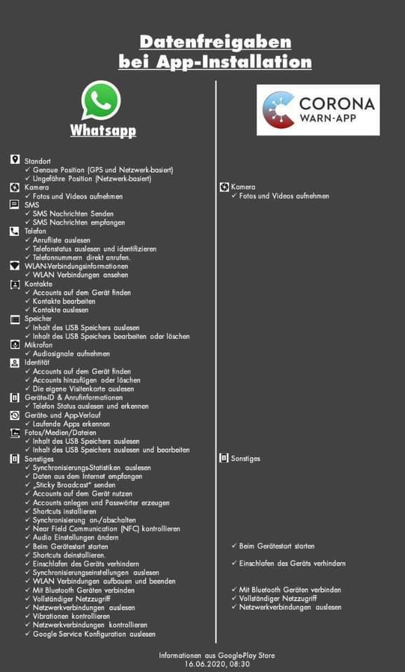

# APP covid


## Privacidade actual, e perda de privacidade em democracias asiaticas

Ver o artigo abaixo sff. Ao contrario da app, isto sim implicaria perdas concretas de privacidade.

Mas ainda estavam acima da perda de privacidade real dos telemoveis e dos impostos, e teria ganhos de liberdade muito relevantes.

'E uma discussao complexa. Mas ainda falta muito ate' a sociedade estar pronta para discutir este assunto devidamente.

Artigo:\  
"Fica então mais claro, que o sucesso coreano advém da legislação democraticamente passada após a epidemia do MERS, em 2012, que permite uma vigilância mais apertada em caso de epidemia."

"Dizem que os ocidentais não aceitam a intromissão do governo nos seus dados − ingenuidade e negação para quem usa iOS, Android, ou paga impostos. Mas quem tem maior liberdade neste momento são os cidadãos do Japão, Taiwan, Coreia do Sul, Nova Zelândia e outros no Pacífico"

<https://observador.pt/opiniao/apocalipticos-da-privacidade-vs-stayaway-covid-e-a-ciencia-de-dados-para-o-bem-comum/>

## App e privacidade
 
Finalmente a APP contra o covid foi aprovada pela CNPD. 

A deliberação 'e importante porque estamos a falar de potencialmente 10M pessoas, mas na pratica as criticas da CNPD são praticamente marginais, e inclusivamente tiveram que recorrer a hipotéticos cenários futuros.

<https://www.cnpd.pt/home/decisoes/Delib/DEL_2020_277.pdf>

Poupo-vos a leitura das [23 paginas](), muito mais simples 'e ver a imagem abaixo que compara:
- as permissões do Whatsapp, uma app que todos usam, mas que ninguém sabe o que realmente faz ("codigo-fonte fechado").

- 'a APP Alemã, que qualquer pessoa pode inspecionar por ter "codigo-fonte aberto".
<https://www.coronawarn.app/en/faq/#open-source>

Ver também a mesma opinião os 2:10 de um dos poucos jornalistas especialistas em tecnologia - Lourenço Medeiros.

<https://sicnoticias.pt/especiais/coronavirus/2020-06-30-Aplicacao-portuguesa-de-rastreio-a-covid-19>

Permissoes da APP alema:


Permissoes da APP espanhola:
  
 
Permissoes de APPs populares:

 
Artigo da PCMag sobre permissoes de apps:
https://www.pcmag.com/news/what-does-big-tech-know-about-you-basically-everything
 
UPDATE: novo parecer da CNPD de 21 julho [pdf](https://www.cnpd.pt/home/decisoes/Par/PAR_2020_82.pdf) 
/ [noticia](https://www.tsf.pt/portugal/sociedade/regulacao-da-app-do-governo-para-rastrear-doentes-com-covid-19-e-minimalista-12456785.html)

FB sic noticias:
https://www.facebook.com/sicnoticias/posts/10158993076321388

FB expresso:
https://www.facebook.com/jornalexpresso/posts/10158171854462949

## Resolucoes do CNPD

Parecer 129/2020: 27 outubro\
(orbigatoriadde da APP):
<https://www.cnpd.pt/umbraco/surface/cnpdDecision/download/121816>
  
  
Parecer 82/2020: 21 julho\
tratamento dos dados da APP:
<https://www.cnpd.pt/umbraco/surface/cnpdDecision/download/121776>
  

deliberacao 277/2020: 29 junho\
(consulta previa da APP)
<https://www.cnpd.pt/umbraco/surface/cnpdDecision/download/121773>


Noticia TSF: [https://www.tsf.pt/portugal/sociedade/regulacao-da-app-do-governo-para-rastrear-doentes-com-covid-19-e-minimalista-12456785.html](aqui)

Relacionado, artigo cientifico sobre transparencia de apps:
<https://down.dsg.cs.tcd.ie/tact/transp.pdf>


## APP Sumario - 17 Julho

A app covid e’ comparável a uma pessoa cega, sem relógio, 
que APENAS ouve falar de outras pessoas cegas anónimas, uma vez por dia.  
Mais info:
https://pestrela.github.io/covid/#app-e-privacidade

A app do INESC foi feita de propósito para respeitar a privacidade. 
Nao pede os recursos do telemóvel - nem de perto nem de longe - que estas 
apps feitas por empresas privadas COM fims lucrativos pedem:
Whatsapp, FB Messenger, Facebook, Google maps, Shazam

Se o isolamento fosse instantâneo, a APP resolvia o problema com 60% de adopcao.  
Se demorar 3 dias, todo o esforço 'e irrelevante
https://pestrela.github.io/covid/#velocidade-de-rastreamento

Na primeira quinzena de junho a velocidade mediana foi de 4 dias. Nao chega.  
Fonte: pagina 16 de https://www.sns.gov.pt/wp-content/uploads/2020/07/infarmed_0807_Baltazar_Nunes.pdf 

A causa 'e que só há 600 pessoas para LVT. LVT sao 50 concelhos, 5 dos quais em calamidade e 5 dos quais em alerta.  
https://github.com/pestrela/covid#comentario-paulo-portas-12-julho


## Como funciona a APP covid

Cada pais esta' autorizado pela Apple e pela Google a ter uma única APP covid por pais.
No entanto, todas as APPs sao compatíveis entre si. 

Isto acontece porque as APPs usam um serviço novo bluetooth, criado pela Apple e Google, 
que permite fazer a troca das mensagens anónimas sem gastar a bateria num instante.


Para activar este serviço em IOS 13.5:  
<https://9to5mac.com/2020/05/19/how-to-turn-on-off-covid-19-contact-tracing-iphone-ios/>  


Para activar este serviço em Android (update May 2020):  
<https://www.howtogeek.com/677100/how-to-turn-off-covid-19-exposure-tracking-and-notifications-on-android/>  


Fontes:

* FAQ: https://static.googleusercontent.com/media/www.google.com/en//covid19/exposurenotifications/pdfs/Exposure-Notification-FAQ-v1.2.pdf
* https://www.macrumors.com/guide/exposure-notification/
* https://expresso.pt/coronavirus/2020-07-24-Testamos-a-app-Stayaway-Covid-e-contamos-tudo-em-sete-passos


## A App não é mágica

<https://stayawaycovid.pt/2020/09/23/a-app-nao-e-magica/>

A STAYAWAY COVID permite informar as pessoas que nos últimos 14 dias tenham estado perigosamente em contacto com alguém infetado.

Apenas após a confirmação da infeção pelo Serviço Nacional de Saúde é que o utilizador da aplicação que contraiu a COVID-19 obterá um código numérico que, introduzindo na aplicação, permitirá que os seus contactos dos 14 dias anteriores sejam alertados para uma potencial ocasião de contágio.

Nem a STAYAWAY COVID, nem nenhuma tecnologia hoje em dia conhecida, permite detetar quem está infetado ao nosso redor! Para isso são necessários os testes à COVID-19 que, atualmente, envolvem uma colheita de amostra por zaragatoa na nasofaringe e na orofaringe e não apresentam resultados instantaneamente.


## Why Google and Apple Failed at COVID-19 Digital Response

Artigo de opiniao:
<https://www.ictworks.org/google-apple-failure-covid-19-digital-response>


* Failure Wasn’t Due to Lack of Resources
* Three Reasons Why Apple and Google Failed
  1. Launching in an Emergency
  2. Putting Technology First
  3. Assuming Government Adoption
  
"Many governments opted to build their own contact tracing software, with mixed results. 
Singapore, Ireland, and Germany were very successful. 
The UK’s effort was an object lesson in mismanagement. 
Others took their time investigating the Apple/Google solution. 
Switzerland became the first country to adopt the exposure notification system in May."


## Quais sao as duas tecnologias para as Apps covid? qual 'e a que portugal vai ter?

Existem duas tecnologias para as APPs covid. 

Este video mostra as diferencas:

* <https://www.youtube.com/watch?v=g8lQmu8gaRE>
* 4:45 Apps baseadas no bluetooth, sem localizacao GPS nem identidade. 
  * Esta 'e  solucao da APP portuguesa feita pelo INESC
* 5:00 Apps baseadas em localizacao GPS, mais precisas
  * Esta 'e a do estado do Utah nos EUA

Fonte: 
https://www.howtogeek.com/672810/how-your-iphone%E2%80%99s-new-covid-19-exposure-notifications-work/


## Porque 'e que o GAEN no Android necessita de localização?

No Android quando se liga o novo serviço bluetooth (GAEN), este também liga o serviço de localização:
[“Device location needs to be on to detect Bluetooth devices near you, 
however, COVID-19 Exposure Notifications don't use device location,”](https://www.mirror.co.uk/news/uk-news/coronavirus-tracker-installed-your-smartphone-22224776)

Isto acontece porque os drivers bluetooth usam a localizacao para poupar bateria e ser mais eficiente. 
Tal acontece [desde 2015](http://nytimes.com/2020/07/20/technology/google-covid-tracker-app.html).
```
Since 2015, Google’s Android system has required users to enable location on their phones to scan for 
other Bluetooth devices, Mr. Voss said, because some apps may use Bluetooth to infer user location. 
```

O serviço de localização combina o GPS, Redes Wi-FI, Redes moveis 3g/4g, alem
 dos próprios "beacons" bluetooth para saber onde o telemóvel esta'.
As aplicacoes sao imensas, nomeadamente os mapas, acertar o relógio automaticamente, smartwatches, "Fobs" para nao perder as chaves de casa, etc.  
Isto pode ser configurado no Android [nos settings](https://support.google.com/nexus/answer/6179507?hl=pt)
 
O ponto crucial 'e que a APP CVOID - que 'e quem sabe que pessoa "X" tem covid - só e' 
autorizada a entrar na loja da Apple e da Google se NAO pedir a localizacao.

Fonte: ver of Ver ponto 10 [da FAQ](https://static.googleusercontent.com/media/www.google.com/en//covid19/exposurenotifications/pdfs/Exposure-Notification-FAQ-v1.2.pdf):
```
10.How will apps get approval to use this system?
"There will be restrictions on the data that apps can collect when using the API, 
**including not being able to request access to location services**, and restrictions on how data can be used."
```

Ver também os comentários no [slashdot](https://yro.slashdot.org/story/20/07/20/2237257/google-promises-privacy-with-virus-app-but-can-still-collection-location-data).
(AKA "News for Nerds").

FAQ GAEN: <https://www.google.com/intl/en_us/covid19/exposurenotifications/>

## o GAEN liga a localização no iPhone?

O iphone NAO liga a localizacao ao ligar o bluetooth.  
[Fonte](https://www.nytimes.com/2020/07/20/technology/google-covid-tracker-app.html).
```
Apple, which does not require iPhone users of the virus apps to turn on location, 
declined to comment on Google’s location practices.
```

Mesmo que NAO fosse o caso, o servico de localizacao 'e costumizado por applicacoes e por servicos do
sistem operativo:

fonte: https://9to5mac.com/2018/08/27/iphone-ipad-how-to-turn-off-on-location-services-gps/


Outras APPs que que nao usam o GAEN sao basicamente inuteis porque 
nao funcionam quando o telemovel esta' trancado, por falta de "handshakes bluetooth".  
[Fonte](https://www.theguardian.com/australia-news/2020/jun/17/covid-safe-app-australia-covidsafe-contact-tracing-australian-government-covid19-tracking-problems-working)
```
Mussared said the best thing the agency could do is implement the Apple-Google developed version of contact tracing into the app. It would resolve many of the ongoing issues, including the iPhone handshake problem, he said.
```

## Os codigos da app nao sao gerados automaticos

StayAway Laboratórios privados não emitem códigos de alerta
Só os médicos o podem fazer. Utentes têm de contactar vários serviços até conseguirem os dígitos para colocar na app

<https://www.facebook.com/groups/205024390569013/permalink/343384310066353/>


## Como configurar os servicos de localizacao em Android e Iphone?

Este artigo mostra como configurar os servicos de localizacao.  
<https://www.nytimes.com/2018/12/10/technology/prevent-location-data-sharing.html>

Android:  


Iphone:  


## Quantas pessoas já' foram alertadas pela APP?

A APP da Alemanha 'e das mais avançadas. Desde 15 Junho ate' 20 julho tiveram 15.5 Milhoes de downloads, 
e 500+ pessoas infetadas __emitiram__ alertas.
 
**No entanto ninguém sabe quantas pessoas __receberam__ alertas - precisamente porque a APP respeita a privacidade!**

Para estimarem este numero, imaginem:

* 500x pessoas
* por onde andaram fisicamente durante 14 dias
* Quem estiveram perto por >15 minutos
  * isto inclui pessoas conhecidos e pessoas anónimas
  
 
Fonte: [artigo nyt](http://nytimes.com/2020/07/20/technology/google-covid-tracker-app.html)
```
Gottfried Ludewig, director general for digitalization and innovation for Germany’s Ministry of Health, 
said of the Corona-Warn-App, which has been downloaded more than 15.5 million times. He said more than
 500 people who tested positive for the virus had used the app to notify other users of
 possible virus exposure.
```


## APP covid em espanha

* Utilizacao: <https://www.xataka.com/aplicaciones/probamos-radar-covid-asi-funciona-aplicacion-rastreo-contactos-que-usaremos-espana>
* Documentos tecnicos: <https://github.com/DP-3T/documents>
* Comparacao tecnica: <https://eknoes.de/posts/covid19-apple-google-dp3t-comparison>

Permissoes da APP espanhola
  
  
## Carta aberta de 200 cientistas a favor do medelo de APP descentralizado baseado em BT

<https://giuper.github.io/JointStatement.pdf>


## Sobre Tomas Pueyo
     
Os textos de Tomas Pueyo sao longos, mas sao de longe os melhor suportados com analises e os mais detalhados.   
<https://medium.com/@tomaspueyo>
 
Combinados, tiveram 60+ Milhoes de visualizacoes, foram subscritos por 100+ especialistas, e foram traduzidos em 40+ linguas pelos proprios leitores interessados.  
<https://medium.com/tomas-pueyo/coronavirus-articles-endorsements-fdc68614f8e3>


## Entrevista a um programador da App

Excelente entrevista com um dos autores da APP portuguesa. Se nao confiarem em politicos... confiem nos informaticos.
<https://www.youtube.com/watch?v=qQga4IibkOK>

Esta foi a agenda:
1 - Como funciona a app STAYAWAY COVID?
2 - A app estará disponível para todos os equipamentos (Mesmo os mais antigos)?
3 - A app influencia a bateria do smartphone?
4 - Porque STAYWAY COVID e não um nome em PT?
5 - Na Irlanda a app é usada por 20% a 25% da população. Esperam superar estes números?
6 - A versão para iPhone vai sair na mesma altura que a para Android?
7 - Como foram realizados os testes?
8 - Mensagem final para os utilizadores instalarem esta app.

## Sobre a APP, no pplware

Bom resumo da App num site especializado em informatica

<https://pplware.sapo.pt/smartphones-tablets/app-portuguesa-stayaway-covid-de-que-ter-medo/>

“Em Resumo…

A app STAYAWAY COVID é segura
Não são usadas informações do GPS
Não são identificados contactos, ou seja, as tags da app são completamente anónimas
Não há registo que a app tenha influência negativa na autonomia da bateria
A app é de instalação voluntária
Não é preciso qualquer tipo de registo
A pessoa que está infetada pode decidir se quer alertar ou não outros utilizadores”


## APP vs APPs maradas

Em relacao 'a APP:

Eu confirmei TECNICAMENTE que a APP foi desenhada de forma a:

a) respeitar totalmente a privacidade,
b) ser totalmente anonima,
c) todos os passos serem voluntarios.

So' agora 'e que as pessoas 'e estao a utilizar a app, e a confusao 'e grande.\  
TODOS os dias respondo a imensas duvidas / cenarios / afirmacoes que a app 'e inutil. 

A resposta a TODOS estes problemas 'e a sempre mesma - 'e assim que funciona uma APP que seja:

a) respeita totalmente a privacidade,
b) 'e totalmente anonima, e
c) todos os passos sao voluntarios.

Por outro lado, se fosse uma app marada para ficar velhinho, ou mudar a foto de sexo, ou para jogar, ja' 
toda a gente era especialista de informatica para a por a funcionar, e fazia com todo o cuidado todos os passos que ela pedia.

-------------------------------

A pergunta numero #1 'e as pessoas assumirem que a app 'e uma pulseira electronica obrigatoria do governo para instalarem depois de receberem o teste positivo.

Nao 'e o caso, de todo. SIM, existe tecnologia para fazer isso, mas as apps europeias nao teem nada a ver com isso. 

A app serve para:
a) a pessoa infectada avisar os contactos anteriores do seus ultimos 14 dias
b) as pessoas nao-infectadas receberem os avisos das outras, e serem mais cuidadosas no futuro

-------------------------------

Por fim, um "top-5" das respostas:

* NAO, a app nao pede localizacao GPS, nem a camara, nem o microfone.
* NAO, a app nao sabe quem voce e'. Nao ha' qualquer registo. Nao pede o email. Nao ha' endereco postal. 
* NAO, as empresas (Google+Apple) e o Governo nao vao ter quaisquer dados com a App. 
  * Pelo contrario, isso acontece 'e com as apps normais do Facebook, com o Gmail, icloud, whatsapp, instagram, e tiktok.
* SIM, a app 'e util para quem fica em casa depois do teste positivo. 
  * A App ja' tem que estar funcinar ANTES para poder avisar os contactos dos ultimos 14 dias antes do teste positivo.
* SIM, 'e preciso pedir o codigo e introduzir-lo manualmente depois de ter o teste positivo.

O mundo actual 'e complicado. Sff perguntem e confiem APENAS em especialistas - cada um na sua area. Nao confiem nos grunhos do Facebook!


---


A utilidade da App esta' no meio de entre essas 2 pessoas. 
O problema esta' exactamente nas pessoas que "continuam a manter a sua vida normal, mantendo as medidas de protecção". 
Conforme o numero de infectados o que antes era perfeitamente possivel e aceitavel, hoje pode ja' nao o ser. E vice versa, o que era proteccao em falta, hoje ja' pode ser exagerado.
.
A Pandemia e o risco muda demasiado depressa. A App 'e um sinal dinamico que vemos na auto-estrada.
.
Recomendo este artigo de Tomas Pueyo (autor do "martelo", com 60 milhoes de leituras) sobre o rastreamento e a utilidade da app no rastreamento.
https://medium.com/@tomaspueyo/coronavirus-how-to-do-testing-and-contact-tracing-bde85b64072e


taiwan:
https://www.facebook.com/jonathan.chen.1213/posts/10158178965295127

Taiwan’s Eternal Dance
https://medium.com/@tomaspueyo/coronavirus-learning-how-to-dance-b8420170203e

Tribolet: 12m10s
https://tviplayer.iol.pt/programa/noticias/53c6b3613004dc006243c401/video/5f88999d0cf2ae07a25551e7


## APP tem que estar a funcionar ANTES do teste

Em complemento ao post anterior, aqui esta' um exemplo tipico de um grunho do Facebook.
.
O erro esta' no ponto 6. A app nao avisa a partir dessa altura para a frente.
Avisa e' quem foi ja' contactado nos 14 dias anteriores sem saber que estava infectado!
.
.
Eu podia ter um trabalho a tempo inteiro a responder a este tipo de lixo. Nao conseguia dar vazao.\  
SFF nao partilhem ests cenas! obg

## Suporte da analise tecnica da App


Codigo fonte da APP:
https://github.com/stayawayinesctec/stayaway-app

FAQ do GAEN:
https://www.google.com/covid19/exposurenotifications/

Comentario 'a resolucao da CNPD:
https://pestrela.github.io/covid/#app-e-privacidade

Codigo fonte do D3PT (onde o GAEN fizeram o fork privado):
https://github.com/DP-3T/documents#apple--google-exposure-notification


A GAEN nao tem codigo fonte publico. Mas 'e um fork privado do D3PT, e esse tem o codigo aberto.
O ponto crucial da arquitectura 'e que a API so' recebe tokens aleatorios para distribuir. 
Estes tokens nao teem a info que "X tem covid".


## Quanto custou a app

A app nao teve financiamento publico e custou 400 mil euros.
https://pplware.sapo.pt/smartphones-tablets/app-stayaway-covid-custou-perto-de-400-mil-euros/
 
Para uma app com potencialmente 7 milhoes de utilizadores parece-me uma pechicha.
https://marketeer.sapo.pt/7-milhoes-de-portugueses-tem-smartphone

## Como funciona a app por dentro

Para quem quer saber como a app funciona por dentro, e porque 'e que 'e privada:

1) A pessoa "A" instala a app. Gera um codigo privado a cada 15 minutos. Este codigo 'e um numero giantesco que 'e impossivel de adivinhar. Alem disso, os numeros teem caracteristicas especiais como ser divisivel por 532244217326832872244231. 'E o mesmo metodo do banco online.

2) As pessoas "B" e "C" instalam a app. O processo 'e igual para eles.

3) As apps ouvem-se umas 'as outras por bluetooth, localmente, e trocam os codigos entre si. 

4) A pessoa "A" e B" encontram-se e trocam codigos. A pessoa "C" nunca esteve em contacto com "A" ou "B". 

5) os codigos sao guardados e apagados ao fim de 14 dias automaticamente.

6) A pessoa "A" recebe o teste positivo. Pede manualmente um codigo especial do medico. A app consegue validar se o codigo especial esta' correcto. A app envia os numeros aleatorios de quem contactou nos ultimos 14 dias para um servidor central.

7) a pessoa "B" faz o download dos codigos de "A". Como os guardou e batem certo, apresenta a notificacao. A unica informacao apresentada 'e o dia. A hora 'e escondida.

8) a pessoa "C" faz o mesmo download. Mas como nunca esteve com "A", nenhum codigo ate certo para ela. Melhor, os codigos de "A" sao totalmente aleatorios sem qualquer significado para "C".

video de explicacao:
https://www.youtube.com/watch?v=oG3t7Gf_5VE

## O que fazer quando a app enviar um alerta / enviar alertas demais

Outra pergunta muito comum 'e:
- o que fazer concretamente quando a app me der um alerta? vou a correr fazer um teste?
e a sua evolucao:
- Quando a app estiver massificada, vamos ter alertas diarios? o que fazer nessa altura?
.
.
Para a primeira pergunta, se eu receber HOJE uma notificacao, passava a ser mais cuidadoso. Nao ia correr para a saude 24. 
Por exmplo, deixava de ir a restaurantes que tenho ido durante a semana de trabalho. Mais importante, cancelava o almoco de familia para o domingo seguinte (exemplo).
.
Isto 'e como conduzir a 120 na auto-estrada. Quando aparece o sinal de "vento" ou "neve", devemos abrandar. Nao 'e preciso necessariamente parar. So' se vier um furacao!
.
Para a segunda pergunta, sim 'e possivel quando o sistema estar massificado. 
Mas nessa situacao 'e muito facil mudar o parametro dos 15 minutos para, por exemplo, 30 minutos. 
Qualquer sistema de engenharia funciona assim e tem que ser calibrado/analisado periodicamente. 


## A APP 'e demasiado manual

A APP respeita todas as garantias de privacidade.

O cuidado foi tanto que isto foi levado a um limite ridículo: O tratamento dos códigos é completamente manual.
Isto leva a que apenas 3% dos casos tenha gerado o código de alerta.

Não está claro para mim de onde veio esta imposição: se do governo, se do INESC, se da CNPD, se dos médicos...

Um sistema melhor era TODOS os passos serem automáticos DEPOIS da adesão inicial voluntária.

Entrevista ao INESC:
"teremos side extremamente escrupulosos no procedimento da geração de códigos"
"esse procedimento foi revelado complicado, pouco flexível, e nao compativel com as situações de urgência / aflição que os médicos ligam com este caso"

<https://www.youtube.com/watch?v=_hEV8bbTNBo>
<https://zap.aeiou.pt/stayaway-obrigatoria-eficacia-reduzida-360904>

## A App falhou por razoes politicas

Esta declaracao de 60 segundos e 'e um exemplo clarissimo que o sucesso de um projecto de adopcao global 'e 5% de razoes tecnicas, e 95% de razoes politicas.

A maior parte dessas razoes politicas acontecem porque os politicos nao sao tecnicos, nem percebem de tecnologia.

<https://www.youtube.com/watch?v=Txyp5rKNc7s>

## Marco 2021: governo quer agilizar App

Finalmente o governo percebeu que a app falhou por razoes politicas:

* geracao por outros profissionais de saúde, que não apenas médicos
* geracao totalmente automatica de codigos 

<https://www.dinheirovivo.pt/geral/governo-quer-alterar-aplicacao-stayaway-covid-13500631.html>

Sem surpresa a CNPD levanta problemas:
"nada permite, por isso, afirmar a capacidade dessa comunicacao em manter a preotecao de dados dos titulares"
"a entrada de uma nova entidde no circuita da informacao, entidde asministrtiv que opera fora dos servicos de saude..."
<https://www.cnpd.pt/umbraco/surface/cnpdDecision/download/121866>

Ja' passou um ano. Continua a nao haver urgencia nenhuma.

## Resolucoes da CNPD sobre a APP

A CNPD comentou diversas vezes a APP stayaway covid. Aqui esta' a lista:
<https://www.cnpd.pt/covid-19/>
