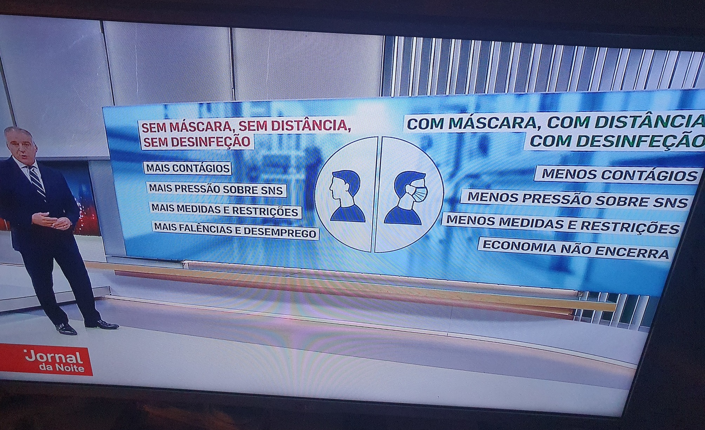
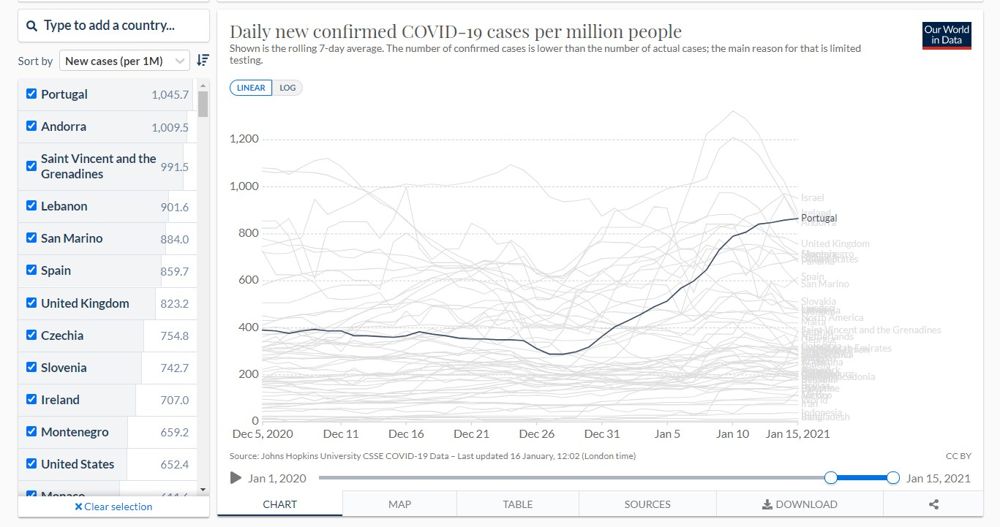
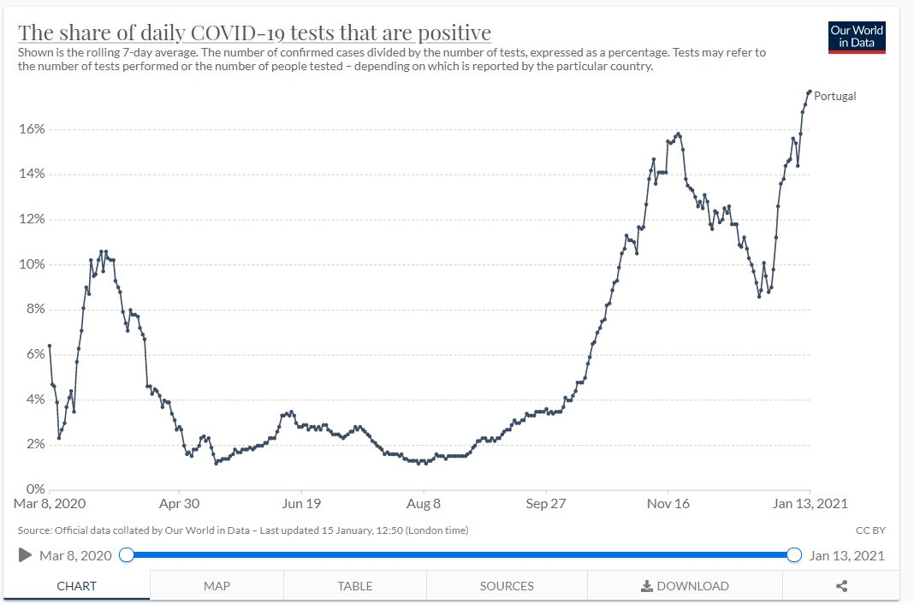

# Medidas de Confinamento

## Mensagem clara em horario nobre
 
Finalmente informacao clara em horario nobre.

## Confinamento PT

Cada concelho teem medidas diferentes um nivel diferente de risco e de medidas

Este site mostra que medidas esao em vigor para o seu concelho:
<https://covid19estamoson.gov.pt/>

Nivel de Risco:

* [Moderado](https://covid19estamoson.gov.pt/medidas-covid19-ambito-nacional-v2/)
* [Elevado](https://covid19estamoson.gov.pt/medidas-covid19-concelhos-risco-elevado/)
* [Muito Elevado](https://covid19estamoson.gov.pt/medidas-covid19-concelhos-risco-muito-elevado/)
* [Extremamente Elevado](https://covid19estamoson.gov.pt/medidas-covid19-concelhos-risco-muito-elevado/)

Este 'e o mapa diario dos concelhos. A cor pode mudar porque as medidas sao decididas a cada 15 dias:

* Mapa dos concelhos: <https://covid19.min-saude.pt/ponto-de-situacao-atual-em-portugal/>

## Confinamento na Europa

o ECDC compara as infeccoes dos varios paises:
<https://www.ecdc.europa.eu/sites/default/files/styles/is_full/public/images/w52_53_COVID_subnational_Last_2week.png>

Este site compara as limitacoes dos governos. 
Por exemplo a restauracao em ES e NL:

<https://reopen.europa.eu/en/map/ESP/6002>
<https://reopen.europa.eu/en/map/NLD/6001>

## Criterios de confinamento

Manuel Carmo Gomes:
**"Proposta de 3 linhas vermelhas. BASTA UMA para actuacao muito forte"**

Criterios:

* Positividade tem que ser menor que 10% (idealmente 5%):
    * [grafico](https://ourworldindata.org/coronavirus-data-explorer?zoomToSelection=true&time=2020-05-08..latest&country=PRT~ESP~FRA&region=World&positiveTestRate=true&interval=smoothed&perCapita=true&smoothing=7&pickerMetric=total_cases&pickerSort=desc)
* Rt menor que 1.1:
    * [grafico aos 1h02m](https://www.youtube.com/watch?v=C_j2wzGboz8)
* Casos < 200/dia:
    * [grafico](https://ourworldindata.org/coronavirus-data-explorer?zoomToSelection=true&time=2020-05-08..latest&country=PRT~ESP~FRA&region=World&casesMetric=true&interval=smoothed&perCapita=true&smoothing=7&pickerMetric=total_cases&pickerSort=desc)
* Hospitais < 1500, UCI < 200:
    * [grafico, clicar 5 vezes na seta da esquerda](https://esriportugal.maps.arcgis.com/apps/opsdashboard/index.html#/e9dd1dea8d1444b985d38e58076d197a)

Sumario Expresso:
<https://expresso.pt/coronavirus/2021-02-09-Carmo-Gomes-deu-uma-aula-a-Costa-medidas-graduais-nao-servem-precisamos-de-testagem-forte-e-criterios-claros-para-fechar-e-desconfinar>

Sumario Observador:
<https://observador.pt/programas/emissao-especial/a-testagem-e-nao-o-confinamento-e-a-arma-principal-que-devemos-usar>

Saida de MCG das reunioes:
<https://sicnoticias.pt/especiais/coronavirus/2021-02-09-Manuel-Carmo-Gomes-explica-por-que-razao-decidiu-deixar-de-integrar-as-reunioes-do-Infarmed>

## Portugal no topo do mundo

Janeiro 2021:

Primeiro grafico: Portugal no topo do mundo em casos/1 Milhao.  
Segundo grafico: Cada vez fazemos MENOS testes. Os casos positivos por Teste devia ser 4%.  

## Janeiro 2021 - Hospitais em ruptura

Hospital da Guarda em rutura.
<https://sicnoticias.pt/especiais/coronavirus/2021-01-06-Hospital-da-Guarda-em-rutura.-Imagens-mostram-camas-amontoadas-nos-corredores>

Sera' fake news? sera' em portugal? sera' de ontem? etc etc

A forma mais simples de confirmar isso 'e ver a noticia seguinte:

"O Hospital da Guarda confirma que o momento é muito difícil e anunciou já que vai redimensionar o espaço na urgência geral para diluir os doentes no espaço.
As imagens divulgadas esta quarta-feira pela SIC mostram uma urgência não covid quase sem espaço, com doentes acamados nos corredores."

<https://sicnoticias.pt/especiais/coronavirus/2021-01-06-Hospital-da-Guarda-anuncia-novo-plano-de-acomodacao-de-doentes-nas-urgencias-1>

