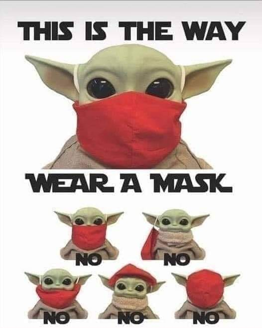

# Humor 

## Pictures

Rapidez da vacina:

O Chip da vacina: 

  
Grunho do facebook:

Fernando Rocha:

  
Baby Yoda teaches masks:

Patudos:

Mascaras:

Bill Gates e a Coca Cola:

Especialistas do Facebook:

Seguranca das Vacinas:

Clientes fogem para nao serem apanhados:

Bula da vacina covid:

Somos todos especialistas em avioes:

## Titulos de Jornal

* Papiro
    * ["Loures põe funcionários a contar autocarros para garantir que passam todos"](https://www.publico.pt/2020/07/10/local/noticia/loures-poe-funcionarios-contar-autocarros-garantir-passam-1924027)
    * Comentário: Sera’ que vao usar papiro e escrever com penas e tinta dos monges copistas?
* Entrevista surreal
    * ["entrevista a Correia de Campos e Diogo Cabrita"](https://www.facebook.com/pedro.vale.estrela/posts/3284345564951293)
    * Comentário: Uma entrevista/debate completamente surreal, a todos os niveis. A jornalista tao cedo nao vai esquecer estes 30m.
* Atraso na APP
    * ["O que falta fazer para a app que ajudará no rastreio da Covid-19 estar pronta"](https://visao.sapo.pt/visaosaude/2020-07-09-stayaway-covid-o-que-falta-fazer-para-a-app-que-ajudara-no-rastreio-da-covid-19-estar-pronto/)
    * Comentário: estamos na fase da APP estar pronta "no fim do mês, em cada mês". Na fase do "eu digo o mês, mas não digo o ano".
* Almoçar morcego
    * ["Local de habitação "é o principal meio de transmissão" do vírus"](https://www.jn.pt/nacional/local-de-coabitacao-e-o-principal-contexto-de-transmissao-do-virus-12118723.html )
    * Comentário: Mas a DGS acho que andamos todos a almoçar morcego?
  
## Vampiros

"Ah e tal, o problema e' a App covid ter o bluetooth sempre ligado."

A tal app que foi desenhada explicitamente para respeitar a privacidade.

Exactamente como as companhias mais valiosas do mundo foram desenhadas explicitamente para abusar da vossa privacidade.

O Vampiro so' entra em casa convidado. No FB e quejandos, e' um muro de texto em legales, e um botao convidativo a dizer "I agree".

  
  
## Humor sobre negacionistas

Sessao Hilariante do "Extremamente Desagradável" sobre os jornalistas pela verdade:
<https://www.youtube.com/watch?v=NhmmQUXGQvA>

## Antonio Costa vs Pacheco Pereira

O ponto alto do debate ontem na TVI24 aos 38m40s:

"'O Pacheco Pereira
eu garanto lhe uma coisa
voce nao gosta de esponja
voce por característica gosta dessa coisa confrontacional
tivesse eu a sua personalidade, e ao fim de 15 dias da pandemia tinha caido para o lado
ou nao tinha resistido"

<https://tvi24.iol.pt/videos/circulatura-do-quadrado/circulatura-do-quadrado-com-antonio-costa/6011faad0cf2951d9a0789dc>

## Premio Unicórnio Voador 2020

Quem foi o mais negacionista em 2020? quem causou mais dano 'a sociedade?
Uma escolha muito dificil

------
Prémio Unicórnio Voador 2020 - Battle Royale
- Médicos pela Verdade
- Jornalistas pela Verdade
- Advogados pela Verdade
- César Augusto Moniz
- João Beles
- André Dias
- Raquel Varela

<https://tinyurl.com/unicorniovoador2020>

## Anormais

[Joao Duarte](https://www.facebook.com/scimed.evidencia/posts/1049726375509195?comment_id=1049757465506086)

Para mim o pior da pandemia não foram as mortes, foi perceber que vivo rodeado de atrasados mentais, obscurantistas, irracionais, falsificadores, egocêntricos, egoistas, abjectos e mentirosos. Mesmo em sítios ou pessoas que achariamos que seriam bastiões seguros de inteligência, racionalidade e humanidade.

Vivemos rodeados de anormais em quem não podemos confiar.
  
  
## 9x Internados no Supermercado

"A senhora da caixa (do supermercado) dirige-se ao microfone e diz: 
'A pessoa que está identificada com covid que se dirija em segurança à caixa'. 
Apareceram nove. Isto não é uma anedota, apareceram nove pessoas”,

<https://sol.sapo.pt/artigo/722402/diogo-clemente-denuncia-situacao-vivida-em-supermercado-apareceram-nove-pessoas-com-covid-19>

## Entrevista a maria jose morgado

Respostas lamentaveis, a todos os niveis.

Em particular ao 30s:
"mas havia alternativa?" -> "nao me faca essa pergunta, nao vou responder"
<https://www.youtube.com/watch?v=71lJsZVCgKE>

sem surpresas, tambem recorre 'a reducao "ad Hitlerum"
<https://pt.wikipedia.org/wiki/Reductio_ad_Hitlerum>

video: <https://www.youtube.com/watch?v=71lJsZVCgKE>
  
## NEIN...
  
Nos nao falamos Alemao... 
mas nem e' preciso usar o google translate para perceber o que este medico nos esta' a dizer:

"
...
8. Aber da wird ein Chip.... NEIN!
9. Und Bill Gates.... NEIN!
...
"

In Portugal we do get our fair share of idiots that have a special pleasure of both promoting 
and spreading extremly obvious fake news.

  
  

