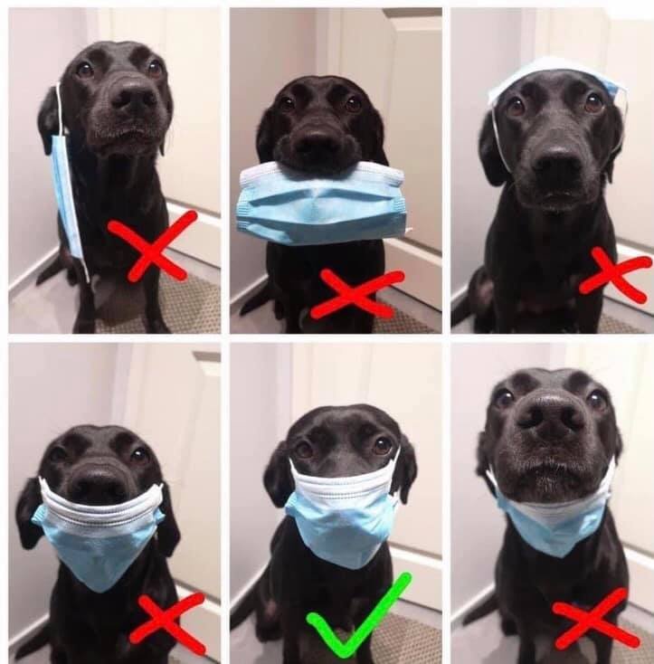

# Humor 

## Pictures

Rapidez da vacina:

O Chip da vacina: 

  
Grunho do facebook:

  
Baby Yoda teaches masks:

Patudos:

Mascaras:

Bill Gates e a Coca Cola:

Especialistas do Facebook:

Seguranca das Vacinas:

Clientes fogem para nao serem apanhados:

Bula da vacina covid:

Somos todos especialistas em avioes:

Fernando Rocha:

## Entrevista surreal

Uma entrevista/debate completamente surreal, a todos os niveis. A jornalista tao cedo nao vai esquecer estes 30m.

Intervenientes: Correia de Campos e Diogo Cabrita

<https://www.facebook.com/pedro.maia.5201/posts/10160031936148135>

  
## Sobre Vampiros

"Ah e tal, o problema e' a App covid ter o bluetooth sempre ligado."

A tal app que foi desenhada explicitamente para respeitar a privacidade.

Exatamente como as companhias mais valiosas do mundo foram desenhadas explicitamente para abusar da vossa privacidade.

O Vampiro so' entra em casa convidado. No FB e quejandos, e' um muro de texto em legales, e um botao convidativo a dizer "I agree".

  
  
## Humor sobre negacionistas

Sessão Hilariante do "Extremamente Desagradável" sobre os jornalistas pela verdade:
<https://www.youtube.com/watch?v=NhmmQUXGQvA>

## Antonio Costa vs Pacheco Pereira

O ponto alto do debate ontem na TVI24 aos 38m40s:

"'O Pacheco Pereira
eu garanto lhe uma coisa
voce nao gosta de esponja
voce por característica gosta dessa coisa confrontacional
tivesse eu a sua personalidade, e ao fim de 15 dias da pandemia tinha caido para o lado
ou nao tinha resistido"

<https://tvi24.iol.pt/videos/circulatura-do-quadrado/circulatura-do-quadrado-com-antonio-costa/6011faad0cf2951d9a0789dc>

## Premio Unicórnio Voador 2020

Quem foi o mais negacionista em 2020? quem causou mais dano 'a sociedade?
Uma escolha muito dificil

------
Prémio Unicórnio Voador 2020 - Battle Royale
- Médicos pela Verdade
- Jornalistas pela Verdade
- Advogados pela Verdade
- César Augusto Moniz
- João Beles
- André Dias
- Raquel Varela

<https://tinyurl.com/unicorniovoador2020>

## Anormais

[Joao Duarte](https://www.facebook.com/scimed.evidencia/posts/1049726375509195?comment_id=1049757465506086)

Para mim o pior da pandemia não foram as mortes, foi perceber que vivo rodeado de atrasados mentais, obscurantistas, irracionais, falsificadores, egocêntricos, egoistas, abjectos e mentirosos. Mesmo em sítios ou pessoas que achariamos que seriam bastiões seguros de inteligência, racionalidade e humanidade.

Vivemos rodeados de anormais em quem não podemos confiar.
  

  
## 9x Internados no Supermercado

"A senhora da caixa (do supermercado) dirige-se ao microfone e diz: 
'A pessoa que está identificada com covid que se dirija em segurança à caixa'. 
Apareceram nove. Isto não é uma anedota, apareceram nove pessoas”,

<https://sol.sapo.pt/artigo/722402/diogo-clemente-denuncia-situacao-vivida-em-supermercado-apareceram-nove-pessoas-com-covid-19>

## Entrevista a maria jose morgado

Respostas lamentáveis, a todos os níveis.

Em particular ao 30s:
"mas havia alternativa?" -> "nao me faca essa pergunta, nao vou responder"
<https://www.tsf.pt/programa/governo-sombra.html>
[link para mp3](https://d2al3n45gr0h51.cloudfront.net/ngx-audio/2021/01/02_janeiro_2021_governo_sombra_online_20210102012109/mp3/02_janeiro_2021_governo_sombra_online_20210102012109.mp3)

sem surpresas, também recorre 'a reducao "ad Hitlerum"
<https://pt.wikipedia.org/wiki/Reductio_ad_Hitlerum>

  

  
## NEIN...
  
Nos nao falamos Alemao... 
mas nem e' preciso usar o google translate para perceber o que este medico nos esta' a dizer:

"
...
8. Aber da wird ein Chip.... NEIN!
9. Und Bill Gates.... NEIN!
...
"

In Portugal we do get our fair share of idiots that have a special pleasure of both promoting 
and spreading extremly obvious fake news.

  
  

