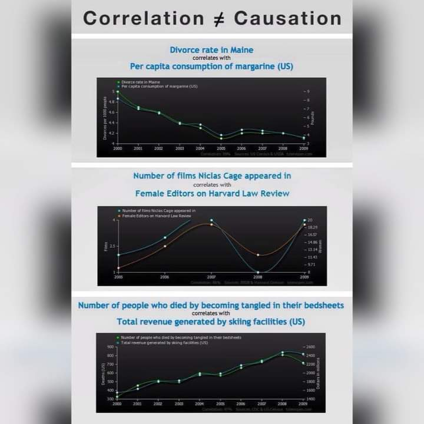
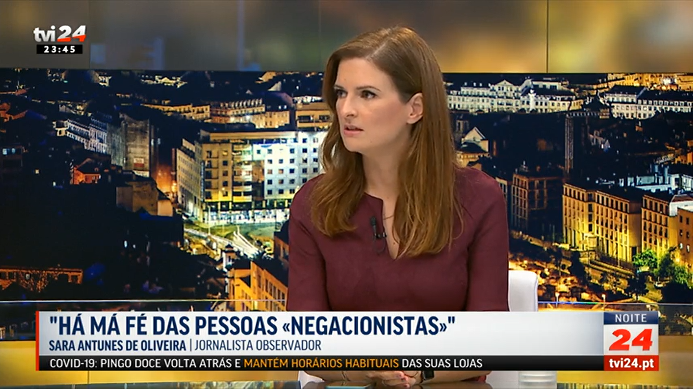
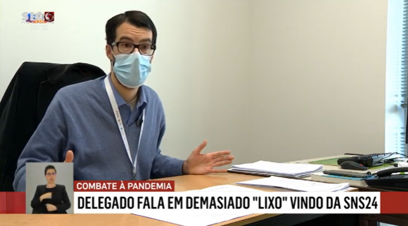
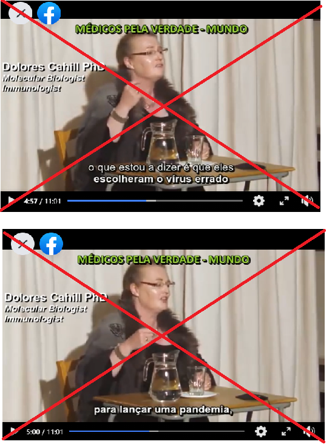
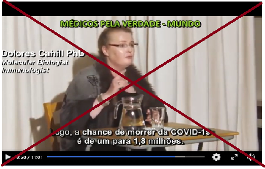

# Negacionistas

## Entrevista Fernando Nobre e Gustavo Carona 

Ver em baixo duas entrevistas fundamentais para perceber que sobre o covid so' contam as opinioes:
- dos especialistas (virulogistas) 
- e dos intensivistas (UCIs) que ficam com a batata quente no fim.

----
A primeira entrevista 'e a Fernando Nobre, medico cirurgiao e fundador da AMI, que diz uma quantidade incrivel de asneiras seguidas.
como qualquer pessoa normal, tinha uma percepcao muito boa sobre esta pessoa; esta entrevista mostrou-me a realidade.
https://www.youtube.com/watch?v=F8PfJMIuLnk

A seguinda entrevista foi na semana imediatmente a seguir a Gustavo Carona, médico intensivista que trabalha na UCI de matosinhos. 
Este sim esta' na linha da frente onde a batata quente vai parar, e ao longo dos 90m desmonta completamente todas as asneiras da grossa da entervista anterior.
https://www.youtube.com/watch?v=G1Lq7Z6xT2A
https://rr.sapo.pt/2020/11/11/pais/m/especial/214351/

update: conversa com bruno nogueira:
https://www.facebook.com/watch/?ref=saved&v=841195703394686

## Cherry picking

<https://pt.wikipedia.org/wiki/Evid%C3%AAncia_suprimida>

Evidência suprimida, supressão de evidências ou evidência incompleta (em inglês: cherry picking) 
é uma falácia que consiste em citar casos ou dados individuais que parecem confirmar uma determinada 
posição, ao mesmo tempo em que se ignora uma porção significativa de casos ou dados relacionados 
que possam contradizer aquela posição. É um tipo de falácia de atenção seletiva, sendo seu 
exemplo mais comum o viés de confirmação. Ela pode ser feita de forma intencional e 
também de forma não intencional. É um grande problema em debates públicos.

Numa frase: se escolhermos os numeros que nos convem, e ignoramos a maioria esmagadora dos outros (que mostram o contrario), 
entao podemos "provar" tudo o que quisermos e o seu contrario.

Quando vemos "cherry picking" propositado, isso 'e ma'-fe';
Noutras pessoas pode ser apenas ignorancia cientifica e desleixo, quando partilham mensagem erradas sem as verificarem em fontes crediveis ("poligrafo", "fact checking", etc).

## Correlacao vs Causalidade - Variaveis ocultas

Esta estatisticamente provado que quando se vendem mais gelados, ha mais afogamentos.  
Sera' que as criancas caem na piscina a correr com o gelado na mao?

Nao. Uma nao causa a outra.  
Em vez disso, ambas sao causadas por uma terceira variavel oculta: a tempertura.

Temperaturas altas levam a mais gelados e a mais afogamentos.
<https://www.thoughtco.com/correlation-and-causation-in-statistics-3126340>

Em baixo muiot mais exemplos:

## Meta analises de ivermectina e hidroxicloroquina

Analise do poligrafo brazil: <https://piaui.folha.uol.com.br/lupa/2021/02/23/anuncio-medicos-pela-vida-covid-19/> sobre as meta analises do site <https://c19study.com/>, <https://c19ivermectin.com/> e similares:

"o suposto estudo é uma meta-análise, ou seja, uma análise feita com base em outros trabalhos existentes. 
(...) O problema é que, nesse caso, a análise é feita sem metodologia e rigor científico."

"A eficácia de um tratamento só pode ser realmente comprovada com estudos científicos que 
usam uma metodologia rigorosa:

* randomização 
* duplo-cego 
* publicados em uma revista científica + peer-review"

Problemas:

* Os p-valor sao simplemente multiplicados entre si = LIXO ESTATISCO
* Misturam pre-prints com erros graves e que nunca vao ser publicados, com estudos "a serio" publicados. 
  * So' o estudo publicados em revistas cientificas e' que contam, por terem sido verificados pelos pares (=especialistas).
* Todos os estudos teem todos pesos iguais. Estudos com qualidade zero, ou negativa teem o mesmo peso 1. 

manifesto falso: <https://piaui.folha.uol.com.br/lupa/wp-content/uploads/2021/02/manifesto-medicos-pela-vida.pdf>

## Milhoes vs Bilioes de segundos

Todos os dias ouvimos falar de "Milhoes de euros", mas tambem de "Mil milhoes de euros".  
Essa 'e a diferenca basica entre um Milionario e um Bilionario nos EUA.

Para ter uma idea, um milhao de segundos sao 11 Dias.  
Mil milhoes de segundos sao 31 Anos.

## Reportagem e Debate TVI sobre negacionistas

Excelente reportagem e debate da TVI sobre os "medicos pela verdade". 

No grupo ha' psicologos, dentistas e enfoermeiros.
Mas nao tem nenhum medico de saude publica, epidemiologita ou virulogista.

Problemas semelhantes nos "jornalistas pela verdade". Quem da' a cara nao e' jornalista.

Reportagem:
<https://tviplayer.iol.pt/video/5fad9d950cf203abc5b0c31e>

O debate comeca aos 1h18m deste video:
<https://tviplayer.iol.pt/video/5fadcf1b0cf2c785555011b9>

Update 2021-02-11:\ 
mais quatro médicos pela verdade condenados:
<https://tviplayer.iol.pt/video/60258c5d0cf245b9a97a76b6>

## Fim dos medicos pela verdade

Uma excelente noticia!

Observador:
<https://observador.pt/2021/02/09/movimento-medicos-pela-verdade-suspende-redes-sociais-e-anuncia-interregno/>

Visao:
<https://visao.sapo.pt/atualidade/sociedade/2021-02-09-fim-dos-medicos-pela-verdade-o-chega-e-as-afinidades-que-a-visao-destapou/>

## Reportagem com Rastreadores

"Ninguem está a tossir. Se daqui a um mês eu tiver covid, por amor de deus nao me liguem para a linha saude24, porque vos põem em isolamento DESNECESSARIAMENTE e adicionam lixo ao sistema"

Excelente reportagem com os rastreadores da covid sobre o lixo da SNS24.
Fica a ideia que o governo está a poupar tostões aqui, para perder milhões na perda da economia.

Sumario:

* 00:50 Festas privadas com centenas de pessoas só podem ser interrompidas pela GNR com mandato judicial
* 01:35 Naquela unidade sao 40 rastreadores, deviam ser 100.
* 02:20 Ha' casos que os infectados tiveram >80 contactos nos últimos 14 dias (!). Todos têm que ser contactados um a um. Cada telefonema demora 20 minutos.
* 03:15 As pessoas mentem os rastreadores
* 04:06 O traceCovid tem imenso "lixo" lá colocado pela linha saude24. Lixo = contactos de baixo risco e que atrasam os realmente importantes.
* 04:30 Os contactos devem simplesmente ficar à espera. Mas como ficam assustados, ligam SEM RAZÃO para a saude24 e recebem instrução de isolamento (sem necessidade!)
* 04:53 Muitas pessoas ficam em isolamento sem necessidade, porque nao foram contactos de risco. Exemplo: alguém que contactou um doente
* 05:10 Ninguém está a tossir. Se daqui a um mês eu tiver covid, por amor de deus nao me liguem para a linha saude24, porque vos poeem em isolamento DESNECESARIAMENTE e adicionam lixo ao sistema"
* 05:50 Sistema de informática "em baixo"
* 06:26 delegados de saúde têm todo o tipo de pedidos sem qualquer interesse (pombas a sujar, cães a ladrar)
* 07:33 Restaurantes escolas, lares, lojas, restaurantes, ginásios, feiras, vigilância 'a população, juntas médicas e assuntos nao-covid
* 07:57 Pessoas à beira do limite - contadas na primeira pessoa

<https://sicnoticias.pt/especiais/coronavirus/2020-11-21-Covid-19.-Delegados-de-saude-alertam-que-ha-pessoas-em-isolamento-sem-necessidade>

## Entrevistas ao chefe dos UCI do Porto

Duas entrevistas ao chefe dos Cuidados Intensivos do Sao Joao (Porto).
'E este o medico que fica com a batata quente com o aumento exponencial dos casos intensivos que lhe batem 'a porta, sem parar.
Quaisquer que sejam os recursos, nunca chegariam para um aumento exponencial de casos; um aumento de 30% 'e irrisorio se for necessario um aumento de 1000% (por exemplo). 
Tanto Covid como nao-covid. Porque ninguem serio vai negar UCI aos covid - e esses enchem tudo, e os nao-covid vao chegando tarde. 
Tudo isto 'e evitavel. Todos sabem o que fazer. O timeline 'e ate' o pais estar 70% vacinado. 

RTP3 grande entrevista:
<https://www.rtp.pt/play/p6646/e500951/grande-entrevista>

Expresso entrevista:
<https://www.facebook.com/groups/205024390569013/permalink/361827324888718/>

## Acordao da Relacao fala em 97% falsos positivos

"Ora, da leitura do artigo, concluem as juízas que “a probabilidade de a pessoa receber um falso positivo é de 97% ou superior”."

O assunto do momento 'e o acordao da Relacao sobre a DRS dos Acores. 

Eu fui ler o dito acordao e os 2x artigos cientificos citados. 
Posso afirmar SEM QUALQUER DUVIDA esta conclusao esta' completamente errada, e' completamente irresponsavel, e demonstra ignorancia atroz de assuntos cientificos.

Artigos Cientificos sao destinados a Cientistas dessa area especifica. Nao sao destinados ao publico em geral.

---
O resultado esta' 'a vista. Conceitos de sensibilidade estatistica e especificidade estatistica sao extremamente complicados de perceber, medir e dominar.
https://pestrela.github.io/covid/#jarg%C3%A3o-estat%C3%ADstico-sensibilidade-e-especificidade

Isto sim 'e informacao correcta sobre este assunto:
“Os testes de PCR têm uma especificidade e sensibilidade superiores a 95%. Isto é, na esmagadora maioria dos casos detectam o vírus que provoca a covid-19”.

<https://www.publico.pt/2020/11/17/sociedade/noticia/juizas-fazem-leitura-errada-artigos-cientificos-poe-causa-fiabilidade-testes-covid19-1939616>
<https://www.publico.pt/2020/11/17/ciencia/opiniao/testes-diagnostico-covid19-capricho-irresponsabilidade-tribunal-relacao-1939606>

Extra:

* post: <https://www.facebook.com/scimed.evidencia/posts/1010122222802944>
* numeros oficiais: <https://www.worldometers.info/coronavirus/country/portugal/>
* Acordao: <http://www.dgsi.pt/jtrl.nsf/33182fc732316039802565fa00497eec/79d6ba338dcbe5e28025861f003e7b30>

## Acordao da Relacao - detalhes

Existem muitos conceitos legais que ja' sao dificeis de entender para Engenheiros, e ainda pior para Cientistas.
- "sem margem de dúvida razoável"
- "interpretacao da lei"
- "suspeita razoavel"

Que, sem surpresa, 'e um dos termos usados na decisao:
"Face à actual evidência científica, esse teste mostra-se, só por si, incapaz de determinar, sem margem de dúvida razoável, que (...)"
<http://www.dgsi.pt/jtrl.nsf/33182fc732316039802565fa00497eec/79d6ba338dcbe5e28025861f003e7b30>

decisao essa em que os juizes reconhecem que nao sao especialistas:
"e neste campo, o julgador terá de se socorrer do saber dos peritos na matéria"

Mas depois usam este excerto de uma CARTA ao editor (publicado sem revisao pelos pares):
"Isto significa que se uma pessoa tem um teste PCR positivo a um limiar de ciclos de 35 ou superior (como acontece na maioria dos laboratórios do EUA e da Europa), as probabilidades de uma pessoa estar infectada é menor do que 3%. A probabilidade de a pessoa receber um falso positivo é de 97% ou superior”."

Este excerto foi posterioremente APAGADO do original. So' este facto ja' invalida a argumentacao:
<https://academic.oup.com/cid/advance-article/doi/10.1093/cid/ciaa1491/5912603>

O resultado 'e termos esta perola num acordao, assumidamente em traducao livre:
" "A probabilidade de a pessoa receber um falso positivo é de 97% ou superior" "

Aguardo com expectativa a jurisprudencia que sair deste acordao.

## Artigo sobre negacionistas no noticias magazine

do artigo:

Acreditam em factos alternativos mirabolantes e em cabalas mundiais. E descobrem essas “verdades” em fóruns online, grupos de Facebook ou canais de YouTube que não são controlados por aqueles que os querem enganar. Quem são estes negacionistas e conspiracionistas? E como falar com eles?

“É importante lembrar que a negação da ciência não tem que ver com a argumentação racional. Se fosse, fornecer evidências seria suficiente para mudar a opinião dos negacionistas e conspiracionistas”

“O negacionista conhece os ‘factos’, mas simplesmente recusa-se a acreditar neles. Porquê? Porque interferem com outras coisas em que deseja acreditar, entram em conflito com a sua identidade, ou porque não confia nas pessoas que lhes fornecem esses factos.”
Como falar com um negacionista?

“Saber ou não saber os factos científicos é o menos relevante, o mais importante é explicar às pessoas como é que a ciência funciona, como avança, o que é o consenso científico”

<https://www.noticiasmagazine.pt/2020/o-extraordinario-mundo-dos-negacionistas/historias/253566/>

## Analise de um video de negacionistas

Este 'e um exemplo tipico de negacionistas:
<https://www.facebook.com/joao.coelho.5201/posts/10219735143302856>

A primeira coisa a fazer deve ser sempre procurar se este video ja' apareceu num "poligrafo" / "fact checking", o que 'e o caso:
<https://www.google.com/search?q=dolores+cahill+fact+checking>

Se isto nao chegasse, entao as principais alegacoes sao:
a) "eles" (os governos?) lancam virus todas os invernos e que "escolheram um errado" (um forte demais?).
b) Os numeros ate' fevereiro teem uma letalidade marginal

Procurando nao se encontra nenhuma prova destas alegacoes
<https://people.ucd.ie/dolores.cahill>
<https://www.irishtimes.com/news/ireland/irish-news/ucd-professor-asked-to-resign-from-eu-committee-over-covid-19-claims-1.4277698>
<https://www.thejournal.ie/dolores-cahill-coronavirus-video-facebook-twitter-5148488-Aug2020/>

Segundo, nada disto bate certo com a realidade dos hospitais cheiois, 
nem com a alegacao que "usaram o virus errado".

## Comentarios Raquel Varela e Carlos Antunes

Raquel varela:
"só olhando para o valor avançado por Carlos Antunes é um erro de 340%."
https://www.facebook.com/raquelvarelahistoriadora/posts/264864001671243

Carlos antunes:
"Sobre uma suposta publicação de uma Raquel Varela... que visou o meu nome:"
https://www.facebook.com/carlos.antunes.908/posts/10158862801999014

Entrevista a carlos antunes no poligrafo:
https://sicnoticias.pt/programas/poligrafo/2021-02-09-Covid-19.-Fecho-das-escolas-foi-determinante-para-queda-abrupta-de-casos

