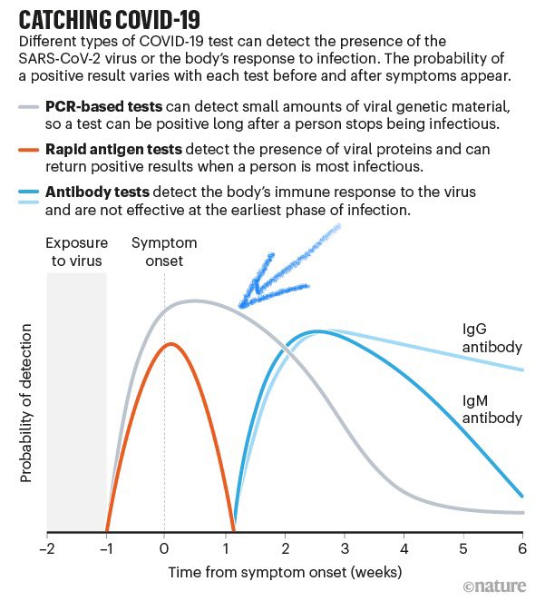

# Fiabilidade de Testes

## O que 'e o Evidentia Medica 

<https://evidentiamedica.com/covid19-evidentia/>

Este site tem informacao de qualidade sobe o covid. Foi criado pelas duas associacoes de medicos de familia:

* APMGF - Associação Portuguesa de Medicina Geral e Familiar 
* ANMSP - Associação Nacional dos Médicos de Saúde Pública

Ricardo Mexia, que todos conhecem da televisão participa neste site, bem como a revista cientifica da ordem dos médicos, e varias outros organismos reputados.
  
  
A maior contribuicao sao 200 artigos cientificos traduzidos e sumarizados para portugues.

A segunda fonte que recomendo 'e esta "FAQ" para os proprios medicos de famila:  
<http://www.apmgf.pt/apmgfcms/dist/apmgf/noticia/noticia.html?id=2327>
    
## Exemplos de FPs e FNs

Ver estes exemplos para um teste perfeito, aleatorio e tipico PCR:

 
 
## Como posso calcular FPs, FNs e probabilidade pre-teste?
 
Ver esta calculadora que relaciona Sensibilidade, Especificidade e Probabilidade Pré-teste:  
<https://www.bmj.com/content/369/bmj.m1808>

## Os testes sao fiaveis?

Os testes COVID PCR são muito fracos. São demasiados Falsos Positivos e Falsos Negativos.
<https://evidentiamedica.com/testar-testar-ou-deixa-te-estar/>

Os únicos testes realmente fiáveis para COVID são os TAC no hospital, que não são práticos, nem rápidos, nem portáteis.

----
Por isso os testes PCR actuais são apenas SUGESTÕES que complementam um diagnóstico clínico (sintomas, envolvente, outros testes de pessoas próximas).

Ver a figura abaixo em forma de "folha".

Exemplo #1 deste artigo: se eu estiver num Lar, com alguns sintomas mas onde já esta muitos infectados, população de risco, espaço fechados, etc, posso ter uma probabilidade subjectiva de 90% de estar infectado.

Faço o teste e da' positivo => probabilidade sobe para 99%;se der negativo, desce para 74%. Se o segundo teste der negativo de novo, desce para 47%; terceiro negativo, desce para 22%, etc.

Exemplo #2: pessoas aleatórias no aeroporto que vieram de áreas com poucas cadeias, sem sintomas, etc => probabilidade 5%; teste positivo = 45%; segundo teste negativo => 20%. etc

fonte: <https://www.bmj.com/content/369/bmj.m1808>

---

Por isto 'e que recentemente escrevi que os testes são só para perceber quem 'e para testar a seguir. Que são um fim em si mesmo. 

Que mesmo com resultado negativo mas com um mau historial/envolvência, 'e para ir para quarentena na mesma.

## Qual 'e a utilidade de testes sistematicos em massa?

Os testes massivos servem APENAS para saber quem 'e que se vai testar a seguir.  
'E um fim em si mesmo. Nao teem nada a ver com as pessoas estarem doentes ou não (isso 'e feito com critérios clínicos).

Quando uma pessoa da' positivo tem que entrar em isolamento. 

Além disso, todos os seus contactos entram em quarentena.  
Estes serão testados depois, e os que derem positivo levam 'a quarentena dos "contactos dos contactos".

O crucial 'e perceber que MESMO que deem negativo, os contactos têm que continuar a quarentena, porque podem desenvolver sintomas depois (falsos negativos).  
A diferença é que aqui não se quarentena (no momento) os contatos desses contactos.

Exemplo:

* dia 1: "A" dá positivo => Isolar "A", pôr em quarentena "B", "C" e "D"
* dia 2: "B" dá negativo => "B" continua de quarentena
* dia 3: "C" dá negativo => "C" continua de quarentena
* dia 4: "D" dá positivo => Isolar "D", pôr em quarentena "X", "Y", "Z"

Fonte: entrevista da RR ao rastreador da Amadora, na pergunta "Não há, portanto, uma estratégia coerente aplicada no combate à pandemia":  
<https://rr.sapo.pt/2020/07/07/pais/especialista-em-saude-publica-nao-diria-que-nao-ha-infecoes-em-transportes-e-uma-afirmacao-politica-que-pode-ser-danosa/especial/198999/>

Definicoes DGS de Isolamento e de Quarentena:  
<https://www.sns24.gov.pt/tema/doencas-infecciosas/covid-19/isolamento/#sec-0>

## Entrevista a um Rastreador na Amadora

Excelente entrevista a um Rastreador da Amadora.  
QUALQUER parágrafo desta entrevista merecia ser explicado com cuidado em horário nobre.

<https://rr.sapo.pt/2020/07/07/pais/especialista-em-saude-publica-nao-diria-que-nao-ha-infecoes-em-transportes-e-uma-afirmacao-politica-que-pode-ser-danosa/especial/198999/>

Testes:

* Os testes servem APENAS para encontrar os próximos contactos. Nao teem nada a ver com pessoas estarem doentes ou não.
TODAS esses contactos têm que ser postos em quarentena, com ou sem teste, e mesmo se o teste vier a dar negativo (por causa dos falsos negativos).
* Foram feitos inquéritos massivos, mas sem a capacidade de dar seguimento. Isso diluiu os casos mais graves na avalanche de assintomáticos. 
* Porque todos continuaram a ir trabalhar enquanto esperavam o resultado dos testes, que nao chegaram em tempo útil.
* Não há estratégia clara; navega-se à vista. Não esta' definido para que serve o teste. Rastreadores não têm poderes para exigir quarentena com ou sem o teste.

Responsabilidades:

* DGS (?), que cria normas, não as esta' a obrigar a serem implementadas, nem a pelo menos serem percebidas
* Autarquias: falta de liderança, falta de recursos, e não exigiram soluções
* Segurança social gere lares e fizeram rastreamentos massivos

Rastreamento:

* O risco real esta' a ser comunicado por pessoas incapacitadas tecnicamente. O resultado 'e comunicação errática que gera "soundbytes".
* Há falta de recursos humanos alocados ao rastreamento. (exemplo: Loures e Odivelas têm 12 a 15 rastreadores; deviam ser 100)
* Houve muito casos atrasados que não tiveram isolamento a tempo; muito menos houve tempo para investigar os contactos e a fonte de infecção.
* Afinal os inquéritos continuam ao fim-de-semana. Não há 'e recursos necessários para os fazer todos a tempo útil. Há problemas de planeamento. 

 
LVT versus o resto do país:

* Sistema de informação esta' desenhado para debitar informação. NÃO esta' desenhado para analisar, processar nem permitir a recolha rápida (inquéritos demasiado grandes).
* Porque 'e que LVT 'e diferente do resto do país?  porque 
  * a) havia cadeias de transmissão na altura do desconfinamento que foram multiplicadas 
  * b) falta de rastreadores
  * c) pobreza acrescida (mais casas partilhadas, pessoas que furam o isolamento com medo de serem expulsos de casas, 
  * d) rastreamento massivo a assintomáticos aumentou a atraso do processamento dos dados
* muitas pessoas mentem ao telefone por medo de perder a casa partilhada.
* há patrões que obrigam positivos a trabalhar  
* apontar causas isoladas (festas de jovens, lares, etc) _ NÃO 'e estatístico, e nao explica o grosso das grandes causas.

Transportes públicos:

* As médias de ocupação dos TP são enganadoras. Basta um autocarro cheio na hora de ponta para aumentar as infeções.
* O sistema actual de rastreamento 'e impossível de afirmar que NÃO há infecções nos TP. A mesma coisa acontece em transmissão por superfícies, etc.
* o que fazer concretamente: usar máscara, olhar para a janela para evitar olhar para pessoas que nao usem máscara ou que aparentam estar doentes.

Ajuntamentos:

* Manifestações políticas são permitidas, mas ajuntamentos pessoais mais pequenos (eg: funerais) não são
* a única coisa que muda o risco 'e a proximidade, a contagiosidade e os EPIs. A actividade em si' é irrelevante.

## Velocidade de Rastreamento

Neste momento existem entre 12 a 15 rastreadores para 2 concelhos juntos: Loures e Odivelas. Loures 'e o sexto maior concelho, Odivelas o 14th.

12 a 15 rastreadores.

O minimo para essa populacao deveria ser 100 profisionais a tempo inteiro.

Obviamente que o rastreamento em 24 horas 'e uma fantasia.

Para referencia, se se demorar mais que 3 dias a doenca anda mais depressa que o isolamento.

fonte: <https://medium.com/@tomaspueyo/coronavirus-how-to-do-testing-and-contact-tracing-bde85b64072e>

---

Segundo, continua-se a insistir em pessoal qualificado para este rastreamento. Exemplo: <https://evidentiamedica.com/nao-tem-de-ser/>

Acredito que em vez disso deviam ser largos milhares de desempregados, tipo call center mas a trabalhar em casa, a ir atras das pessoas uma a uma por telefone.

<https://expresso.pt/sociedade/2020-07-04-Covid-19.-Loures-e-Odivelas-mais-casos-mas-menos-meios>

## Infeccao em ferrovias

Sobre infeccoes em transportes publicos:  
<https://www.tsf.pt/portugal/sociedade/esta-mal-informado-jaime-nina-arrasa-ministro-das-infraestruturas-12433641.html?utm_source=Push&utm_medium=App>

a apresentação do Prof Henrique Barros que nao esta' publica.

no jornal refere-se que NAO se verificou se os infectados andam de comboio.

<https://www.publico.pt/2020/07/09/sociedade/noticia/covid19-proximidade-linhas-ferreas-nao-associado-aumento-risco-infeccao-1923684>

outra fonte 'e a pagina 7 desta apresentação do infarmed. Aqui a coabitação 'e o primeiro factor, e segundo um participante:

“Como foi encontrada uma correlação mais forte entre a coabitação e o surto em Lisboa, esta relação causa-efeito entre comboios e surto foi desvalorizada”

tambem notar que N=1776, enquanto que na pagina 6 N=4358. Portanto ha 2500 pessoas que nao foram validadas.

<https://www.sns.gov.pt/wp-content/uploads/2020/07/infarmed_0807_Ines_Fronteira.pdf>

 
## Comentario paulo portas, 21 junho

Esta foi de longe melhor analise dos últimos tempos sobre o COVID.

a) Comparacoes com outros países so' podem ser com os valores das ultimas 3 semanas.  

Os valores acumulados desde 1 Jan sao irrelevantes e sao enganadores.

Exemplo: ver figura 3 do Centro Europeu de controlo de doenças:

<https://www.ecdc.europa.eu/sites/default/files/documents/RRA-COVID19-update10-2020-06-11.pdf>

b) 'E necessário contratar MUITO mais rastreadores para telefonar a pessoas. 

Comentario: Atualmente este trabalho administrativo 'e feito por MEDICOS, o que sao poucos e totalmente sobre-qualificados: 

Exemplo: <https://evidentiamedica.com/nao-tem-de-ser/>

c) Incrivelmente ninguém fala na APP Portuguesa. Especula-se que esta presa na CNPD. 

Na Alemanha foi recomendada especialmente pelo gobverno e teve 8M downloads no primeiro dia.

Comentário #1: A app portuguesa NAO tem problemas de privacidade porque __por desenho__ 'e impossível ter dados centralizados. 

Ver sff: Ver sff: <https://www.youtube.com/watch?v=93sxCLT45TU>

Comentário #2: Com 60% de cobertura, a APP controlava SOZINHA a pandemia __SE__ se os contactos fossem imediatos; se se demorar 3 dias, a aplicação 'e praticamente inútil. 

Ver sff o grafico 16.b de <https://medium.com/@tomaspueyo/coronavirus-how-to-do-testing-and-contact-tracing-bde85b64072e>

Solucao: Isso resolve-se contratando mais rasteadores (ponto b)

d) Outros países fazem cercas sanitárias nao por "regiao" ou "cidade", mas por rua.

e) Novos estudos calculam tanto os dados absolutos como os relativos das medidas concretas a tomar. 

O distanciamento reduz infeccoes de 12.8 para 2.6%; Mascara reduz de 17.4% para 3.1%. Portanto o distanciamento 'e o melhor, mas a mascara esta' mesmo atras. O malhor 'e ambas. 

No ambiente fechado do porta avioes, 1500 pessoas foram infectadas; 

desses 80% nao usou mascara, 70% nao conservou distancia e 67% frequentou areas comuns.

f) Finalmente o governo anunciou que vai ser feito inquéritos sanitário no aeroporto. A Pandemia começou 'a 3 meses!

-----
Extra: 'e extremamente dificil, mas nao impossível, de comparar países diferentes. 'E necessário controlar dezenas de variacoes:
<https://www.bbc.com/news/52311014>

## Comentario paulo portas, 12 julho

<https://tvi24.iol.pt/opiniao/covid-19/paulo-portas-global-passamos-de-dizer-que-somos-os-melhores-do-mundo-para-dizer-que-o-mundo-esta-contra-nos>

A rubrica de Paulo Portas na TVI deste domingo focou, de novo, que a LENTIDÃO e o DESLEIXO da resposta ao covid em LVT 'e sem dúvida a causa do planalto sem fim em que estamos.

A parte que interessa começa aos 9m45s do vídeo.

Os números abaixo veem duma apresentação crucial das das reuniões do infarmed que foi tornada  publica:  
"gabinete resposta intervenção supressão COVID-19 em LVT", 8 julho:  
<https://www.sns.gov.pt/wp-content/uploads/2020/07/infarmed_0807_Rui_Portugal.pdf>

LVT tem 50 concelhos; destes, 5 estão em estado crítico, e 5 precisam de vigilância especial.  

Para estes 10 conselhos só há ~600 pessoas para fazer TODAS as 3 fases:

* a) inquéritos aos infectados 
* b) vigilância; 
* c) verificação

Estas três fases incluem contactos telefónicos a pessoas que deram contatos errados, visitas aos locais, verificação, etc. 

Isto 'e muito pouco; 600 pessoas têm que gerir 30 mil pessoas (infectados / suspeitos). 

Desde março o número de rastreadores SÓ aumentou 40%; inacreditavelmente, não foram buscar pessoas:

* ao exército
  * estes eram perfeitos, por saberem seguir regras
* aos finalistas de psicologia
* Mas especialmente um reforço massivo de pessoal NÃO técnico, tipo call center, com a única função: encontrar pessoas pelo telefone.

UPDATE: Espanha externalisa 
[tweet ricardo mexia](https://twitter.com/ricmexia/status/1270351387541622784)
/ [fonte](https://elpais.com/espana/catalunya/2020-06-06/es-hora-de-recuperar-la-salud-publica.html)
/ [ferrovial](https://en.wikipedia.org/wiki/Ferrovial)

Pior, foram criados centros de isolamento que não foram usados. 'As pessoas perguntou-se se queria ir para o centro, ou para casa. Sem surpresa, todos quiseram ir para casa, sem controlo.
Isto causa a principal causa de infecção ser a "coabitação", o que 'e óbvio.

A juntar a isto, a APP prometida para fim de Maio ainda não esta' pronta (por razoes nao-técnicas). Ate' Cabo Verde já tem a legislação da APP pronta.

----

Sumário da Apresentação:

* página 5: menos de 600 pessoas para LVT (50 concelhos), separados por médicos, enfermagem, Assistentes operacionais, técnico diagnóstico, etc.
* página 6: 600 profissionais para gerir 30 mil pessoas (infectados e suspeitos)
* página 7: Amadora + Odivelas tiveram quase tantos inquéritos "incontactáveis" como "realizados"
* página 10 Semana de julho teve menos de 23 pessoas a fazer visitas aos locais
* pagina 11: 8 centros de isolamento / hospital de campanha tiveram com ocupação zero ou mínima
* página 12: So' os concelhos problemáticos e Lisboa (que agrega vários) tiveram 49 surtos, total de 1200 confirmados
* página 14: em abril estivemos muito perto do limite de UCI; enfermaria tem acréscimo de enfermaria mes-a-mes.
* página 16: finalmente a última semana mostra um decréscimo nos vários concelhos problemáticos. Mas ainda esta' muito alto.
* página 17: números exatos de todos os hospitais de LVT, em enfermaria, específico covid e não-covid.

## Manchete do expresso, 1 Agosto 

O ponto crucial que a manchete do expresso NAO foca 'e que a velocidade de rastreamento 'e demasiado lenta.  
Isto foi identificado por Paulo Portas 'a semanas na TVI. 
https://pestrela.github.io/covid/#comentario-paulo-portas-12-julho

Com esta lentidão, fazer testes 'as pessoas óbvias só' entope ainda mais o sistema.  
Porque COM ou SEM teste estas pessoas teem que ser obrigadas a cumprir quarentena imediatamente. 
https://pestrela.github.io/covid/#qual-e-a-utilidade-de-testes-sistematicos-em-massa

Citacao de Rui Portugal:  
“Se testar todos os coabitantes, se todos forem positivos, todos os dias tenho 100 novos casos, o que em termos de corte de cadeias de transmissão é perfeitamente inútil"

Por outro lado o rombo no PIB 'e de proporcoes nunca antes vistas, mas continuamos a poupar nos rastreadores.  
Se e só se houvesse recursos suficientes 'e que se deviam TAMBEM testar pessoas óbvias.
https://pestrela.github.io/covid/#entrevista-a-um-rastreador-na-amadora

## Sobre os testes rapidos

Esta este rtigo da Nature (melhor revista cientifica do mundo) compara os 3 tipos de testes actuais.
<https://www.nature.com/articles/d41586-020-02661-2>

A figura diz tudo:
- No eixo horizontal, estao as SEMANAS depois da infeccao. Os sintomas aparecem ao fim de uma semana. 
- No vertical, probabilidade de deteccao.

As ideas a reter sao:

A) Testes PCR (a cinzento, com a seta):
- No dia da infeccao nao detecta nada 
- Nos dias seguintes comeca a crescer, mesmo sem sintomas
- O maximo de detecao 'e aos 10 dias. 
- O teste nunca chega aos 100%. Estes sao os chamados falsos negativos. Por isso 'e que se tem que repetir o teste quando ha' duvidas e um mau historico (lares, sintomas, etc). 
- O teste continua a funcionar nas semanas seguintes, mas caindo.

B) Testes rapidos (a laranja):
- No inicio sao como o PCR
- No meio sao boms, mas nao tao altos como os PCR. Se der positivo 'e provavelmente positivo. Se der negativo mas houver maus historico (lares, sintomas), deve-se avancar para o PCR.
- Na segunda semana o teste cai muito mais rapidamente que o PCR

C) Testes anticorpos (a azul):
- So' comecam a funcionar depois de duas semanas depois da infeccao. Isto 'e uma semana depois dos sintomas.
- Uma vez que tem que se isolar as pessoas 3 dias depois da infeccao, estes testes nao servem para parar a infeccao.
- funcionam por muito mais tempo (meses) que os outros

testes rapidos:

* especificidade: 97% -> poder dar FPs
* sensibilidade: 85% a 90% -> podem dar FNs

  
## Artigo Tomas Peuyo no NYT

Um novo artigo excelente do Tomas Pueyo (autor do artigo do "martelo covid" com milhoes de leituras) num dos melhores jornais do mundo - o New York Times.

O artigo mostra inequivocamente que a nao restricao das viagens, de qualquer tipo, 'e a causa da segunda onda.
Como em 1918, esta sera' maior por nao ser possivel fazer o lockdown segunda vez.

IMPORTANTE: deixem a pagina abrir completamente antes de ler. O artigo tem graficos e animacoes espetaculares.

UPDATE: artigos similares on El Pais:

Excelente artigo do El Pais que explica com muito boas animacoes casos concretos de infeccao em ambientes mundanos. Tudo isto baseado em artigos Cientificos

As conclusoes sao claras:

* ventilacao
* mascaras
* lotacao do espaco
* tempo decorrido

<https://elpais.com/ciencia/2020-10-24/un-salon-un-bar-y-una-clase-asi-contagia-el-coronavirus-en-el-aire.html>

<https://elpais.com/ciencia/2020-06-06/radiografia-de-tres-brotes-asi-se-contagiaron-y-asi-podemos-evitarlo.html>

## Podemos apenas proteger os idosos?

E' uma idea natural, mas que na pratica nao funcionou em nenhum pais do mundo

sff ver este artigo do Tomas Pueyo (os artigos dele do achatar a curva tiveram 60 milhoes de leituras)

<https://medium.com/@tomaspueyo/coronavirus-should-we-aim-for-herd-immunity-like-sweden-b1de3348e88b>

"Looking at that, a very sensible strategy comes to mind: Can we free young people, let them catch the coronavirus, seclude older people during that process, and once all the young people are infected and there’s Herd Immunity, let older people free too?"

"The idea of protecting those at risk sounded good in theory, but in practice it hasn’t worked so far anywhere in the world. There have been outbreaks in nursing homes all over the world. In the US, around 60% of the top ~1,000 outbreaks have been in nursing homes."

"If the virus doesn’t run around, it doesn’t infect old people. Conversely, if it’s running wild, it’s very hard to prevent care home residents from getting infected."

"The elderly still need workers to take care of them. What will happen with these workers, called shielders? Will they also be quarantined? For years? What about their partners, will they also be quarantined? Will they have to lose their jobs? What about their kids, should they also be quarantined? Stop going to school? If not, what about other kids and their parents? Should they be quarantined instead? All of that’s impossible, so we must assume many care home workers will get infected. How to protect the elderly from them?"

## Covid vs Gripe

Com a subida de casos da segunda vaga, re-apareceram os mesmos argumentos de Marco. 

Como os numeros ja' sao demasiado grandes, a idea que tudo isto e' uma "pandemia de Falsos Positivos" ja' nao convence ninguem. 

Em vez disto, aparecem 'e comparacoes incorrectas com a epoca de Gripe, tipo Bolsonaro, com artigos de jornal antigos.

---
O crucial 'e perceber que se nao houvessem medidas draconianas, era como se fosse varias epocas de gripe todas de uma vez (por ser tao contagioso). Ate' atingir a imunidade de grupo 'a forca. 

Os EUA teem menos medidas que a Europa, e por isso:
- em MAIO ja' tinha ultrapassado TODAS epocas de gripe anteriores
- em OUTUBRO  ja' esta' em oitavo lugar na tabela; e so' tem 2 pandemias acima dela

<https://elemental.medium.com/us-covid-19-deaths-compared-to-diseases-pandemics-wars-2a7495a43280>

----
covid vs gripe:
- taxa de letalidade pior 
- muito mais contagioso
- sem imunidade de grupo

"qurentena" (=isolamento profilatico) soa pior que "isolamento"
"recolher obrigatorio" soa pior que "confinamento"

## Animacao do grafico do ECDC

novo Artigo Tomas Peuyo october 2020:
<https://www.facebook.com/tomaspueyo/posts/10157199175897693>

Animacao europa:
<https://www.facebook.com/591162692/videos/pcb.10157199175897693/10157199168752693/>

## Reunioes Familiares sem mascara

Finalmente a comunicaco social esta' a ajudar para atacar DE FACTO onde o virus esta' a ser propagado: 
reunioes familiares sem mascara.

"as pessoas quando vão visitar casas de familiares com quem não residem têm de se comportar como se estivessem no trabalho ou num restaurante. Ou seja, devem estar de máscara, evitar contactos próximos (de abraços e de beijos) e de contacto físico, e manter um mínimo de distância possível"

"Temos de nos lembrar que só devemos retirar a máscara junto do nosso agregado familiar, com quem nós moramos."

"até o simples ato de fazer uma refeição com a família implica que tudo seja pensado (ainda mais) ao pormenor e que cheguemos a colocar em causa se queremos mesmo fazer esse ajuntamento."

<https://tvi24.iol.pt/sociedade/gustavo-tato-borges/covid-19-como-evitar-contagios-nas-reunioes-familiares>

## 2020-11-09 - 3 videos curtos de Tomas Pueyo

3 videos curtos do Tomas Pueyo, famoso pelo artgo do "martelo", com 60 milhoes de leituras.
 
O primeiro mostra o que as pessoas individuais podem fazer para diminiur as infeccoes
<https://www.youtube.com/watch?v=3Y4UjT-Tge0>

O segundo mostra o modelo do queijo suico. So' a combinacao de varias medidas das pessoas e do governo 'e que diminiu sifnificativamente o problema
<https://www.youtube.com/watch?v=QzGb65UB5LQ>

O terceiro mostra as regioes todas da europa desde marco
<https://www.youtube.com/watch?v=MLNjUknJhms>

Este 'e o ultimo artigo dele, para quem prefrir ler detalhadamente em vez de ver videos
<https://tomaspueyo.medium.com/coronavirus-the-swiss-cheese-strategy-d6332b5939de>

Este sao os graficos da europa, estados unidos e Asia. 
Os paises asiatios (nao 'e so' a china!) estao a lidar bem melhor com o problema
<https://miro.medium.com/max/1000/0*DFP2EXBAyZaX9uMc>

## 2020-11-09 - novo artigo de Tomas Pueyo

Nivel 1: barreiras
- testes na chegada + quarentena + teste 4 dias depois

Nivel 2: Bolha Social
- limitar de ajuntamentos

Layer 3: Contra-infeccao
- mascaras obrigatorias
- ajuntamentos possiveis so' no exterior e com distancia minima
- oculos necessarios para espacos interiores
- encontros no interior so' com ventilacao, filtros, temperatura alta e humidade certa

Layer 4: Rastreamento
- testes so' devem encontrar 1 positivo a cada 20 testes. Se for mais, esta' se a testar de menos
- 2 rastreadores por cada caso diario
- publicar a eficacia do rastreamento: Que percentagem dos contactos sao isolados ao fim de 2 dias 
- dar recursos para as pessoas poderem esperar na quarentena
- quarentenas obrigatorias e verificadas
- Multar pesadamente quem nao cumpre qurentena e publicitar
 

 
 
## artigo cientifico sobre dados da DGS

sumario do artigo:
<https://www.medrxiv.org/content/10.1101/2020.11.03.20225565v1.full.pdf>

O artigo 'e serio de investigadores de faculdades de medicina respeitdos.

o artigo falha no ponto essencial: os investigadores nao pediram explicitamente no texto 
do artigo o acesso ao sistema especifico de covid chamado "tracecovid".

Em vez disto, so' tiveram acesso ao "sinave". Este 'e o sistema geral para todas as doencas. 
Sem surpresa constataram que a qualidade dos dados 'e baixissima (dados copiados 'a mao, burocracia, lentidao, etc).
Tambem concluiram que os artigos cientificos baseados nestes dados podem estar errados (garbage in = garbage out)
 

Os autores sugerem todo o tipo de melhorias ao sinave, em vez de simplesmente pedirem o acesso 'a melhor fonte possivel - o tracecovid.

 
## Aprovacao da vacina pela FDA

* blog post: <https://blogs.sciencemag.org/pipeline/archives/2020/11/09/vaccine-efficacy-data>
* protocolo Cientifico: https://pfe-pfizercom-d8-prod.s3.amazonaws.com/2020-11/C4591001_Clinical_Protocol_Nov2020.pdf>
* FAQ: <https://www.pfizer.com/science/coronavirus>

Fase 3 tem ~40000 pessoas.
metade com vacina, metade com placebo.

requisitos:
- Pessoas saudadeis >12 anos
- Concordem com o protocolo do estudo (inclui restricoes ao estilo de vida, etc)
- preferencia explicita a quem tiver maior risco de covid (trbsportes publicos, contatco com clientes, etc)

Verificacoes obrigatorias:
- 1 mes
- 6 meses
- 12 meses
- 24 meses

Os primeiros resultados sao anunciados quando receberem 64 doentes (PCR).
A decisao 'e feita com 164 doentes.

Hoje, 2020-11-XX, receberam 95 doentes.
  
* 5 tiveram  vacina; 90 placebo
* 11 dos 90 estiveram muito mal
* 0 dos 5 estiveram muito mal
  
Mais dados:

*  15 dos 95 era > 65 anos
  
Foram feitas analise estatisticas que quando chegar aos 164 a probabilidde 'e enorme que a vacina 'e muitissimo eficaz.
update: dia 18 de nov 2020 ja' chegaram aos 164 pessoas

