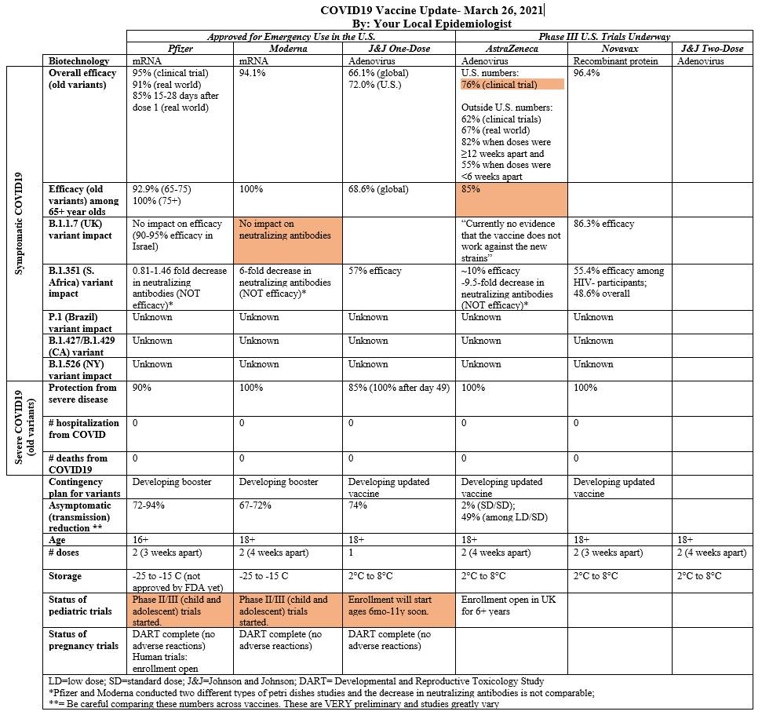

# Vacinacao

## Plano de vacinacao PT

* plano vacinaco (19 paginas): <https://www.sns.gov.pt/wp-content/uploads/2019/06/PlanoVacinacaoCovid_19.pdf>
* apresentacao task force (32 slides): <https://www.sns.gov.pt/wp-content/uploads/2019/06/ApresPlanoVacCovid19_FrancoscoRamos.pdf>
* apresentacao infarmed (12 slides): <https://www.sns.gov.pt/wp-content/uploads/2019/06/ApresPlanoVacCovid19_RuiSantosIvo.pdf>
  * VACINAS PARA A COVID-19: Desenvolvimento, aprovação e acesso
 
 
sumario: <https://www.sns.gov.pt/noticias/2020/12/03/covid-19-plano-de-vacinacao/>
 

## Reportagem CBS 60 minutos

Excelente reportagem da CBS sobre a logistica de distribuicao da vacina, liderada pelo especialista militar do aprovisionamento nos EUA:\  
<https://www.cbsnews.com/search/?q=warp+speed>

Comparacao com portugal, ver aos 25m:\  
<https://www.rtp.pt/play/p6690/o-ultimo-apaga-a-luz>
"uma task force de 12 entidades 'e um dia bem passado" -> "task force da task force" -> "comissao de inquerito" -> "alto comissario"
 

## Passaporte Covid

Sobre o "passaporte" covid, vejo comentadores na TV que não dizem o mais importante: o certificado FACILITA a viagem ao DISPENSAR o teste. E' tudo. 

Informação da fonte:  
"Os cidadãos ainda não vacinados poderão viajar para outro país da UE?  
Sim. O Certificado Verde Digital deverá facilitar a livre circulação na UE, mas não será uma condição prévia para a mesma"

<https://ec.europa.eu/info/live-work-travel-eu/coronavirus-response/safe-covid-19-vaccines-europeans/covid-19-digital-green-certificates_pt#os-cidados-ainda-no-vacinados-podero-viajar-para-outro-pas-da-ue>

## Seguranca das vacinas

O assunto do dia e' a segurança das vacinas.

Da astrazeneca houve 37 casos de trombose/embolia em 17 milhões. 

Isto e' a prevalência normal de tromboses na população. Não e' causado pela vacina.

E' mais provável serem atingidos por um raio no próximo ano:
<https://www.cdc.gov/disasters/lightning/victimdata.html>

Se todos os 10M portugueses tomassem esta vacina (2 doses) iamos ter 43 casos no TOTAL. 
Em Janeiro morreram 300 __POR DIA__.

A explicação é que as pessoas teem imensa dificuldade em comparar percentagens derivadas de numeros muito grandes.
Pelo que ficam agarradas aos números absolutos pequenos, que compreendem melhor.
Se não querem tomar a vossa vacina, em particular da astra zeneca, sff dêem o meu nome!

## Comparacao das 5 vacinas

"your local epidemiologist" 'e uma pagina no FB que recomendo. Informacao directa de Ciencia explicada de forma simples.

<https://yourlocalepidemiologist.substack.com/about>

Em particular manteem actualizado esta tabela comparando as vacinas das diferentes marcas:

